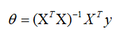
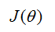
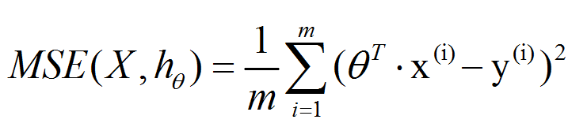
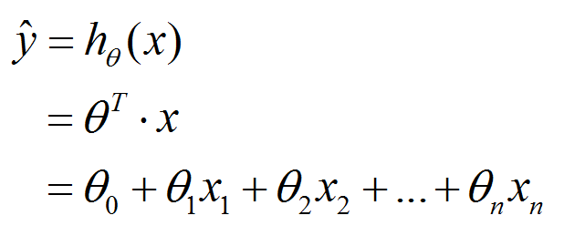
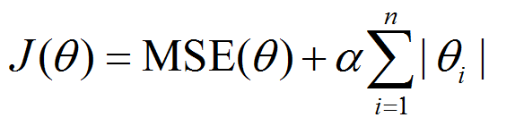
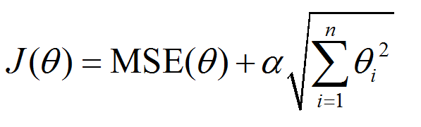
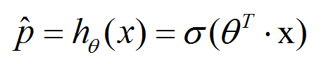
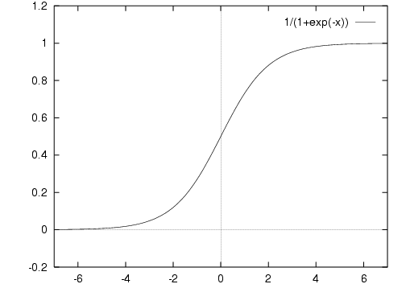
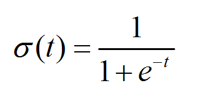

# logistic regressive #

逻辑回归 与 线性回归 的关系 

	逻辑回归，属于广义“线性回归”。

线性回归(Linear Regression)

	线性回归中的“线性”如何理解呢？ **特征** 与 **结果** 之间的1次的。
	“回归”如何理解呢？ 一般会认为是“回归平均值”(regression to the mean)，即所有的数据总会落在一定的区间范围内。

线性回归，有一个“全局最优解”，它的解析解，公式如下：

除了使用“解析解”，还可以使用“梯度下降”进行求解。“梯度下降”有两种：全局梯度下降 和 随机梯度下降。在日常中，常用的是“随机梯度下降”，因为它的梯度下降较快、也有机会跳出局部最优解。

损失函数常用J(theta)表示

**超参数**

在机器学习的上下文中，超参数是在开始学习过程之前设置值的参数，而不是通过训练得到的参数数据。通常情况下，需要对超参数进行优化，给学习机选择一组最优超参数，以提高学习的性能和效果。

	tradeoff	英['treɪdˌɔ:f]
	美[ˈtredˌɔf, -ˌɑf]
	n.	（公平） 交易，折衷，权衡;
	[例句]the tradeoff of territory or land for peace.
	以领土或土地换取和平的交易

----------

[梯度下降法的三种形式BGD、SGD以及MBGD](https://www.cnblogs.com/maybe2030/p/5089753.html)

1. 批量梯度下降法（Batch Gradient Descent，简称BGD）
2. 随机梯度下降法（Stochastic Gradient Descent，简称SGD）
3. 小批量梯度下降法（Mini-batch Gradient Descent，简称MBGD）

	stochastic	英[stə'kæstɪk]
	美[stə'kæstɪk]
	adj.	随机的;
	[例句]Stochastic and mathematical models;
	随机和数学模型；

批量梯度下降法（Batch Gradient Descent，简称BGD）是梯度下降法最原始的形式，它的具体思路是在更新每一参数时都使用所有的样本来进行更新

- 优点：全局最优解；易于并行实现；
- 缺点：当样本数目很多时，训练过程会很慢。
从迭代的次数上来看，BGD迭代的次数相对较少。

由于批量梯度下降法在更新每一个参数时，都需要所有的训练样本，所以训练过程会随着样本数量的加大而变得异常的缓慢。随机梯度下降法（Stochastic Gradient Descent，简称SGD）正是为了解决批量梯度下降法这一弊端而提出的。

随机梯度下降是通过每个样本来迭代更新一次，如果样本量很大的情况（例如几十万），那么可能只用其中几万条或者几千条的样本，就已经将theta迭代到最优解了，对比上面的批量梯度下降，迭代一次需要用到十几万训练样本，一次迭代不可能最优，如果迭代10次的话就需要遍历训练样本10次。但是，SGD伴随的一个问题是噪音较BGD要多，使得SGD并不是每次迭代都向着整体最优化方向。

优点：训练速度快；

缺点：准确度下降，并不是全局最优；不易于并行实现。

从迭代的次数上来看，SGD迭代的次数较多，在解空间的搜索过程看起来很盲目。

有上述的两种梯度下降法可以看出，其各自均有优缺点，那么能不能在两种方法的性能之间取得一个折衷呢？即，算法的训练过程比较快，而且也要保证最终参数训练的准确率，而这正是小批量梯度下降法（Mini-batch Gradient Descent，简称MBGD）的初衷。

----------

### L1和L2正则 ###

L1和L2经常被称为“惩罚系数”

正则化（Regularization）[机器学习中正则化项L1和L2的直观理解](http://blog.csdn.net/jinping_shi/article/details/52433975)

机器学习中几乎都可以看到损失函数后面会添加一个额外项，常用的额外项一般有两种，一般英文称作L1 norm和L2 norm，中文称作L1正则化和L2正则化，或者L1范数和L2范数。

L1正则化和L2正则化可以看做是损失函数的惩罚项。所谓『惩罚』是指对【损失函数】中的某些参数做一些限制。对于线性回归模型，使用L1正则化的模型建叫做Lasso回归，使用L2正则化的模型叫做Ridge回归（岭回归）。

一般【回归分析】中“回归”表示【特征的系数】，正则化项则是对【系数】进行了处理（限制）。L1正则化和L2正则化的说明如下：

- L1正则化是指权值向量中各个元素的**绝对值之和**
- L2正则化是指权值向量中各个元素的**平方和然后再求平方根**

那添加L1和L2正则化有什么用？下面是L1正则化和L2正则化的作用，这些表述可以在很多文章中找到。

- L1正则化可以产生稀疏权值矩阵，即产生一个稀疏模型，可以用于特征选择
- L2正则化可以防止模型过拟合（overfitting）；一定程度上，L1也可以防止过拟合

----------

L1是蓝色的线，L2是红色的线，很明显，L1的分布对极端值更能容忍。那么如果数据损失项使用L1 Norm，很明显，L1 Norm对outlier没有L2 Norm那么敏感；如果正则化损失项使用L1的话，那么使学习到的参数倾向于稀疏，使用L2 Norm则没有这种倾向。

作者：知乎用户
链接：https://www.zhihu.com/question/26485586/answer/89215997
来源：知乎
著作权归作者所有。商业转载请联系作者获得授权，非商业转载请注明出处。

L0：计算非零个数，用于产生稀疏性，但是在实际研究中很少用，因为L0范数很难优化求解，是一个NP-hard问题，因此更多情况下我们是使用L1范数

L1：计算绝对值之和，用以产生稀疏性，因为它是L0范式的一个最优凸近似，容易优化求解

L2：计算平方和再开根号，L2范数更多是防止过拟合，并且让优化求解变得稳定很快速（这是因为加入了L2范式之后，满足了强凸）。

作者：你白
链接：https://www.zhihu.com/question/26485586/answer/67507160
来源：知乎
著作权归作者所有。商业转载请联系作者获得授权，非商业转载请注明出处。

----------

均方误差（Mean Square Error，MSE）：参数估计中【均方误差】是指【参数估计值】与【参数真值】之差/平方的/期望值，记为MSE。

【线性回归】-【梯度下降】-【均方误差】

Lasso Regression（L1）

Ridge Regression（L2，岭回归）

在梯度下降的算法中，目的就是让【损失函数J(theta)】最小，而【损失函数J(theta)】就是使用MSE来进行计算的。此时，在【损失函数J(theta)】引入了L1和L2，会在一定程度上降低模型的准确率，但是却能够提高模型的泛化能力（举一反三的能力、通用性）。

在【损失函数J(theta)】引入了L1和L2，会在一定程度上降低模型的准确率，【准确率下降多少】与【超参数alpha】有关：【超参数alpha】越大，准确率下降越多，说明模型越注重泛化的能力；如果【超参数alpha】很小（或者设置为0），说明更加注重它的准确率，而不注重它的泛化能力。

### ElasticNet  ###

2017.12.26 34:19

### 逻辑回归logistic regression ###

【逻辑回归】，最终不是做“预测”的，而是利用“预测值”来进行“分类”的；而【线性回归】是做“预测”的。

logistic回归是一种广义线性回归（generalized linear model）

Sigmoid函数

Sigmoid函数是一个在生物学中常见的S型的函数，也称为S型生长曲线。在信息科学中，由于其【单增】以及【反函数单增】等性质，Sigmoid函数常被用作神经网络的阈值函数，将变量映射到0,1之间。

60:00

