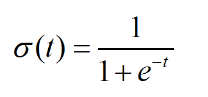

## 20171228 ##

02:58 回顾 逻辑回归

	05:42 几率和概率的区分
	08:00 【Sigmoid函数】与【几率和概率】的关系
	13:38 继续回到逻辑回归的Sigmoid
	15:15 

## 逻辑回归 ##

----------

[A Short Introduction – Logistic Regression Algorithm](https://helloacm.com/a-short-introduction-logistic-regression-algorithm/)

**Logistic Regression** is another technique borrowed by machine learning from the field of **statistics**. It is the go-to method for **binary classification problems** (problems with two class values).

> 【逻辑回归】，是来源于【统计学】，用于解决【二分类问题】。

**Logistic regression** is like **linear regression** in that the goal is to **find the values for the coefficients** that weight each input variable.

> 【逻辑回归】与【线性回归】的相同之处：求解theta（θ）。

Unlike **linear regression**, **the prediction for the output** is transformed using a non-linear function called the **logistic function**.

> 与【线性回归】不同的是，【逻辑回归】的预测结果(the prediction for the output)要经过逻辑函数(logistic function)的处理。

The logistic function looks like a big S and will transform **any value** into **the range 0 to 1**. This is useful because we can apply a rule to **the output of the logistic function** to snap **values to 0 and 1** (e.g. IF less than 0.5 then output 1) and predict **a class value**.

> 介绍logistic function的形状(S)和作用(分类)。

	snap To	 对齐到;

Because of the way that the model is learned, the predictions made by logistic regression can also be used as the probability of a given data instance belonging to class 0 or class 1. This can be useful on problems where you need to give more rationale for a prediction.

Like **linear regression**, **logistic regression** does work better when you remove **attributes that are unrelated to the output variable** as well as **attributes that are very similar (correlated) to each other**.

> 【逻辑回归】与【线性回归】的相似之处：如果去除两种attributes，会让结果更好。

It’s a fast model to learn and effective on **binary classification** problems.

我感觉下面这个图，和我理解的有差异哎。

----------

## 几率和概率 ##

概率：当n趋向于正无穷的时候，生男生女的概率是50%。
几率：当n处于某一定值时（例如100人），出生男孩女孩分别是70和30，那生男孩的几率就是0.7；生男孩女孩的概率是0.5，是不会变的。

- 几率：就是指在已经发生的随机事件中，某一种随机事件在整个随机事件中所占的比例。
- 概率：是由巨大数据统计后得出的结论，讲的是一个大的整体趋势，在讲整体的规律。几率是较少数据统计的结果，是一种具体的趋势和规律，是阶段性的趋势和规律。

举例来说，掷一枚硬币，正面和反面出现的**概率**相等，都是1/2。这是经过上百万次试验取得的理论数据。但某人只掷20次，正面出现的几率为13/20，反面出现的几率仅为7/20。

概率和几率的关系，是整体和具体、理论和实践、战略和战术的关系。

## 【Sigmoid函数】与【几率和概率】的关系 ##

如果来做二分类，要么就是正例1，要么就是负例0。
如果是正例的几率是P，那么是负例（不是正例）的几率就是1-P。

