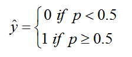

## 20171228 ##

02:58 回顾 逻辑回归

	05:42 几率和概率的区分
	08:00 【Sigmoid函数】与【几率和概率】的关系
	13:38 继续回到逻辑回归的Sigmoid
	15:15 

01:35:48 逻辑回归是二分类，怎么做到多分类呢？把多分类问题转换成了多个二分类问题

## 逻辑回归 ##

----------

[A Short Introduction – Logistic Regression Algorithm](https://helloacm.com/a-short-introduction-logistic-regression-algorithm/)

**Logistic Regression** is another technique borrowed by machine learning from the field of **statistics**. It is the go-to method for **binary classification problems** (problems with two class values).

> 【逻辑回归】，是来源于【统计学】，用于解决【二分类问题】。

**Logistic regression** is like **linear regression** in that the goal is to **find the values for the coefficients** that weight each input variable.

> 【逻辑回归】与【线性回归】的相同之处：求解theta（θ）。

Unlike **linear regression**, **the prediction for the output** is transformed using a non-linear function called the **logistic function**.

> 与【线性回归】不同的是，【逻辑回归】的预测结果(the prediction for the output)要经过逻辑函数(logistic function)的处理。

The logistic function looks like a big S and will transform **any value** into **the range 0 to 1**. This is useful because we can apply a rule to **the output of the logistic function** to snap **values to 0 and 1** (e.g. IF less than 0.5 then output 1) and predict **a class value**.

> 介绍logistic function的形状(S)和作用(分类)。

	snap To	 对齐到;

Because of the way that the model is learned, the predictions made by logistic regression can also be used as the probability of a given data instance belonging to class 0 or class 1. This can be useful on problems where you need to give more rationale for a prediction.

Like **linear regression**, **logistic regression** does work better when you remove **attributes that are unrelated to the output variable** as well as **attributes that are very similar (correlated) to each other**.

> 【逻辑回归】与【线性回归】的相似之处：如果去除两种attributes，会让结果更好。

It’s a fast model to learn and effective on **binary classification** problems.

我感觉下面这个图，和我理解的有差异哎。

----------

## 几率和概率 ##

概率：当n趋向于正无穷的时候，生男生女的概率是50%。
几率：当n处于某一定值时（例如100人），出生男孩女孩分别是70和30，那生男孩的几率就是0.7；生男孩女孩的概率是0.5，是不会变的。

- 几率：就是指在已经发生的随机事件中，某一种随机事件在整个随机事件中所占的比例。
- 概率：是由巨大数据统计后得出的结论，讲的是一个大的整体趋势，在讲整体的规律。几率是较少数据统计的结果，是一种具体的趋势和规律，是阶段性的趋势和规律。

举例来说，掷一枚硬币，正面和反面出现的**概率**相等，都是1/2。这是经过上百万次试验取得的理论数据。但某人只掷20次，正面出现的几率为13/20，反面出现的几率仅为7/20。

概率和几率的关系，是整体和具体、理论和实践、战略和战术的关系。

## 【Sigmoid函数】与【几率和概率】的关系 ##

如果来做二分类，要么就是正例1，要么就是负例0。
如果是正例的几率是P，那么是负例（不是正例）的几率就是1-P。

## 逻辑回归 ##

假如有一个样本x，那它的几率p如下：

在上面的两个式子中，只要知道了sigmoid、theta和x，就可以求解到p；其中，x是已知的样本，sigmoid的定义也是已知的，因此只要知道了theta，就可以求解p了。

> 过程：x->p->y 
> 过程：由theta、x 和 sigmoid求解到p，再由p根据阈值转换成分类y。
> 只要求解到theta，就可以解决所有的问题。

如果阈值是0.5，那么【样本x】的【逻辑回归】的【分类结果y】表示如下：

> 由于【逻辑回归】是【二分类】，y只取值0或1。

现在回顾一下求硬币的概率，对于一个硬币，投掷10次，出现7次正面，3次反面的概率的计算公式如下：

现在回到【逻辑回归】，对于一个样本x，它分类结果y的取值为0或1，假设样本x为正例（即y=1）的概率是p，为负例的概率就是1-p，如下：

当y=1时，取值为p；当y=0时，取值为1-p。

如果有m个样本，从第1个样本到第m个样本的概率表示如下：

01:06:13 训练数据集

model = LogisticRegression()
其中，有一个参数solver : {'newton-cg', 'lbfgs', 'liblinear', 'sag', 'saga'} 

default: 'liblinear' 
solver默认是liblinear，而liblinear 表示用解析解的方式来求解theta；而sag是使用梯度下降的方式进行求解。

For small datasets, 'liblinear' is a good choice, whereas 'sag' and 'saga' are faster for large ones.

- LIBLINEAR -A Library for Large Linear Classification
- SAG -Minimizing Finite Sums with the Stochastic Average Gradient
- SAGA -A Fast Incremental Gradient Method

multi_class : str, {'ovr', 'multinomial'}, default: 'ovr'

        Multiclass option can be either 'ovr' or 'multinomial'. If the option
        chosen is 'ovr', then a binary problem is fit for each label. Else
        the loss minimised is the multinomial loss fit across
        the entire probability distribution. Does not work for liblinear
        solver.

第二个注意的参数就是multi_class，其默认值是ovr，表示二分类的意思。

n_jobs是并行度，就是几个线程同时运行。

sklearn是单机的，如果想要多个服务器同时计算，就要用spark或Tensorflow。

逻辑回归是二分类，怎么做到多分类呢？把多分类问题转换成了多个二分类问题

KNN算法不讲了，有时间自己要学习一下！！！

elasticNet是L1和L2惩罚的整合

gdbt,svm,xboost

# Soft-max #

逻辑回归的本质是做二分类，但可以将多分类问题转换成多个二分类问题来解决，分别求解多个theta，theta的数量与分类的数量相等，每个theta的计算是相对独立的；而Soft-max是天生就是来做多分类的，求解theta的过程中，每个theta之间是会相互影响的。

说逻辑回归与Softmax的区别？除了说一个本质是做二分类，另一个是做多分类，还应该从求解theta的角度进行区分。

逻辑回归和Soft-max的关系？Soft-max的一个特例是逻辑回归，Soft-max是用于做多分类的。

Soft-max在神经网络、深度学习中都会用到。

类别k的分数：

其中，k是类别的数量，之所以是类别的数量，是因为进行Soft-max多分类。

Soft-max函数，如下：

预测分类的方法，如下：

argmax

argmax是一种函数，函数y=f(x)，x0= argmax(f(x)) 的意思就是参数x0满足f(x0)为f(x)的最大值；换句话说就是 argmax(f(x))是使得 f(x)取得最大值所对应的变量x。arg即argument，此处意为“自变量”。

Soft-max就是MIMO的Sigmoid函数。

http://blog.csdn.net/Suan2014/article/details/77162042

