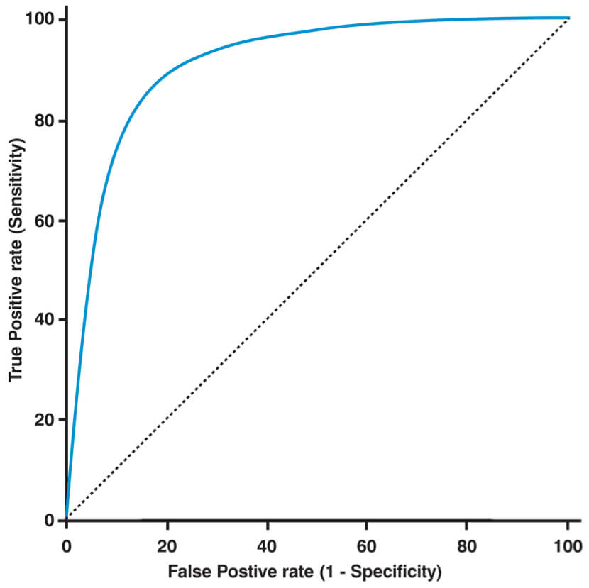
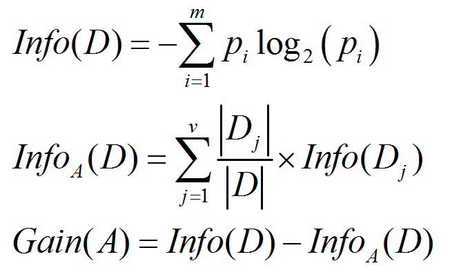
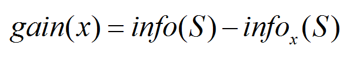
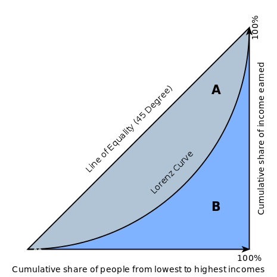
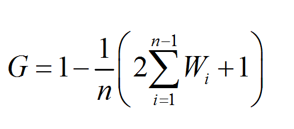
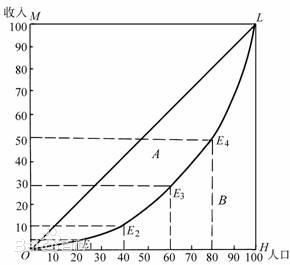
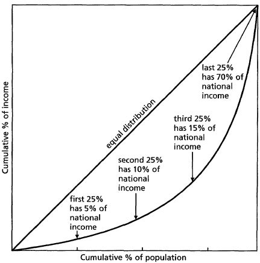
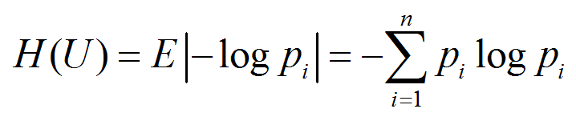
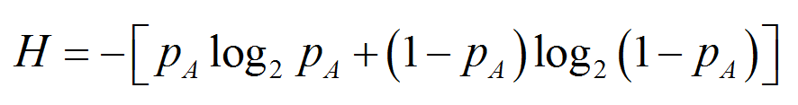
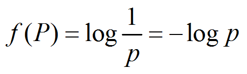

09:32 决策树、随机森林

09:33 交叉熵损失函数

10:00 评估指标

	regression

ROC曲线

受试者工作特征曲线 （receiver operating characteristic curve，简称ROC曲线），又称为感受性曲线（sensitivity curve）。得此名的原因在于曲线上各点反映着相同的感受性，它们都是对同一信号刺激的反应，只不过是在几种不同的判定标准下所得的结果而已。

ROC曲线最早是运用在军事上，后来逐渐运用到医学领域。相传在第二次世界大战期间，雷达兵的任务之一就是死死地盯住雷达显示器，观察是否有敌机来袭。理论上讲，只要有敌机来袭，雷达屏幕上就会出现相应的信号，但是实际上，有时如果有飞鸟出现在雷达扫描区域时，雷达屏幕上有时也会出现信号。这种情况令雷达兵烦恼不已：如果过于谨慎，凡是有信号就确定为敌机来袭，显然会增加误报风险；如果过于大胆，凡是信号都认为飞鸟，又会增加漏报的风险。每个雷达兵都竭尽所能地研究飞鸟信号和飞机信号之间的区别，以便增加预报的准确性。但问题在于，每个雷达兵都有自己的判别标准，有的雷达兵比较谨慎，容易出现误报；有的雷达兵则比较胆大，容易出现漏报。

为了研究每个雷达兵预报的准确性，雷达兵的管理者汇总了所有雷达兵的预报特点，特别是他们漏报和误报的概率，并将这些概率画到一个二维坐标里面。这个二维坐标的纵坐标为敏感性，即在所有敌机来袭的事件中，每个雷达兵准确预报的概率。而横坐标则特1-特异性，表示了在所有非敌机来袭信号中，雷达兵预报错误的概率。由于每个雷达兵的预报标准不同，且得到的敏感性和特异性的组合也不同。将这些雷达兵的预报性能进行汇总后，雷达兵管理员发现他们刚好在一条曲线上，这条曲线就是我们经常在医学杂志上看见的ROC曲线。



# 决策树与随机森林 #

https://www.cnblogs.com/fionacai/p/5894142.html

## 决策树 ##

 首先，在了解【树模型】之前，自然想到【树模型】和【线性模型】有什么区别呢？其中最重要的是，【树形模型】是【一个一个(one by one)特征】进行处理，之前【线性模型】是【所有(all)特征】给予权重相加得到一个新的值。

> 从如何使用【特征】的方式来区分【树模型】和【线性模型】：树模型，one by one；线性模型，all together。

【决策树】与【逻辑回归】的分类区别也在于此，【逻辑回归】是将【所有特征】变换为【概率】后，通过大于某一概率阈值的划分为一类，小于某一概率阈值的为另一类；而【决策树】是对【每一个特征】做一个划分。另外【逻辑回归】只能找到线性分割（输入特征x与logit之间是线性的，除非对x进行多维映射），而【决策树】可以找到非线性分割。

> 此时，需要注意区分“线性回归”和“逻辑回归”。“逻辑回归”属于“广义线性回归”。在这里，谈论的是“逻辑回归”，不是“线性回归”；“逻辑回归”可以用于分类。
> 【逻辑回归】：所有特征-->期望值-->概率-->分类；只能进行线性分割。
> 【决策树】：每个特征-->分类；可以找到非线性分割。

而**【树形模型】更加接近人的思维方式，可以产生可视化的分类规则，产生的模型具有可解释性（可以抽取规则）**。【树模型】拟合出来的函数其实是分区间的阶梯函数。

其次，需要了解几个重要的基本概念：**根节点**（最重要的特征）；**父节点与子节点**是一对，先有父节点，才会有子节点；**叶节点**（最终标签）。


### 决策树的生成： ###

**决策树思想，实际上就是寻找最纯净的划分方法**，这个最纯净在数学上叫【纯度】，【纯度】，通俗点理解，就是目标变量要分得足够开（y=1的和y=0的混到一起就会不纯）。另一种理解，【纯度】是【分类误差率】的一种衡量。实际【决策树算法】往往用到的是，【纯度】的另一面也即【不纯度】。**【不纯度】的选取有多种方法，每种方法也就形成了不同的决策树方法**，比如**ID3算法**使用**信息增益**作为【不纯度】；**C4.5算法**使用**信息增益率**作为【不纯度】；**CART算法**使用**基尼系数**作为【不纯度】。

> 决策树-->分类-->纯度-->不纯度（ID3、C4.5、CART算法）-->不同的决策树

【决策树】要达到寻找最纯净划分的目标要干两件事，**建树**和**剪枝**。

### 建树 ###

#### （1）如何按次序选择属性 ####

也就是首先【树根上】以及【树节点】是【哪个变量】呢？【这些变量】是从【最重要】到【次重要】依次排序的，**那怎么衡量这些变量的重要性呢**？　**ID3算法**用的是【信息增益】，**C4.5算法**用【信息增益率】；**CART算法**使用【基尼系数】。【决策树方法】是会把【每个特征】都试一遍，然后选取**那个能够使分类分的最好的特征**，也就是说将A属性作为父节点，产生的纯度增益（GainA）要大于B属性作为父节点，则A作为优先选取的属性。

信息增益计算



#### （2） 如何分裂训练数据（对每个属性选择最优的分割点） ####

**如何分裂数据**，也即**分裂准则是什么**？依然是通过【不纯度】来分裂数据的，通过比较【划分前后】的【不纯度值】，来确定【如何分裂】。

下面做具体的介绍：

——**CART算法**：既可以做分类，也可以做回归。只能形成二叉树。

**分支条件**：二分类问题

**ID3算法**：使用【信息增益】作为分裂的规则，信息增益越大，则选取该分裂规则。多分叉树。信息增益可以理解为，有了x以后对于标签p的不确定性的减少，减少的越多越好，即信息增益越大越好。

**C4.5算法**：使用【信息增益率】作为分裂规则（需要用【信息增益】除以，**该属性本身的熵**），此方法避免了ID3算法中的归纳偏置问题，因为ID3算法会偏向于选择类别较多的属性（形成分支较多会导致信息增益大）。多分叉树。连续属性的分裂只能二分裂，离散属性的分裂可以多分裂，比较分裂前后信息增益率，选取【信息增益率】最大的。

三种方法对比：

ID3的缺点，倾向于选择水平数量较多的变量，可能导致训练得到一个庞大且深度浅的树；另外输入变量必须是分类变量（连续变量必须离散化）；最后无法处理空值。

C4.5选择了信息增益率替代信息增益。

CART以基尼系数替代熵；最小化不纯度而不是最大化信息增益。

### 剪树 ###

如何停止分裂

下面这六种情况都会停止分裂。其中第一种其实属于树的完全长成，但这会出现过拟合问题，所有之前很流行一种抑制这种情况的方法，叫**树的剪枝**。树的剪枝分为**预剪枝**和**后剪枝**。**预剪枝**，及早的停止树增长控制树的规模，方法可以参考如下6点停止分类的条件。**后剪枝**在已生成过拟合决策树上进行剪枝，删除没有意义的组，可以得到简化版的剪枝决策树，包括REP（设定一定的误分类率，减掉对误分类率上升不超过阈值的多余树）、PEP，还有一种CCP，即给分裂准则—基尼系数加上惩罚项，此时树的层数越深，基尼系数的惩罚项会越大。

1. 如果节点中所有观测属于一类
2. 如果该节点中所有观测的属性取值一致
3. 如果树的深度达到设定的阈值
4. 如果该节点所含观测值小于设定的父节点应含观测数的阈值
5. 如果该节点的子节点所含观测数小于设定的阈值
6. 如果没有属性能满足设定的分裂准则的阈值


----------

信息增益到底怎么理解呢？

https://www.zhihu.com/question/22104055

熵：表示随机变量的不确定性。

条件熵：在一个条件下，随机变量的不确定性。

信息增益：熵 - 条件熵。即，在一个条件下，信息不确定性减少的程度！通俗的讲就是，一个事情是不确定的，但是给出一个条件，你可以通过这个条件来减少这件事情的不确定性，这个条件能带来的“不确定性减少的信息量”，就是“信息增益”。

通俗地讲，X(明天下雨)是一个随机变量，X的熵可以算出来， Y(明天阴天)也是随机变量，在阴天情况下下雨的信息熵我们如果也知道的话（此处需要知道其联合概率分布或是通过数据估计）即是条件熵。

两者相减就是信息增益！原来明天下雨例如信息熵是2，条件熵是0.01（因为如果是阴天就下雨的概率很大，信息就少了），这样相减后为1.99，在获得阴天这个信息后，下雨信息不确定性减少了1.99！是很多的！所以信息增益大！也就是说，阴天这个信息对下雨来说是很重要的！

作者：Kay Zhou
链接：https://www.zhihu.com/question/22104055/answer/67014456
来源：知乎
著作权归作者所有。商业转载请联系作者获得授权，非商业转载请注明出处。

在决策树算法的学习过程中，信息增益是特征选择的一个重要指标，它定义为一个特征能够为分类系统带来多少信息，带来的信息越多，说明该特征越重要，相应的信息增益也就越大。

- 信息熵是代表随机变量的复杂度（不确定度）
- 条件熵代表在某一个条件下，随机变量的复杂度（不确定度）
- 信息增益恰好是：信息熵-条件熵。

换句话说，信息增益代表了在一个条件下，信息复杂度（不确定性）减少的程度。

那么我们现在也很好理解了，在决策树算法中，我们的关键就是每次选择一个特征，特征有多个，那么到底按照什么标准来选择哪一个特征。

这个问题就可以用信息增益来度量。如果选择一个特征后，信息增益最大（信息不确定性减少的程度最大），那么我们就选取这个特征。

信息增益为总的熵减去某个分类标准对应的熵。



信息增益（information gain,IG）是指期望信息或者信息熵的有效减少量（通常用“字节”衡量），根据它能够确定在什么样的层次上选择什么样的变量来分类。

信息增益（IG）是信息论中比较重要的一个计算方法，该方法能够估算系统中新引入的特征所带来的信息量，即信息的增加量。通过该计算，实现了ID3算法，使得决策树分类方法获得改良，并得到了广泛应用。

建立决策树的过程是每次选择一个特征对数据进行划分，这相当于给数据提供了已知信息，这个过程一定会使数据的不确定性减小，且不确定性减小的越多代表这次划分越有效，而这里面不确定性的减小程度就是用信息增益来度量的。

----------


----------

基尼系数 Gini coefficient

基尼系数是1943年美国经济学家**阿尔伯特·赫希曼**根据【洛伦兹曲线】所定义的**判断收入分配公平程度的指标**。**基尼系数是比例数值，在0和1之间**，是国际上用来综合考察居民内部收入分配差异状况的一个重要分析指标。

赫希曼根据【洛伦茨曲线】提出的**判断分配平等程度的指标**。设【实际收入分配曲线】和【收入分配绝对平等曲线】之间的面积为A，【实际收入分配曲线】右下方的面积为B。并以A除以（A+B）的商表示【不平等程度】。这个数值被称为【基尼系数】或称**洛伦茨系数**。如果A为零，基尼系数为零，表示收入分配完全平等；如果B为零则系数为1，收入分配绝对不平等。收入分配越是趋向平等，洛伦茨曲线的弧度越小，基尼系数也越小，反之，收入分配越是趋向不平等，洛伦茨曲线的弧度越大，那么基尼系数也越大。



国内不少学者对基尼系数的具体计算方法作了探索，提出了十多个不同的计算公式。山西农业大学经贸学院张建华先生提出了一个简便易用的公式：假定一定数量的人口按收入由低到高顺序排队，分为人数相等的n组，从第1组到第i组人口累计收入占全部人口总收入的比重为wi，则说明：该公式是利用定积分的定义将对洛伦茨曲线的积分(面积B)分成n个等高梯形的面积之和得到的。



基尼系数是量度贫富悬殊程度的标量。它的定义如下：我们首先收集社会上每一个人的总财富额，把它从少至大排序，计算它的累积函数（cumulative function），然后便可绘出图中的洛仑兹曲线（Lorenz curve）。图中横轴是人口比例的累积分布，竖轴是财富比例的累积分佈。


我们先想想两个极端情况。假设社会上人人财富均等，那就给成了图中的45度直线，称平等曲线（line of (perfect) equality）；但如财富集中在一人手中，那就绘成图中在右端的竖轴，称绝对不平均直线（line of perfect inequality）。而图中的洛仑兹曲线乃实际分佈。A和B是图中两面积，基尼系数便是A/(A+B)。

用此定义，在人人财富均等情况下，基尼系数为0；在财富一人独占的情况下，基尼系数为1。利用这定义，基尼系数可用简单的电脑函数计算，有兴趣者可参[GitHub stephenhky/econ_inequality](https://github.com/stephenhky/econ_inequality/blob/master/ginicoef.py)。

```python
import numpy as np

def gini_coef(wealths):
    cum_wealths = np.cumsum(sorted(np.append(wealths, 0)))
    sum_wealths = cum_wealths[-1]
    xarray = np.array(range(0, len(cum_wealths))) / np.float(len(cum_wealths)-1)
    yarray = cum_wealths / sum_wealths
    B = np.trapz(yarray, x=xarray)
    A = 0.5 - B
    return A / (A+B)

```

只用八行Python代码便可实现。


作者：何史提
链接：https://www.zhihu.com/question/20219466/answer/25936162
来源：知乎
著作权归作者所有。商业转载请联系作者获得授权，非商业转载请注明出处。


洛伦兹曲线Lorenz curve

洛伦兹曲线（Lorenz curve），也译为“劳伦兹曲线”。就是，在一个总体（国家、地区）内，以“【最贫穷的人口】计算起一直到【最富有人口】”的【人口百分比】对应各个【人口百分比】的【收入百分比】的点组成的曲线。



**横纵轴**

图中横轴OH表示人口（按收入由低到高分组）的累积百分比，纵轴OM表示收入的累积百分比，弧线（O-E1-E2-E3-E4-L）为洛伦兹曲线。



----------


# 信息熵 #


----------

热力学（thermodynamics）是从**宏观角度**研究【物质的热运动性质】及【其规律】的学科。【热力学】，属于【物理学】的分支，它与【统计物理学】分别构成了【热学理论】的**宏观**和**微观**两个方面。

热力学主要是从【能量转化】的观点来研究物质的热性质 ，它提示了**能量从一种形式转换为另一种形式时遵从的宏观规律**，总结了【物质】的【宏观现象】而得到的热学理论。热力学并不追究由大量微观粒子组成的物质的微观结构，而只关心系统在整体上表现出来的热现象及其变化发展所必须遵循的基本规律。通过对实践中【热现象】的大量观测和实验发现，**【宏观状态量】之间是有联系的，它们的变化是互相制约的**。制约关系除与物质的性质有关外，还必须遵循一些对任何物质都适用的基本的热学规律，如热力学第零定律、热力学第一定律、热力学第二定律和热力学第三定律 等。

第零定律和温度

热力学第零定律（英语：Zeroth Law of Thermodynamics），又称热平衡定律，是热力学的四条基本定律之一，是一个关于互相接触的物体在热平衡时的描述，以及为温度提供理论基础。最常用的定律表述是：“若两个热力学系统均与第三个系统处于热平衡状态，此两个系统也必互相处于热平衡。” 换句话说，第零定律是指：在一个数学二元关系之中，热平衡是递移的。

第一定律和内能

热力学第一定律（the first law of thermodynamics）就是不同形式的能量在传递与转换过程中守恒的定律，表达式为Q=△U+W。表述形式：热量可以从一个物体传递到另一个物体，也可以与机械能或其他能量互相转换，但是在转换过程中，能量的总值保持不变。

第二定律和熵

热力学第二定律（second law of thermodynamics），热力学基本定律之一，其表述为：不可能把热从低温物体传到高温物体而不产生其他影响，或不可能从【单一热源】取热使之完全转换为有用的功而不产生其他影响，或不可逆热力过程中熵的微增量总是大于零。又称“熵增定律”，表明了在自然过程中，一个孤立系统的总混乱度（即“熵”）不会减小。

第三定律和绝对熵

热力学第三定律是热力学的四条基本定律之一，其描述的是热力学系统的熵在温度趋近于绝对零度时趋于定值。而对于完整晶体，这个定值为零。


----------


信息熵的直观理解

http://blog.csdn.net/wendingzhulu/article/details/42045137

要理解【信息熵】，其实并不难，因为生活中无处不是信息熵的体现。比如，假设你是一个伪球迷，对各国家足球队实力一点都不了解，问你冠军赛两支队伍谁可能夺冠。首先经过你脑海的是，这两家国家队可能实力相当，用概率学的说法，即两支球队夺冠的概率都是50%，那么结果就像是掷硬币，正反靠天时地利人和，并无从考证——我们设定【这种情景为A】。这个时候，有个人跑过来和你说，他是一个足球评论员，对各足球对非常了解，然后告诉你此次冠军赛实力相差悬殊，德国队近来年表现优秀，主帅勒夫策略非凡，而另外一支队伍已经有很多届未进入世界杯总决赛了；基于这些不完整信息，作为伪球迷的你，心理肯定给德国队夺冠加分，假设这个时候你心理的夺冠概率变成了德国队80%的夺冠率，而另一支队伍只剩20%的夺冠率——我们设定【这种情景为A+】。我们知道，比赛的结果只有一个，冠军也只有一支队伍。结果出来了，有人跑过来准备跟你说到底谁夺冠了，如果你只是在【A情境】下，这个夺冠信息对你肯定很有诱惑力，因为你本来就无法判断谁可能夺冠；如果你是在【A+情境】下，这个夺冠信息对你来说多少有点失去新鲜，因为世界级的赛事，出差错的可能性不高，所以你会觉得你其实已经大概知道了结果，听或不听没有太大意义。换种说法表述，晚上冠军赛开战，如果你身处【情景A】，你肯定比较好奇，势均力敌的双方到底谁能夺冠；而如果你身处【情景A+】，你会觉得这是一场结果已定的赛事，没有太大兴趣。

好的，举了这么一个例子，你应该已经开始恍然了，信息会改变你对事物的未知度和好奇心，信息量越大，你对事物越了解，进而你对事物的好奇心也会降低，因为你对事物的确定性越高。至此，为了抽象这个模型，聪明的香农总结出了信息熵这个概念。信息熵用以表示一个事物的非确定性，如果该事物的非确定性越高，你的好奇心越重，该事物的信息熵就越高。我们先抛出信息熵的公式



为什么是这个表达式，我们慢慢表述。
 
信息熵和热力学熵

对于【熵（Entropy）】的理解，学术讨论早就已经上升到哲学的范畴，我们只是从最基本的角度去直观地理解这个概念。【熵】来源于【热力学】，是由鲁**道夫·克劳修斯**提出的，用来表示【任何一种能量在空间中分布的混乱程度】，**能量分布得越混乱，熵就越大**。**一个体系的能量达到完全均匀分布时，这个系统的熵就达到最大值**。 怎么直观地理解这个定义呢？比如一个热力学体系内，有一个冰块和一杯热水，二者在独立的情况下，冰块和热水内部的分子状态是有差别的，冰块是固态，分子主要是有限振动，而热水中分子快速做布朗运动。也就说，在这个热力学系统中，有两个队伍存在，可以认为他们分别是有序的。如果把冰和热水混合在一起，冰会融化，水温会降低，最终他们的状态达到了一致，都成了凉水（这个有前提，不赘述）。至此，系统从两个【有序状态】转向了【无序状态】，**热力学系统就均匀分布了，熵就增加了**。这是一个最简单的例子。但是，大家都知道，【熵】的来源是【热力学第二定律】，在【热力学第一定律】阐述了**能量是守恒的**朴素定理后，【热力学第二定律】的【熵】要表述的就是**即使能量是守恒的，但是能量引起的变化不一定是可以修复的**。就好比冰化成了水，如果不引入外界系统做功，水不可能再恢复到冰的状态——也就说，这不是一个可逆的过程——有没有像俗语“说出去的话，像泼出去的水”。

回顾历史，这是一个伟大的论断，解决了永动机是不可行的理论证明，探讨了宇宙的熵增加宿命，甚至上升到了哲学层面。

好的，从【热力熵】回到【信息熵】的理解。【熵】表述的是**一种状态**，【信息熵】表述的就是**事物的信息状态**。事物的信息怎么定义呢？用我们最开始的例子解说，如果你确定一件事件的发生概率是100%，你认为这件事情的信息量为0——可不是吗，既然都确定了，就没有信息量了；相反，如果你不确定这件事，你需要通过各种方式去了解，就说明这件事是有意义的，是有信息量的。好的，你应该注意到了一个词“确定”。是的，**【信息熵】表述的就是事物的不确定程度**。一场势均力敌的比赛结果的不确定性高于一场已经被看到结果的比赛，多么符合直观理解啊！

信息熵公式解析：

从上面的直观表述，我们发现【信息熵】其实可以有很直观的表述，**表征的是事物的不确定性**。继续抽象，我们应该**定量表述事物的不确定性**呢？这就是【信息熵的数学表述】了。

我们知道，合理的数据定理都需要满足【数学自洽性】验证，我们已经知道确定的事件表述为P(A)=100%，则熵为0；假设一件事情，只有两种可能，则概率分布是P(A)和P(-A)，其熵表述为



该式子对应的数据分布是


可以发现，但P(A)=0.5的时候，也就是事件结果最难预测的时候，信息熵是最大的，值达到1——这同样是符合直觉判断的。

 那么，为什么求熵的时候用的是对数log2呢？这个就得从【香农】提出的【信息熵】**使用的场景**说起，大家都知道，【香农】提出的【信息熵】是用于【信息论】的，而【信息论】主要解决的是**通讯问题**，所以说，【信息熵】是和【计算机】通讯相关的理论。计算机的基本存储单位是二进制位，即1bit，每个bit都尤其只有两种表达——0或1。如果一个事件有两种可能性，且概率均等，都为50%，那么需要用1bit表示；如果有4种可能，且概率均等，则用2bit表示——你会发现，1bit刚好就是我们上面证明的H的最大值。这样就解释通了，底数为何为2了。

[熵：宇宙的终极规则](http://www.ruanyifeng.com/blog/2017/04/entropy.html)

[未来世界的幸存者](http://survivor.ruanyifeng.com/index.html)


逻辑自洽logic self-consistency

逻辑自洽，指的是一个语言学的原则，即一个理论在语言本身的陈述上是不矛盾的，人们通过仔细分析这个理论的文字符号，没有发现任何的矛盾，达到了自我的完备。

逻辑的英文是logic，其中log是语言的意思，所以logic就是“语言的规则”，或者说“语言的可分析性”。因此“逻辑自洽”其实是一个语言学的原则，即一个理论在语言本身的陈述上是不矛盾的，人们通过仔细分析这个理论的文字符号，没有发现任何的矛盾，达到了自我的完备。


----------

信息熵

https://baike.baidu.com/item/%E4%BF%A1%E6%81%AF%E7%86%B5/7302318?fr=aladdin

【信息】是个**很抽象的概念**。人们常常说信息很多，或者信息较少，但却很难说清楚信息到底有多少。比如一本五十万字的中文书**到底有多少信息量**。

直到1948年，香农提出了“信息熵”的概念，才解决了对【信息的量化度量】问题。【信息熵】这个词是【C．E．香农】从【热力学】中借用过来的。【热力学】中的【热熵】是表示**分子状态混乱程度的物理量**。【香农】用【信息熵】的概念来描述**信源的不确定度**。

信息论之父 C. E. Shannon 在 1948 年发表的论文“通信的数学理论（ A Mathematical Theory of Communication ）”中， Shannon 指出，**【任何信息】都存在【冗余】，【冗余大小】与信息中每个符号（数字、字母或单词）的出现概率或者说不确定性有关。**

Shannon 借鉴了热力学的概念，把【信息】中排除了【冗余】后的【平均信息量】称为【“信息熵”】，并给出了计算【信息熵】的数学表达式。

通常，一个【信源】发送出什么符号是【不确定】的，**衡量它**可以根据其出现的【概率】来度量。概率大，出现机会多，不确定性小；反之就大。

**由于概率越大，它的不确定性就越小**，因此【不确定性函数f】是【概率P】的【单调递降函数】；两个独立符号所产生的不确定性应等于各自不确定性之和，即f（P1，P2）=f(P1)+f(P2)，这称为可加性。同时满足这两个条件的函数f是对数函数，即



在信源中，考虑的不是【某一单个符号】发生的【不确定性】，而是要考虑【这个信源】所有可能发生情况的【平均不确定性】。若信源符号有n种取值：U1…Ui…Un，对应概率为：P1…Pi…Pn，且各种符号的出现彼此独立。这时，信源的平均不确定性应当为单个符号不确定性-logPi的统计平均值（E），可称为信息熵，即


式中对数一般取2为底，单位为比特。但是，也可以取其它对数底，采用其它相应的单位，它们间可用换底公式换算。

信息熵：全部未知信息
条件熵：A-B的差
相对熵：A+B减去交集
互信息：A和B的交集


