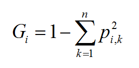

00:00:00-00:18:00 讲逻辑回归与Softmax的区别
00:18:00-  决策树

# 决策树 #

根据一棵对来做决策（以递归的方式进行分裂），所以叫【决策树】，可以做【分类】，也可以做【回归】。

【类别】只跟【叶子】节点有关，而【非叶子】结果是构成了树的结构。

【决策树】是【随机森林】的基本组件。

sklearn的决策树，默认是使用CART算法来进行分类。CART算法使用Gini系数来确定是否继续分裂。

Gini系数公式，如下：

01:20:00 我开始有点听不懂了

# 随机森林 #

01:27:00 随机森林
01:36:00 随机森林
01:48:00 听不懂了 

PCA 主成份分析

GDBT XBoost

