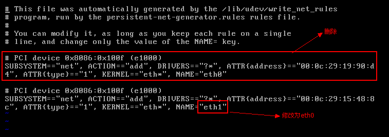
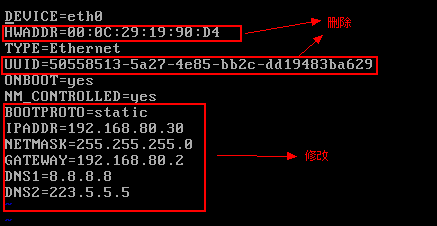
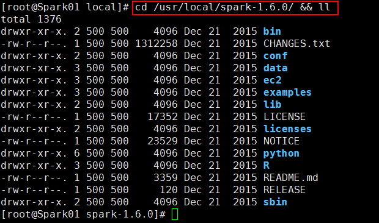
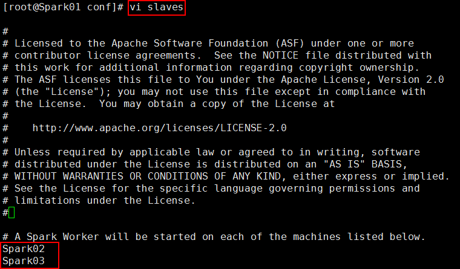
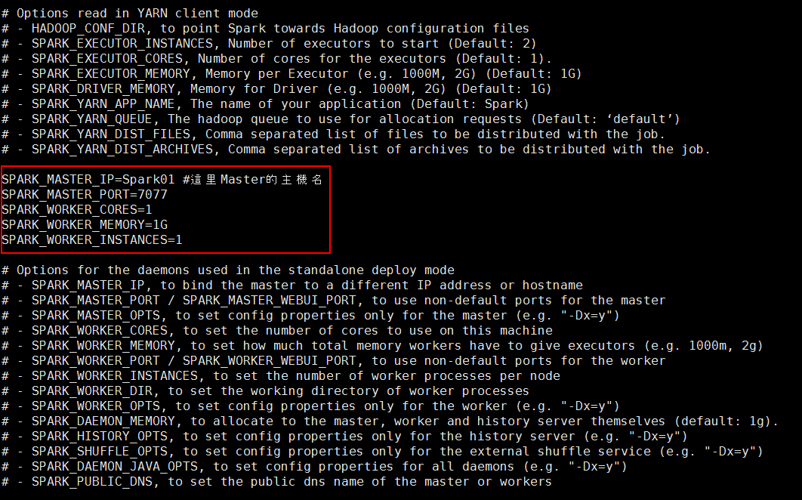
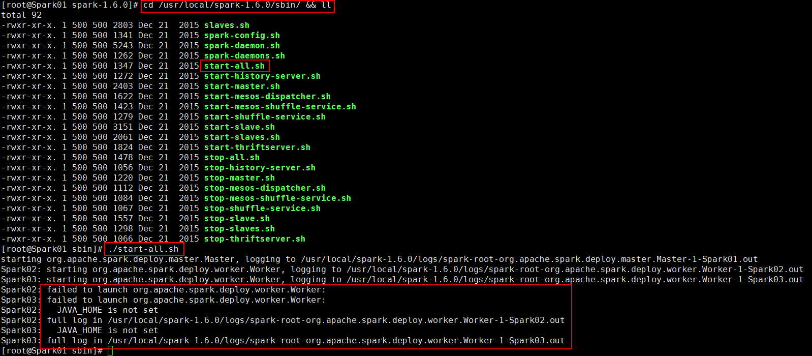
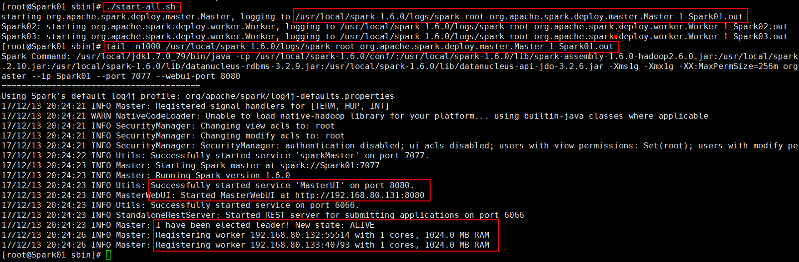
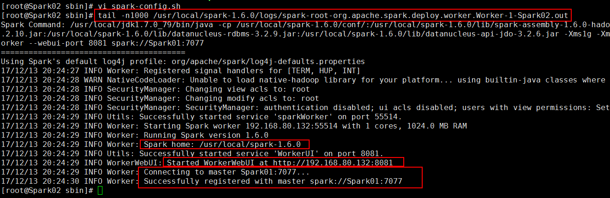
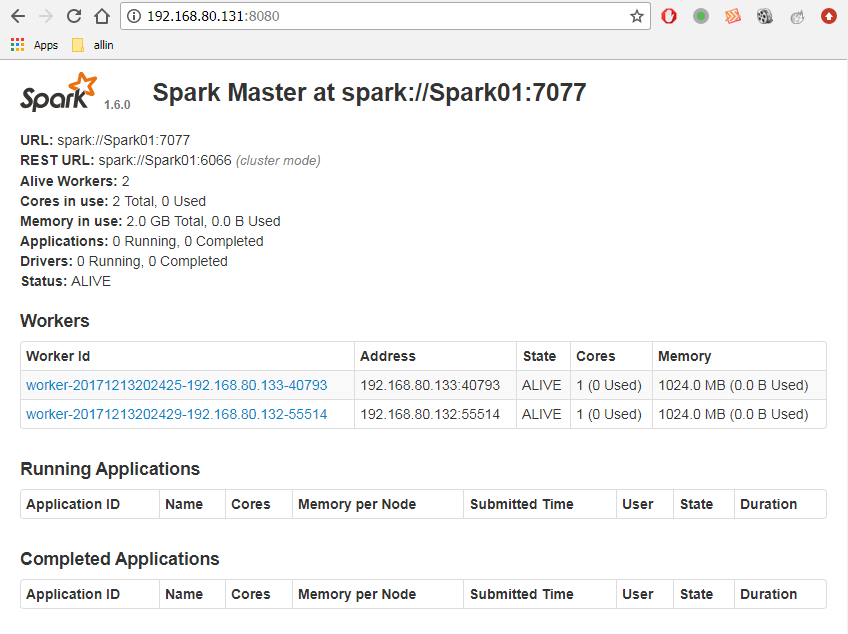

## 1、準備4臺虛擬機 ##

Spark01 192.168.80.131
Spark02 192.168.80.132
Spark03 192.168.80.133
Spark04 192.168.80.134

Spark01 手工安裝，Spark02、Spark03、Spark04克隆Spark01。
登錄用戶：root
登錄密碼：hadoop

### 1.1、Spark01:安裝Linux操作系統 ###

设置IP和子网掩码

	ifconfig eth0 192.168.80.131 netmask 255.255.255.0

设置网关

	route add default gw 192.168.80.2

使用ssh登录

	ssh root@192.168.80.131

輸入用戶名和密碼：

	root #用戶名
	hadoop #密碼

查看eth0的IP地址配置：

	cat /etc/sysconfig/network-scripts/ifcfg-eth0

文件`ifcfg-eth0`內容如下：

	DEVICE=eth0
	HWADDR=00:0C:29:B3:11:0A
	TYPE=Ethernet
	UUID=d4db0a0a-ba7a-40d0-bbfd-fe0657200d7c
	ONBOOT=no #需要修改為yes
	NM_CONTROLLED=yes
	BOOTPROTO=dhcp #需要修改為static

修改eth0的IP地址配置：

	vi /etc/sysconfig/network-scripts/ifcfg-eth0

修改后的內容如下：

	DEVICE=eth0
	HWADDR=00:0C:29:B3:11:0A
	TYPE=Ethernet
	UUID=d4db0a0a-ba7a-40d0-bbfd-fe0657200d7c
	ONBOOT=yes              #由no修改為yes
	NM_CONTROLLED=yes
	BOOTPROTO=static        #由dhcp修改為static
	IPADDR=192.168.80.131   #新增
	NETMASK=255.255.255.0   #新增
	GATEWAY=192.168.80.2    #新增
	DNS1=8.8.8.8            #新增
	DNS2=223.5.5.5          #新增

重新啟動網絡服務：

	service network restart

驗證網絡是否成功：

	ping www.baidu.com 
	#或者ping 網關
	ping 192.168.80.2

關機做快照

	shutdown -h now
	#快照名稱:ClearSystem
	#快照描述：root/hadoop

----------

网易开源镜像站：[http://mirrors.163.com/](http://mirrors.163.com/)  
网易开源镜像使用帮助：[http://mirrors.163.com/.help/](http://mirrors.163.com/.help/)

首先备份/etc/yum.repos.d/CentOS-Base.repo

	mv /etc/yum.repos.d/CentOS-Base.repo /etc/yum.repos.d/CentOS-Base.repo.backup

下载对应版本repo文件, 放入/etc/yum.repos.d/(操作前请做好相应备份)

- [CentOS7](http://mirrors.163.com/.help/CentOS7-Base-163.repo)
- [CentOS6](http://mirrors.163.com/.help/CentOS6-Base-163.repo)
- [CentOS5](http://mirrors.163.com/.help/CentOS5-Base-163.repo)

运行以下命令生成缓存

	yum clean all
	yum makecache

可以考慮安裝的一些軟件

	yum install -y wget
	yum install -y lrzsz
	yum install -y openssh-clients
	yum install -y tree
	yum install -y telnet

----------

### 1.2、Spark01:配置hosts文件+安裝JDK ###

#### 配置hosts ####

	#修改`/etc/hosts`文件
	vi /etc/hosts
	#添加如下內容：
	192.168.80.131 Spark01
	192.168.80.132 Spark02
	192.168.80.133 Spark03
	192.168.80.134 Spark04
	#測試一下hosts文件是否生效：
	ping Spark01

#### 安裝JDK ####

	#上傳文件
	mkdir -p /usr/local/software
	cd /usr/local/software && ll
	rz -y jdk-7u79-linux-x64.tar.gz
	#解壓文件
	tar -zxvf jdk-7u79-linux-x64.tar.gz -C /usr/local/
	cd /usr/local/ && ll
	#編輯/etc/profile
	vi /etc/profile
	#/etc/profile添加配置
	export JAVA_HOME=/usr/local/jdk1.7.0_79
	export PATH=$JAVA_HOME/bin:$PATH
	#重新加載/etc/profile
	source /etc/profile
	#驗證Java環境是否成功
	java -version

保存快照，快照名稱為`JDK`。

### 1.3、Spark02、Spark03、Spark04:克隆Spark01的JDK快照 ###

#### 修改主机名 ####

	#編輯/etc/sysconfig/network文件
	vi /etc/sysconfig/network
	#修改其中的`HOSTNAME`:
	NETWORKING=yes
	HOSTNAME=Spark02

#### 修改网卡地址 ####

	vi /etc/udev/rules.d/70-persistent-net.rules

具体修改如下：

#### 修改IP地址 ####

	vi /etc/sysconfig/network-scripts/ifcfg-eth0

具体修改如下：

最后，重启机器：  

	shutdown -r now

測試網絡是否申通

	ping Spark01
	ping Spark02
	ping Spark03
	ping Spark04

### 1.4、配置Spark01到Spark02、Spark03、Spark04的免密登錄 ###

#### Spark01生成密鈅對 ####

生成密鈅對命令：

	ssh-keygen -t rsa

输入后，会提示创建.ssh/id_rsa、id_rsa.pub的文件，其中第一个为密钥，第二个为公钥。过程中会要求输入密码，为了ssh访问过程无须密码，可以直接回车 。

补充说明：

	ssh-keygen:生成秘钥
	其中：
	  -t指定算法
	  -f 指定生成秘钥路径
	  -N 指定密码

查看钥匙

	cd /root/.ssh/ && ll

#### Spark01對Spark02、Spark03、Spark04實現免密登錄 ####

	ssh-copy-id root@192.168.80.132
	ssh root@Spark02
	ssh-copy-id root@192.168.80.133
	ssh root@Spark03
	ssh-copy-id root@192.168.80.134
	ssh root@Spark04

## 2、安裝Spark集群 ##

### 2.1、操作Spark01 ###

	#上傳文件
	cd /usr/local/software/ && ll
	rz -y spark-1.6.0-bin-hadoop2.6.tar
	#解壓文件
	tar -xvf spark-1.6.0-bin-hadoop2.6.tar -C /usr/local/
	cd /usr/local/ && ll
	#更改目錄名稱 
	mv spark-1.6.0-bin-hadoop2.6/ spark-1.6.0
	#查看spark目錄結構
	cd /usr/local/spark-1.6.0/ && ll

修改第1個配置文件

	#切換到conf目錄下
	cd conf/ && ll
	#拷貝一份slaves文件
	cp slaves.template slaves
	#修改slaves文件
	vi slaves
	#刪除localhost，添加如下內容：
	Spark02
	Spark03

修改第2個配置文件

	#拷貝文件
	cp spark-env.sh.template spark-env.sh
	#編輯文件
	vi spark-env.sh
	#添加如下內容：
	SPARK_MASTER_IP=Spark01 #這里Master的主機名
	SPARK_MASTER_PORT=7077
	SPARK_WORKER_CORES=1
	SPARK_WORKER_MEMORY=1G
	SPARK_WORKER_INSTANCES=1

### 2.2、將Spark01上的spark-1.6.0拷貝到Spark02、Spark03上 ###

	cd /usr/local/ && ll
	scp -r spark-1.6.0/ root@Spark02:$PWD
	scp -r spark-1.6.0/ root@Spark03:$PWD

### 2.3、啟動Spark集群 ###

首先關閉防火牆：同時操作Spark01、Spark02、Spark03

	#查看防火墙的运行状态
	service iptables status
	#关闭防火墙
	service iptables stop
	#关闭防火墙开机启动
	chkconfig iptables off
	#验证防火墙开机启动的状态
	chkconfig --list | grep iptables

接著，切換到Spark01上，并確保已經實現Spark01到Spark02、Spark03的免密登錄

	#切換到spark安裝目錄的sbin目錄下
	cd /usr/local/spark-1.6.0/sbin/ && ll
	#啟動spark集群
	./start-all.sh

可能通過以下命令到Spark02或Spark03上去查看日誌

	tail -n1000 /usr/local/spark-1.6.0/logs/spark-root-org.apache.spark.deploy.worker.Worker-1-Spark02.out

根據上面的提示`JAVA_HOME is not set`，需要在Spark02和Spark03（注意兩臺虛擬機都需要修改）的`$SPARK_HOME/sbin`目錄下的spark-config.sh文件后追加如下內容：

	export JAVA_HOME=/usr/local/jdk1.7.0_79 #指明安裝Java的路徑

再次回到Spark01上，啟動Spark集群

切換到Spark02上，查看啟動日誌：

### 2.4、Spark集群啟動驗證 ###

第一種驗證方式：使用jps命令。如果成功，將看Spark01上有Master的JVM進程，而Spark02和Spark03上有Worker的進程。

第二種方式：在瀏覽器打開如下地址：

	http://192.168.80.131:8080

呈現如下頁面：

注意，由於8080是一個tomcat的默認端口，而spark也使用了這個端口，我們可以通過修改spark的配置文件修改成其他的端口

	vi spark-env.sh
	SPARK_MASTER_WEBUI_PORT=8888

> 至此結束