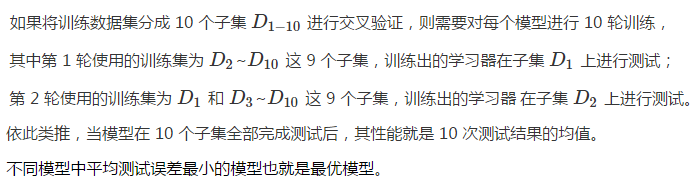
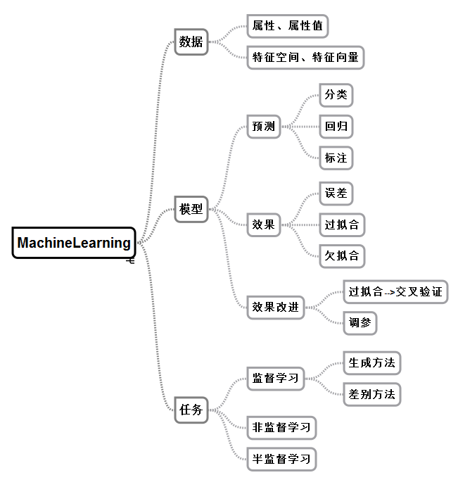

# 机器学习概论 #

## 人类学习与机器学习 ##

**人类学习机制**：从大量现象中提取反复出现的规律与模式。

这一过程在人工智能中的实现就是**机器学习**。

## 什么是机器学习 ##

从**形式化**角度定义，如果算法**利用某些经验**使自身在特定任务类上的**性能得到改善**，就可以说该算法实现了机器学习。而从**方法论**的角度看，机器学习是计算机**基于数据构建概率统计模型**并**运用模型对数据进行预测与分析**的学科。

机器学习可说是**从数据中来，到数据中去**。假设已有数据具有一定的统计特性，则不同的数据可以视为满足独立同分布的样本。**机器学习要做的就是根据已有的训练数据推导出描述所有数据的模型，并根据得出的模型实现对未知的测试数据的最优预测**。

> 段总结：数据-->模型-->预测

## 数据：属性、属性值、特征空间、特征向量 ##

在机器学习中，**数据**并非通常意义上的数量值，而是对于对象某些性质的描述。被描述的性质叫作**属性**，属性的取值称为**属性值**，不同的属性值有序排列得到的向量就是**数据**，也叫**实例**。

根据线性代数的知识，数据的不同**属性**之间可以视为相互独立，因而每个属性都代表了一个不同的**维度**，这些维度共同张成了**特征空间**。 每一组属性值的集合都是这个空间中的一个点，因而每个实例都可以视为特征空间中的一个向量，即**特征向量**。

> 段总结：属性-->维度-->特征空间（特征向量）

**需要注意的是**这里的特征向量不是和特征值对应的那个概念，而是指特征空间中的向量。根据特征向量对输入数据进行分类就能够得到输出。

## 模型划分：分类、回归、标注 ##

而在实际的机器学习任务中，输出的形式可能更加复杂。根据输入输出类型的不同，预测问题可以分为以下三类。

- 分类问题：输出变量为有限个离散变量，当个数为 2 时即为最简单的二分类问题；
- 回归问题：输入变量和输出变量均为连续变量；
- 标注问题：输入变量和输出变量均为变量序列。

## 模型效果：误差、过拟合、欠拟合 ##

在实际生活中，一个算法既不可能和所有训练数据符合得分毫不差，也不可能对所有测试数据预测得精确无误。因而**误差**性能就成为机器学习的重要指标之一。在机器学习中，**误差**被定义为**学习器的实际预测输出与样本真实输出之间的差异**。在分类问题中，常用的误差函数是错误率，即分类错误的样本占全部样本的比例。

> 段总结：什么是误差

**误差**可以进一步分为**训练误差**和**测试误差**两类。**训练误差**指的是学习器在训练数据集上的误差，也称经验误差；**测试误差**指的是学习器在新样本上的误差，也称泛化误差。**训练误差**描述的是**输入属性与输出分类之间的相关性**，能够判定给定的问题是不是一个容易学习的问题。**测试误差**则反映了**学习器对未知的测试数据集的预测能力**，是机器学习中的重要概念。实用的学习器都是测试误差较低，即在新样本上表现较好的学习器。

> 段总结：误差的分类

**学习器**依赖已知数据对真实情况进行拟合，即由学习器得到的模型要尽可能逼近真实模型，因此要**在训练数据集中尽可能提取出适用于所有未知数据的普适规律**。然而，一旦过于看重训练误差，一味追求预测规律与训练数据的符合程度，就会把训练样本自身的一些非普适特性误认为所有数据的普遍性质，从而**导致学习器泛化能力的下降**。**过拟合**出现的原因通常是学习时模型包含的参数过多，从而导致训练误差较低但测试误差较高。

> 段总结：误差-->泛化能力-->过拟合

与**过拟合**对应的是**欠拟合**。如果说造成过拟合的原因是学习能力太强，造成欠拟合的原因就是学习能力太弱，以致于训练数据的基本性质都没能学到。如果学习器的能力不足，甚至会把黑猩猩的图像误认为人，这就是欠拟合的后果。

> 段总结：过拟合-->反面-->欠拟合

## 模型效果改进：过拟合-->交叉验证 ##

在实际的机器学习中，**欠拟合可以通过改进学习器的算法克服，但过拟合却无法避免，只能尽量降低其影响**。由于训练样本的数量有限，因而具有有限个参数的模型就足以将所有训练样本纳入其中。可模型的参数越多，能与这个模型精确相符的数据也就越少，将这样的模型运用到无穷的未知数据当中，**过拟合的出现便不可避免**。更何况训练样本本身还可能包含一些噪声，这些随机的噪声又会给模型的精确性带来额外的误差。

整体来说，**测试误差**与**模型复杂度**之间呈现的是**抛物线的关系**。当模型复杂度较低时，测试误差较高；随着模型复杂度的增加，测试误差将逐渐下降并达到最小值；之后当模型复杂度继续上升时，测试误差会随之增加，对应着过拟合的发生。

在模型选择中，为了对测试误差做出更加精确的估计，一种广泛使用的方法是**交叉验证**。**交叉验证思想在于重复利用有限的训练样本，通过将数据切分成若干子集，让不同的子集分别组成训练集与测试集，并在此基础上反复进行训练、测试和模型选择，达到最优效果**。

## 模型效果改进：参数 ##

除了算法本身，**参数的取值**也是影响模型性能的重要因素，同样的学习算法在不同的参数配置下，得到的模型性能会出现显著的差异。因此，**调参**，也就是对算法参数进行设定，是机器学习中重要的工程问题，这一点在今天的神经网络与深度学习中体现得尤为明显。

## 机器学习任务：监督、非监督、半监督 ##

根据训练数据是否具有标签信息，可以将机器学习的任务分成以下三类。

- 监督学习：基于已知类别的训练数据进行学习；
- 无监督学习：基于未知类别的训练数据进行学习；
- 半监督学习：同时使用已知类别和未知类别的训练数据进行学习。

**监督学习**假定**训练数据满足独立同分布**的条件，并根据训练数据学习出一个由输入到输出的映射模型。反映这一映射关系的模型可能有无数种，**所有模型**共同构成了**假设空间**。**监督学习的任务就是在假设空间中根据特定的误差准则找到最优的模型**。

根据学习方法的不同，**监督学习**可以分为**生成方法**与**判别方法**两类。**生成方法**是根据输入数据和输出数据之间的联合概率分布确定条件概率分布 P(Y|X)，这种方法表示了输入 X 与输出 Y 之间的生成关系；**判别方法**则直接学习条件概率分布 P(Y|X) 或决策函数 f(X)，这种方法表示了根据输入 X 得出输出 Y 的预测方法。两相对比，**生成方法**具有更快的收敛速度和更广的应用范围，**判别方法**则具有更高的准确率和更简单的使用方式。

## 思维导图 ##

