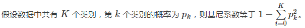
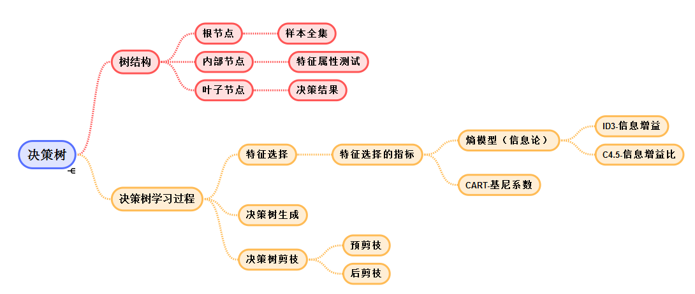

# 决策树 #

## 决策树介绍 ##

**决策树算法**是解决**分类问题**的另一种方法。与基于概率推断的朴素贝叶斯分类器和逻辑回归模型不同，决策树算法采用**树形结构**，使用层层推理来实现最终的分类。与贝叶斯分类器相比，决策树的优势在于构造过程无需使用任何先验条件，因而适用于探索式的知识发现。

> 段总结：分类问题-->决策树-->树形结构
> 决策树算法-->解决分类问题
> 决策树算法-->采用“树形”结构

## 决策树结构 ##

**决策树**是一个包含**根节点**、**内部节点**和**叶节点**的树结构，其**根节点**包含**样本全集**，**内部节点**对应**特征属性测试**，**叶节点**则代表**决策结果**。从根节点到每个叶节点的每条路径都对应着一个从数据到决策的判定流程。使用决策树进行决策的过程就是从根节点开始，测试待分类项的特征属性，并按照其值选择输出的内部节点。当选择过程持续到到达某个叶节点时，就将该叶节点存放的类别作为决策结果。

> 段总结：决策树结构：根节点、内部节点、叶节点
> 根节点-->样本全集
> 内部节点-->特征属性测试
> 叶节点-->决策结果

由于**决策树**是基于**特征**对实例进行分类的，因而其学习的本质是**从训练数据集中归纳出一组用于分类的**“如果...... 那么......”**规则**。在学习的过程中，这组规则集合既要在训练数据上有较高的符合度，也要具备良好的泛化能力。**决策树模型的学习过程**包括三个步骤：**特征选择、决策树生成和决策树剪枝**。

## 决策依据：特征 ##

**特征选择**决定了使用**哪些特征**来划分**特征空间**。在训练数据集中，每个样本的属性可能有很多个，在分类结果中起到的作用也有大有小。因而**特征选择的作用在于筛选出**与分类结果相关性较高，也就是**分类能力较强的特征**。理想的特征选择是在每次划分之后，分支节点所包含的样本都尽可能属于同一个类别。

在特征选择中通常使用的准则是**信息增益**。机器学习中的信息增益就是通信理论中的互信息，是信息论的核心概念之一。**信息增益描述的是在已知特征后对数据分类不确定性的减少程度，因而特征的信息增益越大，得到的分类结果的不确定度越低，特征也就具有越强的分类能力**。根据信息增益准则选择特征的过程，就是自顶向下进行划分，在每次划分时计算每个特征的信息增益并选取最大值的过程。信息增益的计算涉及信源熵和条件熵的公式。

在最早提出的决策树算法——**ID3 算法**中，决策树的生成就利用**信息增益**准则选择特征。ID3 算法构建决策树的具体方法是从根节点出发，对节点计算所有特征的信息增益，选择信息增益最大的特征作为节点特征，根据该特征的不同取值建立子节点；对每个子节点都递归调用以上算法生成新的子节点，直到信息增益都很小或没有特征可以选择为止。

ID3 算法使用的是信息增益的绝对取值，而信息增益的运算特性决定了当属性的可取值数目较多时，其信息增益的绝对值将大于取值较少的属性。这样一来，如果在决策树的初始阶段就进行过于精细的分类，其泛化能力就会受到影响，无法对真实的实例做出有效预测。

为了避免信息增益准则对多值属性的偏好，ID3 算法的提出者在其基础上提出了改进版，也就是 C4.5 算法。**C4.5 算法**不是直接使用信息增益，而是引入“**信息增益比**”指标作为最优划分属性选择的依据。信息增益比等于使用属性的特征熵归一化后的信息增益，而每个属性的特征熵等于按属性取值计算出的信息熵。在特征选择时，C4.5 算法先从候选特征中找出信息增益高于平均水平的特征，再从中选择增益率最高的作为节点特征，这就保证了对多值属性和少值属性一视同仁。在决策树的生成上，C4.5 算法与 ID3 算法类似。

无论是 ID3 算法还是 C4.5 算法，都是基于信息论中**熵模型**的指标实现特征选择，因而涉及大量的**对数计算**。另一种主要的决策树算法 **CART 算法**则用**基尼系数**取代了熵模型。

CART 算法的全称是分类与回归树（Classification and Regression Tree），既可以用于分类也可以用于回归。

**基尼系数**在与**熵模型**高度近似的前提下，避免了**对数运算**的使用，使得 **CART 分类树具有较高的执行效率**。

为了进一步简化分类模型，**CART 分类树算法**每次只对某个特征的值进行**二分**而非多分，最终生成的就是**二叉树模型**。因而在计算基尼系数时，需要对每个特征找到使基尼系数最小的最优切分点，在树生成时根据最优特征和最优切分点生成两个子节点，将训练数据集按照特征分配到子节点中去。

> 段总结：CART算法是进行二分。

## 决策树过拟合：剪枝 ##

同其他机器学习算法一样，**决策树**也难以克服**过拟合**的问题，**“剪枝”是决策树对抗过拟合的主要手段**。

园丁给树苗剪枝是为了让树形完好，**决策树剪枝**则是通过**主动去掉分支**以**降低过拟合**的风险，**提升模型的泛化性能**。

**那么如何判定泛化性能的提升呢**？其方法是定义**决策树整体的损失函数**并使之极小化，这等价于使用正则化的最大似然估计进行模型选择。另一种更简单的方法是在训练数据集中取出一部分用于模型验证，**根据验证集分类精度**的变化决定是否进行剪枝。

**决策树的剪枝策略**可以分为**预剪枝**和**后剪枝**。

**预剪枝**是指在决策树的生成过程中，在划分前就对每个节点进行估计，如果当前节点的划分不能带来泛化性能的提升，就直接将当前节点标记为叶节点。

预剪枝的好处在于禁止欠佳节点的展开，在降低过拟合风险的同时显著减少了决策树的时间开销。但它也会导致“误伤”的后果，某些分支虽然当前看起来没用，在其基础上的后续划分却可能让泛化性能显著提升，预剪枝策略将这些深藏不露的节点移除，无疑会矫枉过正，带来欠拟合的风险。

相比之下，**后剪枝策略**是先从训练集生成一棵完整的决策树，计算其在验证集上的分类精度，再在完整决策树的基础上剪枝，通过比较剪枝前和剪枝后的分类精度决定分支是否保留。和预剪枝相比，后剪枝策略通常可以保留更多的分支，其欠拟合的风险较小。但由于需要逐一考察所有内部节点，因而其训练开销较大。

以上的决策树算法虽然结构上简单直观，逻辑上容易解释，但一个重要缺点是“一言堂”，即只依据一个最优特征执行分类决策。

在实际问题中，分类结果通常会受到多个因素的影响，因而需要**对不同特征综合考虑**。依赖**多个特征**进行分类决策的就是**多变量决策树**。在特征空间上，**单变量决策树**得到的分类边界是**与坐标轴平行的分段**，**多变量决策树**的分类边界则是**斜线**的形式。受篇幅所限，关于多变量决策树的内容在此不做赘述。

## 思维导图 ##

