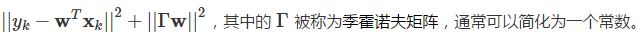

# 线性回归 #

数学中的线性模型可谓“简约而不简单”：它既能体现出重要的基本思想，又能构造出功能更加强大的非线性模型。在机器学习领域，线性回归就是这样一类基本的任务，它应用了一系列影响深远的数学工具。

> 段总结：这一段好像什么也没有说

在数理统计中，**回归分析**是确定多种变量间相互依赖的定量关系的方法。线性回归**假设**输出变量是若干输入变量的**线性组合**，并根据这一关系求解线性组合中的最优系数。在众多回归分析的方法里，线性回归模型最易于拟合，其估计结果的统计特性也更容易确定，因而得到广泛应用。而在机器学习中，回归问题隐含了输入变量和输出变量**均可连续取值**的**前提**，因而利用线性回归模型可以对任意输入给出对输出的估计。

> 段总结：线性回归假设，输出变量是若干输入变量的线性组合，并根据这一关系求解线性组合中的最优系数。
> 段总结：线性回归前提，回归问题隐含了输入变量和输出变量均可连续取值的前提。

## 线性回归的学习模型 ##

当实例只有一个属性时，输入和输出之间的关系就是二维平面上的一条直线；当实例的属性数目较多时，线性回归得到的就是 n 维空间上的一个超平面，对应一个维度等于 n - 1 的线性子空间。

## 线性模型的优化：误差-->最小二乘法 ##

## 线性模型优化：为什么要使用最小二乘法（均方误差） ##

说到这里，问题就来了：凭什么使均方误差最小化的参数就是和训练样本匹配的最优模型呢？

## 线性模型优化：过拟合-->正则化 ##

在理想的情况下，多元线性回归的最优参数为

但不论采用怎样的选取标准，存在多个最优解都是无法改变的事实，这也意味着**过拟合**的产生。更重要的是，在过拟合的情形下，微小扰动给训练数据带来的毫厘之差可能会导致训练出的模型谬以千里，模型的稳定性也就无法保证。

要解决过拟合问题，常见的做法是**正则化**，即添加额外的惩罚项。在线性回归中，正则化的方式根据其使用惩罚项的不同可以分为两种，分别是“**岭回归**”和“**LASSO 回归**”。

在机器学习中，岭回归方法又被称为“参数衰减”，于 20 世纪 40 年代由前苏联学者安德烈·季霍诺夫提出。当然，彼时机器学习尚未诞生，季霍诺夫提出这一方法的主要目的是解决矩阵求逆的稳定性问题，其思想后来被应用到正则化中，形成了今天的岭回归。**岭回归实现正则化的方式是在原始均方误差项的基础上添加一个待求解参数的二范数项**，即最小化的对象变为

从最优化的角度看，二范数惩罚项的作用在于**优先选择范数较小的 w**，这相当于在最小均方误差之外额外添加了一重关于最优解特性的约束条件，将最优解限制在高维空间内的一个球里。**岭回归的作用**相当于在原始最小二乘的结果上做了缩放，虽然最优解中每个参数的贡献被削弱了，但参数的数目并没有变少。

**LASSO 回归**的全称是“最小绝对缩减和选择算子”（Least Absolute Shrinkage and Selection Operator），由加拿大学者罗伯特·提布什拉尼于 1996 年提出。与岭回归不同的是，LASSO 回归选择了待求解参数的一范数项作为惩罚项，即最小化的对象变为

与岭回归相比，**LASSO 回归的特点**在于稀疏性的引入。它降低了最优解 w 的维度，也就是将一部分参数的贡献削弱为 0，这就使得 w 中元素的数目大大小于原始特征的数目。

**岭回归**和 **LASSO 回归**也可以从**概率的视角**进行阐释：**岭回归**是在 w 满足**正态先验分布**的条件下，用最大后验概率进行估计得到的结果；**LASSO 回归**是在 w 满足**拉普拉斯先验分布**的条件下，用最大后验概率进行估计得到的结果。

但无论岭回归还是 LASSO 回归，其作用都是**通过惩罚项的引入抑制过拟合现象，以训练误差的上升为代价，换取测试误差的下降**。将以上两种方法的思想结合可以得到新的优化方法，在此就不做赘述了。

## 思维导图 ##

