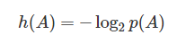
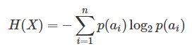
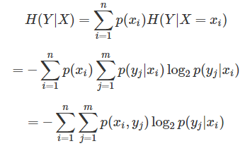
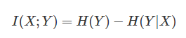
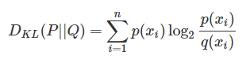
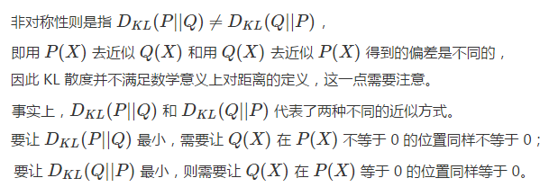
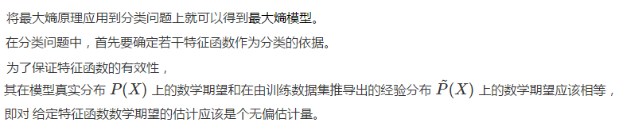
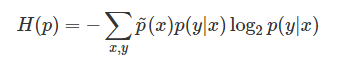
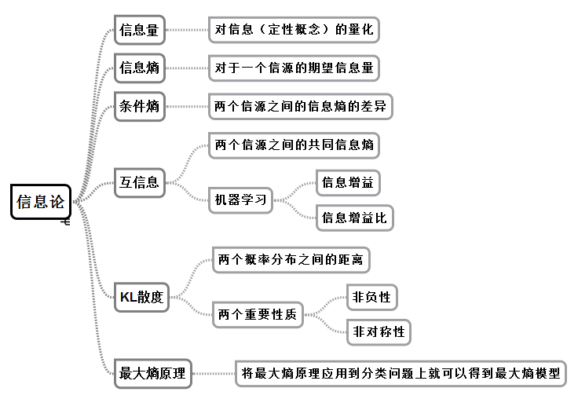

# 信息论 #

## 信息论的诞生 ##

近年来的科学研究不断证实，不确定性才是客观世界的本质属性。**不确定性的世界**只能使用**概率模型**来描述，正是对**概率**的刻画促成了**信息论**的诞生。

> 段总结：不确定世界-->概率-->信息论

1948 年，供职于美国贝尔实验室的物理学家克劳德·香农发表了著名论文《通信的数学理论》（A Mathematical Theory of Communication），给出了对**信息**这一**定性概念**的**定量分析**方法，标志着**信息论**作为一门学科的正式诞生。

> 段总结：信息（定性概念）-->定量分析

## 信息论：信息熵 ##

信息论使用“**信息熵**”的概念，对**单个信源的信息量**和通信中传递信息的数量与效率等问题做出了解释，并在**世界的不确定性**和**信息的可测量性**之间搭建起一座桥梁。

> 段总结：信息论-->信息熵-->定量分析-->单个信源的信息量

香农对**信息的量化**正是基于以上的思路，他定义了“**熵**”这一信息论中最基本最重要的概念。“熵”这个词来源于另一位百科全书式的科学家约翰·冯诺伊曼，他的理由是没人知道熵到底是什么。虽然这一概念已经在热力学中得到了广泛使用，但直到引申到信息论后，**熵的本质**才被解释清楚，即**一个系统内在的混乱程度**。

> 段总结：熵的本质是一个系统内在的混乱程度。

在信息论中，如果事件 A 发生的概率为 p(A)，则**这个事件**的**自信息量**的定义为

> 段总结：单个事件的信息量

如果国足闯进世界杯决赛圈，1:1000 的夺冠赔率是个很乐观的估计，用这个赔率计算出的信息量约为 10 比特；而国乒夺冠的赔率不妨设为 1:2，即使在这样高的赔率下，事件的信息量也只有 1 比特。两者之间的差距正是其可能性相差悬殊的体现。

> 段总结：举个例子，利用上面公式计算信息量，单位为比特。

根据**单个事件的自信息量**可以计算**包含多个符号的信源的信息熵**。信源的信息熵是信源可能发出的各个符号的自信息量在信源构成的概率空间上的统计平均值。如果一个离散信源 X 包含 n 个符号，每个符号 ai 的概率取值为 p(ai)，则 X 的信源熵为

> 段总结：信息熵，是信源（多个事件）概率空间上的统计平均值。

**信源熵**描述了**信源**每发送一个符号所提供的**平均信息量**，是信源总体信息测度的均值。当信源中的每个符号的取值概率相等时，信源熵取到最大值 log2n（log以2为底，n的对数），意味着信源的随机程度最高。

> 段总结：信源熵描述了信源每发送一个符号所提供的平均信息量，是信源总体信息测度的均值。

## 信息论：条件熵 ##

在**概率论**中，有**条件概率**的概念，将**条件概率**扩展到**信息论**中，就可以得到**条件熵**。如果**两个信源**之间具有相关性，那么在已知其中一个信源 X 的条件下，另一个信源 Y 的信源熵就会减小。条件熵 H(Y|X) 表示的是在已知随机变量 X 的条件下另一个随机变量 Y 的不确定性，也就是在给定 X 时，根据 Y 的条件概率计算出的熵再对 X 求解数学期望：

> 段总结：条件熵，描述的是两个具有相关性的信源之间的信息不确定性。

条件熵的意义在于先按照变量 X 的取值对变量 Y 进行了一次分类，对每个分出来的类别计算其单独的信息熵，再将每个类的信息熵按照 X 的分布计算其数学期望。

以上课为例，学生在教室中可以任意选择座位，那么可能出现的座位分布会很多，其信源熵也就较大。如果对座位的选择添加一个限制条件，比如男生坐左边而女生坐右边，虽然左边的座位分布和右边的座位分布依然是随机的，但相对于未加限制时的情形就会简单很多。这就是分类带来的不确定性的下降。

## 信息论：互信息 和 机器学习：信息增益 ##

定义了**条件信息熵**后，就可以进一步得到**互信息**的概念

**互信息**等于 Y 的信源熵减去已知 X 时 Y 的条件熵，即由 X 提供的关于 Y 的不确定性的消除，也可以看成是 X 给 Y 带来的信息增益。**互信息**这个名称在**通信领域**经常使用，**信息增益**则在**机器学习**领域中经常使用，两者的本质是一样的。

> 段总结：互信息（通信领域）==信息增益（机器学习）

在机器学习中，**信息增益**常常被用于**分类特征的选择**。对于给定的训练数据集 Y，H(Y) 表示在未给定任何特征时，对训练集进行分类的不确定性；H(Y|X) 则表示了使用特征 X 对训练集 Y 进行分类的不确定性。信息增益表示的就是特征 X 带来的对训练集 Y 分类不确定性的减少程度，也就是特征 X 对训练集 Y 的区分度。

> 段总结：信息增益表示的就是特征 X 带来的对训练集 Y 分类不确定性的减少程度

显然，**信息增益更大的特征具有更强的分类能力**。但信息增益的值很大程度上依赖于数据集的信息熵 H(Y)，因而并不具有绝对意义。为解决这一问题，研究者又提出了**信息增益比**的概念，并将其定义为 g(X,Y)=I(X;Y)/H(Y)。

> 段总结：信息增益-->信息增益比

## 信息论和机器学习：KL散度 ##

另一个在**机器学习**中经常使用的**信息论概念**叫作“**Kullback-Leibler 散度**”，简称**KL 散度**。KL 散度是描述两个概率分布 P 和 Q 之间的差异的一种方法，其定义为

KL 散度是对额外信息量的衡量。给定一个信源，其符号的概率分布为 P(X)，就可以设计一种针对 P(X) 的最优编码，使得表示该信源所需的平均比特数最少（等于该信源的信源熵）。

可是当信源的符号集合不变，而符合的概率分布变为 Q(X) 时，再用概率分布 P(X) 的最优编码对符合分布 Q(X) 的符号编码，此时编码结果的字符数就会比最优值多一些比特。

**KL 散度**就是用来衡量这种情况下平均每个字符多用的比特数，也可以表示**两个分布之间的距离**。

**KL 散度**的两个重要性质是**非负性**和**非对称性**。**非负性**是指 KL 散度是大于或等于 0 的，等号只在两个分布完全相同时取到。

## 信息论：最大熵原理 ##

除了以上定义的指标之外，信息论中还有一个重要定理，叫作“**最大熵原理**”。最大熵原理是确定随机变量统计特性时力图最符合客观情况的一种准则。**对于一个未知的概率分布，最坏的情况就是它以等可能性取到每个可能的取值。这个时候的概率分布最均匀，也就是随机变量的随机程度最高，对它进行预测也就最困难。**

从这个角度看，**最大熵原理的本质**在于**在推断未知分布时不引入任何多余的约束和假设，因而可以得到最不确定的结果，预测的风险也就最小**。投资理财中的名言“不要把所有鸡蛋放在同一个篮子里”，就可以视为最大熵原理的一个实际应用。

这样一来，每一个**特征函数**就对应了一个**约束条件**。**分类的任务就是在这些约束条件下，确定一个最好的分类模型**。由于除了这些约束条件之外，没有任何关于分类的先验知识，因而需要利用最大熵原理，求解出不确定性最大的条件分布，即让以下函数的取值最大化

式中的 p(y|x) 就是分类问题要确定的目标条件分布。计算上式的最大值实质上就是一个约束优化问题，由特征函数确定的约束条件可以通过拉格朗日乘子的引入去除其影响，转化为无约束优化问题。从数学上可以证明，这个模型的解是存在且唯一的。

## 思维导图 ##

