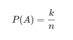

# 概率论 #

除了线性代数之外，概率论（probability theory）也是人工智能研究中必备的数学基础。同线性代数一样，概率论也代表了一种看待世界的方式，其关注的焦点是无处不在的可能性。对随机事件发生的可能性进行规范的数学描述就是概率论的公理化过程。概率的公理化结构体现出的是对概率本质的一种认识。

## 概率论：概率的度量 ##

### 古典概率：单个随机事件 ###

将同一枚硬币抛掷 10 次，其正面朝上的次数既可能一次没有，也可能全部都是，换算成频率就分别对应着 0% 和 100%。频率本身显然会随机波动，但随着重复试验的次数不断增加，特定事件出现的频率值就会呈现出稳定性，逐渐趋近于某个常数。

从事件发生的频率认识概率的方法被称为“频率学派”（frequentist probability），频率学派口中的“概率”，其实是一个可独立重复的随机实验中单个结果出现频率的极限。因为稳定的频率是统计规律性的体现，因而通过大量的独立重复试验计算频率，并用它来表征事件发生的可能性是一种合理的思路。

在概率的定量计算上，频率学派依赖的基础是古典概率模型。在古典概率模型中，试验的结果只包含有限个基本事件，且每个基本事件发生的可能性相同。如此一来，假设所有基本事件的数目为 n，待观察的随机事件 A 中包含的基本事件数目为 k，则古典概率模型下事件概率的计算公式为

从这一基本公式就可以推导出复杂的随机事件的概率。

### 条件概率：两个随机事件 ###

前文中的概率定义针对都是单个随机事件，可如果要刻画两个随机事件之间的关系，这个定义就不够看了。在一场足球比赛中，球队 1:0 取胜和在 0:2 落后的情况下 3:2 翻盘的概率显然是不一样的。这就需要引入**条件概率**的概念。

条件概率（conditional probability）是根据已有信息对样本空间进行调整后得到的新的概率分布。假定有两个随机事件 A 和 B，条件概率就是指事件 A 在事件 B 已经发生的条件下发生的概率，用以下公式表示

上式中的 P(AB) 称为联合概率（joint probability），表示的是 A 和 B 两个事件共同发生的概率。如果联合概率等于两个事件各自概率的乘积，即 P(AB)=P(A)⋅P(B)，说明这两个事件的发生互不影响，即两者相互独立。对于相互独立的事件，条件概率就是自身的概率，即 P(A|B)=P(A)。

### 全概率：多个随机事件 ###

基于条件概率可以得出全概率公式（law of total probability）。全概率公式的作用在于将复杂事件的概率求解转化为在不同情况下发生的简单事件的概率求和，即

全概率公式代表了频率学派解决概率问题的思路，即先做出一些假设（P(Bi)），再在这些假设下讨论随机事件的概率（P(A|Bi)）。

### 逆概率：多个随机事件，结果-->原因 ###

对全概率公式稍作整理，就演化出了求解“逆概率”这一重要问题。所谓“逆概率”解决的是在事件结果已经确定的条件下（P(A)），推断各种假设发生的可能性（P(Bi|A)）。由于这套理论首先由英国牧师托马斯·贝叶斯提出，因而其通用的公式形式被称为贝叶斯公式：

式中的 P(H) 被称为**先验概率**（prior probability），即预先设定的假设成立的概率；P(D|H) 被称为**似然概率**（likelihood function），是在假设成立的前提下观测到结果的概率；P(H|D) 被称为**后验概率**（posterior probability），即在观测到结果的前提下假设成立的概率。

从科学研究的方法论来看，贝叶斯定理提供了一种全新的逻辑。它**根据观测结果寻找合理的假设**，或者说**根据观测数据寻找最佳的理论解释，其关注的焦点在于后验概率**。概率论的贝叶斯学派（Bayesian probability）正是诞生于这种理念。

在**贝叶斯学派**眼中，**概率描述的是随机事件的可信程度**。如果手机里的天气预报应用给出明天下雨的概率是 85%，这就不能从频率的角度来解释了，而是意味着明天下雨这个事件的可信度是 85%。

## 两个学派：频率学派和贝叶斯学派 ##

**频率学派**认为假设是客观存在且不会改变的，即**存在固定的先验分布，只是作为观察者的我们无从知晓。因而在计算具体事件的概率时，要先确定概率分布的类型和参数，以此为基础进行概率推演**。

相比之下，**贝叶斯学派**则认为**固定的先验分布是不存在的，参数本身也是随机数**。换言之，**假设本身取决于观察结果，是不确定并且可以修正的**。数据的作用就是对假设做出不断的修正，使观察者对概率的主观认识更加接近客观实际。

概率论是线性代数之外，人工智能的另一个理论基础，多数机器学习模型采用的都是基于概率论的方法。但由于实际任务中可供使用的训练数据有限，因而需要对概率分布的参数进行估计，这也是机器学习的核心任务。

**概率的估计有两种方法**：**最大似然估计法**（maximum likelihood estimation）和**最大后验概率法**（maximum a posteriori estimation），两者分别体现出频率学派和贝叶斯学派对概率的理解方式。

**最大似然估计法的思想**是使训练数据出现的概率最大化，依此确定概率分布中的未知参数，估计出的概率分布也就最符合训练数据的分布。**最大后验概率法的思想**则是根据训练数据和已知的其他条件，使未知参数出现的可能性最大化，并选取最可能的未知参数取值作为估计值。在**估计参数**时，**最大似然估计法**只需要使用训练数据，**最大后验概率法**除了数据外还需要额外的信息，就是贝叶斯公式中的先验概率。

从理论的角度来说，频率学派和贝叶斯学派各有千秋，都发挥着不可替代的作用。但具体到人工智能这一应用领域，基于贝叶斯定理的各种方法与人类的认知机制吻合度更高，在机器学习等领域中也扮演着更加重要的角色。

## 随机变量 ##

### 离散型随机变量和连续型随机变量 ###

概率论的一个重要应用是描述**随机变量**（random variable）。根据取值空间的不同，随机变量可以分成两类：**离散型随机变量**（discrete random variable）和**连续型随机变量**（continuous random variable）。在实际应用中，需要对随机变量的每个可能取值的概率进行描述。

### 概率质量函数和概率密度函数 ###

离散变量的每个可能的取值都具有大于 0 的概率，取值和概率之间一一对应的关系就是离散型随机变量的分布律，也叫**概率质量函数**（probability mass function）。概率质量函数在连续型随机变量上的对应就是**概率密度函数**（probability density function）。

需要说明的是，**概率密度函数**体现的并非连续型随机变量的真实概率，而是**不同取值可能性之间的相对关系**。对连续型随机变量来说，其可能取值的数目为不可列无限个，当归一化的概率被分配到这无限个点上时，每个点的概率都是个无穷小量，取极限的话就等于零。而概率密度函数的作用就是对这些无穷小量加以区分。虽然在 x→∞ 时，1/x 和 2/x 都是无穷小量，但后者永远是前者的 2 倍。这类**相对意义**而非绝对意义上**的差别**就可以被**概率密度函数**所刻画。对**概率密度函数进行积分，得到的才是连续型随机变量的取值落在某个区间内的概率**。

### 重要分布 ###

定义了概率质量函数与概率密度函数后，就可以给出一些重要分布的特性。重要的**离散分布**包括两点分布、二项分布和泊松分布，重要的**连续分布**则包括均匀分布、指数分布和正态分布。

### 数字特征 ###

除了概率质量函数 / 概率密度函数之外，另一类描述随机变量的参数是其**数字特征**。数字特征是用于刻画随机变量某些特性的常数，包括数学期望（expected value）、方差（variance）和协方差（covariance）。

**数学期望**即均值，体现的是随机变量可能取值的加权平均，即根据每个取值出现的概率描述作为一个整体的随机变量的规律。**方差**表示的则是随机变量的取值与其数学期望的偏离程度。方差较小意味着随机变量的取值集中在数学期望附近，方差较大则意味着随机变量的取值比较分散。

数学期望和方差描述的都是**单个随机变量**的数字特征，如果要描述**两个随机变量**之间的相互关系，就需要用到**协方差**和**相关系数**。协方差度量了两个随机变量之间的线性相关性，即变量 Y 能否表示成以另一个变量 X 为自变量的 aX+b 的形式。

根据协方差可以进一步求出相关系数（correlation coefficient），相关系数是一个绝对值不大于 1 的常数，它等于 1 意味着两个随机变量满足完全正相关，等于 -1 意味着两者满足完全负相关，等于 0 则意味着两者不相关。需要说明的是，无论是协方差还是相关系数，刻画的都是线性相关的关系。如果随机变量之间的关系满足 Y=X^2，这样的非线性相关性就超出了协方差的表达能力。

## 思维导图 ##

