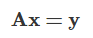

# 线性代数 #

## 线性代数与人工智能 ##

**线性代数**是**人工智能**的基础。

**线性代数的核心意义**在于提供了⼀种看待世界的抽象视角：万事万物都可以被抽象成**某些特征的组合**，并在由预置规则定义的框架之下以静态和动态的方式加以观察。

## 线性代数和集合 ##

**线性代数**中最基本的概念是**集合**。在数学上，集合的定义是由某些特定对象汇总而成的集体。集合中的元素通常会具有某些共性，因而可以用这些共性来表示。对于集合 { 苹果，橘子，梨 } 来说， 所有元素的共性是它们都是水果；对于集合 {牛，马，羊} 来说，所有元素的共性是它们都是动物。

在线性代数中，由单独的数 a 构成的元素被称为**标量**：一个标量 a 可以是整数、实数或复数。如果多个标量 a1,a2,⋯,an 按一定顺序组成一个序列，这样的元素就被称为**向量**。显然，向量可以看作标量的扩展。原始的一个数被替代为一组数，从而带来了**维度的增加**，给定表示索引的下标才能唯一地确定向量中的元素。

> 段总结：标量-->集合-->向量

每个向量都由若干标量构成，如果将向量的所有标量都替换成相同规格的向量，得到的就是如下的**矩阵**:

> 段总结：向量-->集合-->矩阵

相对于**向量**，**矩阵**同样代表了维度的增加，矩阵中的每个元素需要使用两个索引（而非一个）确定。同理，如果将矩阵中的每个标量元素再替换为向量的话，得到的就是**张量**。直观地理解，**张量就是高阶的矩阵**。如果把三阶魔方的每一个小方块看作一个数，它就是个 3×3×3 的张量，3×3 的矩阵则恰是这个魔方的一个面，也就是张量的一个切片。相比于向量和矩阵，张量是更加复杂，直观性也更差的概念。

> 段总结：向量-->矩阵-->张量

在计算机存储中，**标量**占据的是**零维数组**；**向量**占据的是**一维数组**，例如语音信号；**矩阵**占据的是**二维数组**，例如灰度图像；**张量**占据的是**三维乃至更高维度的数组**，例如 RGB 图像和视频。

> 段总结：从计算机存储的角度，来看待标量、向量、矩阵、张量。

## 向量：范数和内积 ##

描述作为数学对象的**向量**需要有**特定的数学语言**，**范数**和**内积**就是代表。**范数**是对单个向量大小的度量，描述的是向量自身的性质，其作用是将向量映射为一个非负的数值。

**范数**计算的是单个向量的尺度，**内积**计算的则是两个向量之间的关系。两个相同维数向量内积的表达式为

即对应元素乘积的求和。内积能够表示两个向量之间的相对位置，即向量之间的夹角。

在二维空间上，这意味着两个向量的夹角为 90 度，即相互垂直。而在高维空间上，这种关系被称为**正交**。如果两个向量正交，说明他们线性无关，相互独立，互不影响。

在实际问题中，向量的意义不仅是某些数字的组合，更可能是某些对象或某些行为的特征。范数和内积能够处理这些表示特征的数学模型，进而提取出原始对象或原始行为中的隐含关系。

## 向量：线性空间和内积空间 ##

如果有一个集合，它的元素都是具有相同维数的向量（可以是有限个或无限个）， 并且定义了加法和数乘等结构化的运算，这样的集合就被称为**线性空间**，定义了内积运算的线性空间则被称为**内积空间**。

在**线性空间**中，任意一个向量代表的都是 n 维空间中的一个点；反过来， 空间中的任意点也都可以唯一地用一个向量表示。两者相互等效。

> 段总结：在线性空间中，向量和空间点的一一对应关系。

在**线性空间**上点和向量的相互映射中，一个关键问题是**参考系**的选取。在现实生活中，只要给定经度、纬度和海拔高度，就可以唯一地确定地球上的任何一个位置，因而经度值、纬度值、高度值构成的三维向量 (x, y, h) 就对应了三维物理空间中的⼀个点。可是在直觉无法感受的高维空间中，坐标系的定义可就没有这么直观了。要知道，人工神经网络要处理的通常是数以万计的特征，对应着维度同样数以万计的复杂空间，这时就需要**正交基**的概念了。

> 段总结：线性空间-->参考系-->正交基

在**内积空间**中，一组两两正交的向量构成这个空间的**正交基**，假若正交基中基向量的 L2 范数都是单位长度 1，这组正交基就是**标准正交基**。**正交基的作用**就是给内积空间定义出经纬度。⼀旦描述内积空间的正交基确定了，向量和点之间的对应关系也就随之确定。

> 段总结：线性空间，需要正交基（参考系），而正交基是由内积来确定的。

值得注意的是，**描述内积空间的正交基并不唯一**。对二维空间来说，平面直角坐标系和极坐标系就对应了两组不同的正交基，也代表了两种实用的描述方式。

## 矩阵：线性空间的变化 ##

**线性空间**的一个重要特征是**能够承载变化**。当作为参考系的标准正交基确定后，空间中的点就可以用向量表示。当这个点从一个位置移动到另一个位置时，描述它的向量也会发生改变。点的变化对应着向量的线性变换，而描述对象变化抑或向量变换的数学语言，正是**矩阵**。

> 段总结：线性空间-->承载变化-->矩阵

**在线性空间中，变化的实现有两种方式**：一是**点本身的变化**，二是**参考系的变化**。在第一种方式中，使某个点发生变化的方法是用代表变化的矩阵乘以代表对象的向量。可是反过来，如果保持点不变，而是换一种观察的角度，得到的也将是不同的结果，正所谓“横看成岭侧成峰，远近高低各不同”。在这种情况下，**矩阵的作用**就是对**正交基**进行变换。因此，对于矩阵和向量的相乘，就存在不同的解读方式：

这个表达式既可以理解为向量 x 经过矩阵 A 所描述的变换，变成了向量 y；也可以理解为一个对象在坐标系 A 的度量下得到的结果为向量 x，在标准坐标系 I（单位矩阵：主对角线元素为 1，其余元素为 0）的度量下得到的结果为向量 y。

这表示矩阵不仅能够**描述变化**，也可以**描述参考系本身**。引用网络上一个**精当的类比**：表达式 Ax 就相当于对向量 x 做了一个环境声明，用于度量它的参考系是 A。如果想用其他的参考系做度量的话，就要重新声明。而对坐标系施加变换的方法，就是让表示原始坐标系的矩阵与表示变换的矩阵相乘。

## 矩阵：特征值和特征向量 ##

描述矩阵的⼀对重要参数是**特征值**和**特征向量**。对于给定的矩阵 A，假设其特征值为λ，特征向量为 x，则它们之间的关系如下：

正如前文所述，**矩阵代表了向量的变换**，其效果通常是对原始向量同时施加方向变化和尺度变化。**可对于有些特殊的向量，矩阵的作用只有尺度变化而没有方向变化，也就是只有伸缩的效果而没有旋转的效果**。对于给定的矩阵来说，这类特殊的向量就是矩阵的**特征向量**，特征向量的尺度变化系数就是**特征值**。

**矩阵特征值**和**特征向量**的动态意义在于**表示了变化的速度和方向**。如果把矩阵所代表的变化看作奔跑的人，那么矩阵的特征值就代表了他奔跑的速度，特征向量代表了他奔跑的方向。但矩阵可不是普通人，它是三头六臂的哪吒，他的不同分身以不同速度（特征值）在不同方向（特征向量）上奔跑，所有分身的运动叠加在⼀起才是矩阵的效果。

求解给定矩阵的特征值和特征向量的过程叫做**特征值分解**，但**能够进行特征值分解的矩阵必须是 n 维方阵**。将特征值分解算法推广到所有矩阵之上，就是更加通用的**奇异值分解**。

## 思维导图 ##

