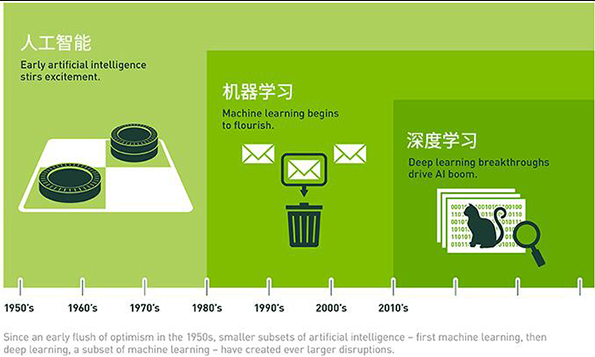

# 日志 #

## 2018-03-12 ##

深度学习解决的核心问题之一就是自动地将简单的特征组合成更加复杂的特征，并使用这些组合特征解决问题。

深度学习是机器学习的一个分支，它除了可以学习特征和任务之间的关联以外，还能自动从简单特征中提取更加复杂的特征。

### 面试：什么是深度学习？谈谈你的理解 ###

我的思路：要谈“深度学习”，就要谈一下比“深度学习”更大的概念。在谈一下概念的时候，必须要站在比这个概念更高的层次去谈，才能谈得清楚。比“深度学习”更高层的概念是“机器学习”，比“机器学习”这个概念再大的概念是“人工智能”。现在我们关注于“机器学习”。

机器学习，有各种算法，线性回归、逻辑回归、决策树（DT）、SVM，这些是不是就比较直接，首先选出特征，然后训练出模型，就进行预测了。相对来说，这些是浅层模型或者说是非深度模型。而深度学习，神经网络里面隐藏层个数较多，而用的较多的又是卷积神经网络，比较有名的例子就有LeNet（5层）/AlexNet（8层）/VGG（19层）/Inception（22层）/ResNet（152层）。

深度学习的概念源于人工神经网络的研究。含多隐层的多层感知器就是一种深度学习结构。深度学习通过组合低层特征形成更加抽象的高层表示属性类别或特征，以发现数据的分布式特征表示。



### 机器学习和深度学习的差异 ###

深度学习和机器学习都提供了训练模型和分类数据的方法，那么这两者到底有什么区别?

使用标准的机器学习的方法，我们需要**手动选择图像的相关特征**，以**训练机器学习模型**。然后，模型在对新对象进行分析和分类时引用这些特征。

通过深度学习的工作流程，可以从图像中**自动提取**相关功能。另外，深度学习是一种端到端的学习，网络被赋予原始数据和分类等任务，并且可以自动完成。

另一个关键的区别是深度学习算法与数据缩放，而浅层学习数据收敛。浅层学习指的是当用户向网络中添加更多示例和训练数据时，机器学习的方式能够在特定性能水平上达到平台级。

如果需要在深度学习和机器学习之间作出抉择，用户需要明确是否具有高性能的GPU和大量的标记数据。如果用户没有高性能GPU和标记数据，那么机器学习比深度学习更具优势。这是因为深度学习通常比较复杂，就图像而言可能需要几千张图才能获得可靠的结果。高性能的GPU能够帮助用户，在建模上花更少的时间来分析所有的图像。

如果用户选择机器学习，可以选择在多种不同的分类器上训练模型，也能知道哪些功能可以提取出最好的结果。此外，通过机器学习，我们可以灵活地选择多种方式的组合，使用不同的分类器和功能来查看哪种排列最适合数据。

所以，一般来说，深度学习的计算量更大，而机器学习技术通常更易于使用。

### TensorFlow基本概念 ###

http://www.infoq.com/cn/articles/introduction-of-tensorflow-part02?utm_source=infoq&utm_campaign=user_page&utm_medium=link

TensorFlow的名字中已经说明了它最重要的两个概念——Tensor和Flow。Tensor就是张量。在TensorFlow中，所有的数据都通过张量的形式来表示。从功能的角度上看，张量可以被简单理解为多维数组。但张量在TensorFlow中的实现并不是直接采用数组的形式，它只是对TensorFlow中运算结果的引用。**在张量中并没有真正保存数字，它保存的是如何得到这些数字的计算过程**。

```python
import tensorflow as tf
a = tf.constant([1.0, 2.0], name="a")
b = tf.constant([2.0, 3.0], name="b")
result = a + b
print result        # 输出“Tensor("add:0", shape=(2,), dtype=float32) ”

sess = tf.Session()
print sess.run(result)    # 输出“[ 3.  5.]”
sess.close()
```

一个张量中主要保存了三个属性：**名字（name）、维度（shape）和类型（type）**。**张量的第一个属性名字**不仅是一个张量的唯一标识符，它同样也给出了这个张量是如何计算出来的。张量的命名是通过“node:src_output”的形式来给出。其中node为计算节点的名称，src_output表示当前张量来自节点的第几个输出。比如张量“add:0”就说明了result这个张量是计算节点“add”输出的第一个结果（编号从0开始）。

张量的第二个属性是**张量的维度（shape）**。这个属性描述了一个张量的维度信息。比如“shape=(2,) ”说明了张量result是一个一维数组，这个数组的长度为2。张量的第三个属性是**类型（type）**，每一个张量会有一个唯一的类型。TensorFlow会对参与运算的所有张量进行类型的检查，当发现类型不匹配时会报错。

如果说TensorFlow的第一个词**Tensor**表明了它的**数据结构**，那么**Flow**则体现了**它的计算模型**。Flow翻译成中文就是“流”，**它直观地表达了张量之间通过计算相互转化的过程**。

TensorFlow是一个通过**计算图**的形式来表述计算的编程系统。TensorFlow中的**每一个计算**都是**计算图**上的一个**节点**，而**节点之间的边**描述了**计算之间的依赖关系**。

TensorFlow计算图定义完成后，我们需要通过会话（Session）来执行定义好的运算。会话拥有并管理TensorFlow程序运行时的所有资源。当所有计算完成之后需要关闭会话来帮助系统回收资源，否则就可能出现资源泄漏的问题。

TensorFlow可以通过Python的上下文管理器来使用会话。以下代码展示了如何使用这种模式。

	# 创建一个会话，并通过Python中的上下文管理器来管理这个会话。
	with tf.Session() as sess
	# 使用这创建好的会话来计算关心的结果。
	sess.run(...)
	# 不需要再调用“Session.close()”函数来关闭会话，
	# 当上下文退出时会话关闭和资源释放也自动完成了。

通过Python上下文管理器的机制，只要将所有的计算放在“with”的内部就可以。当上下文管理器退出时候会自动释放所有资源。这样既解决了因为异常退出时资源释放的问题，同时也解决了忘记调用Session.close函数而产生的资源泄漏。

计算神经网络的前向传播结果需要三部分信息。第一个部分是**神经网络的输入**，这个输入就是从实体中提取的特征向量。第二个部分为**神经网络的连接结构**。神经网络是由神经元构成的，神经网络的结构给出不同神经元之间输入输出的连接关系。神经网络中的神经元也可以称之为节点。最后一个部分是**每个神经元中的参数**。图中用w来表示神经元中的权重，b表示偏置项。

## 2018-03-13 ##

TensorFlow实现反向传播

监督学习最重要的思想就是，在已知答案的标注数据集上，模型给出的预测结果要尽量接近真实的答案。通过调整神经网络中的参数对训练数据进行拟合，可以使得模型对未知的样本提供预测的能力。

在神经网络优化算法中，最常用的方法是反向传播算法（backpropagation）

通过反向传播算法优化神经网络是一个迭代的过程。在每次迭代的开始，首先需要选取一小部分训练数据，这一小部分数据叫做一个batch。然后，这个batch的样例会通过前向传播算法得到神经网络模型的预测结果。因为训练数据都是有正确答案标注的，所以可以计算出当前神经网络模型的预测答案与正确答案之间的差距。最后，基于这预测值和真实值之间的差距，反向传播算法会相应更新神经网络参数的取值，使得在这个batch上神经网络模型的预测结果和真实答案更加接近。

	反向传播-->迭代的过程
	迭代过程：小部分训练数据(batch)-->前向传播-->预测结果-->计算预测值与正确答案之间的差距-->反向传播-->更新神经网络参数的取值-->迭代

但如果每轮迭代中选取的数据都要通过常量来表示，那么TensorFlow的计算图将会太大。因为每生成一个常量，TensorFlow都会在计算图中增加一个节点。一般来说，一个神经网络的训练过程会需要经过几百万轮甚至几亿轮的迭代，这样计算图就会非常大，而且利用率很低。为了避免这个问题，TensorFlow提供了placeholder机制用于提供输入数据。placeholder相当于定义了一个位置，这个位置中的数据在程序运行时再指定。这样在程序中就不需要生成大量常量来提供输入数据，而只需要将数据通过placeholder传入TensorFlow计算图。在placeholder定义时，这个位置上的数据类型是需要指定的。和其他张量一样，placeholder的类型也是不可以改变的。placeholder中数据的维度信息可以根据提供的数据推导得出，所以不一定要给出。

	常量-->对应计算图中一个节点-->常量越多，节点越多，这样不合理
	合理的方式-->placehoder（位置）-->数据类型需要指定


Tensorflow的计算模型、数据模型和运行模型

计算图的概念

计算模型--计算图：每一个计算都是计算图上的节点，而节点之间的边描述了计算之间的依赖关系。

所有Tensorflow的程序都可以通过计算图的形式来表示，这就是Tensorflow的基本计算模型。


