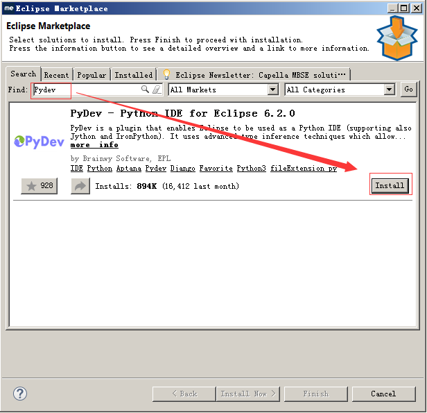
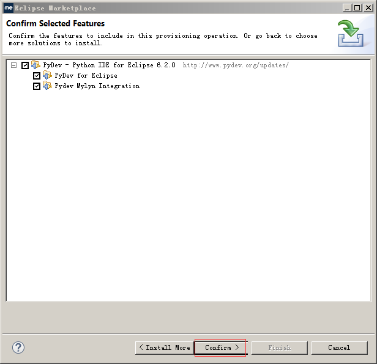
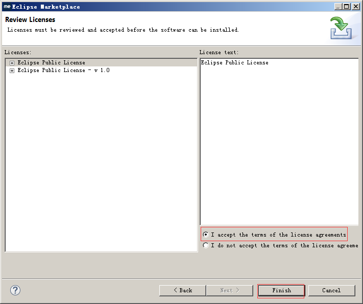

[pypi 镜像使用帮助](https://mirrors.tuna.tsinghua.edu.cn/help/pypi/)

pip安装numpy

	pip install numpy

pip安装sklearn

	pip install -U scikit-learn

pip安装scipy(注：sklearn 依赖scipy包)

	pip install -i https://pypi.tuna.tsinghua.edu.cn/simple scipy

MyEclipse安装PyDev

打开help-> install from catalog

https://www.cnblogs.com/jym-sunshine/p/4924530.html

http://blog.csdn.net/jielysong117/article/details/39052147

http://scikit-learn.org/stable/

[Eclipse 安装python后pydev不出现](https://www.cnblogs.com/MazeHong/p/7225087.html)

[Python在Myeclipse上配置(解决Pydev插件不出现和安装标准库的方法)](http://blog.csdn.net/danielntz/article/details/51429686)

[MyEclipse10中配置开发Python所需要的PyDev 绝对靠谱 不忽悠！](https://www.cnblogs.com/simith/p/5090716.html)

# An introduction to machine learning with scikit-learn #

[An introduction to machine learning with scikit-learn](http://scikit-learn.org/stable/tutorial/basic/tutorial.html)

n samples --> predict properties of unknown data
each sample --> features

learning problem:

	supervised learning
	unsupervised learning

