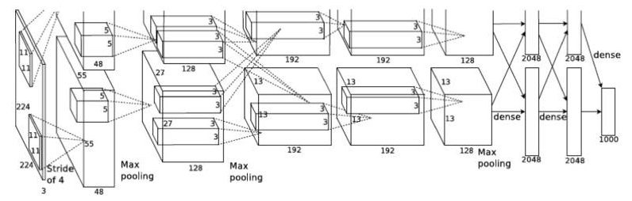

# CNN浅析和历年ImageNet冠军模型解析 #

- 作者：黄文坚
- 黄文坚，《TensorFlow实战》作者，该书获得Google TensorFlow工程研发总监Rajat Monga、360首席科学家颜水成教授、北大长江学者崔斌教授的推荐，出版后曾获京东、亚马逊、当当计算机类图书销量第一,并获台湾知名出版社引进版权。

[CNN浅析和历年ImageNet冠军模型解析](http://www.infoq.com/cn/articles/cnn-and-imagenet-champion-model-analysis#)

卷积神经网络（Convolutional Neural Network, CNN）最初是为解决**图像识别**等问题设计的。在早期的图像识别研究中，**最大的挑战是如何组织特征**，因为图像数据不像其他类型的数据那样可以通过人工理解来提取特征。

在股票预测等模型中，我们可以从原始数据中提取过往的交易价格波动、市盈率、市净率、盈利增长等金融因子，这即是**特征工程**。**但是在图像中，我们很难根据人为理解提取出有效而丰富的特征。**在深度学习出现之前，我们必须借助SIFT、HoG等算法提取具有良好区分性的特征，再集合SVM等机器学习算法进行图像识别。

SIFT对一定程度内的缩放、平移、旋转、视角改变、亮度调整等畸变，都具有不变性，是当时最重要的图像特征提取方法之一。然而**SIFT这类算法提取的特征还是有局限性的**，在ImageNet ILSVRC比赛的最好结果的错误率也有26%以上，而且常年难以产生突破。

**卷积神经网络提取的特征则可以达到更好的效果**，同时它不需要将**特征提取**和**分类训练**两个过程分开，它**在训练时就自动提取了最有效的特征**。CNN作为一个深度学习架构被提出的最初诉求，是降低对图像数据预处理的要求，以及避免复杂的特征工程。**CNN可以直接使用图像的原始像素作为输入**，而不必先使用SIFT等算法提取特征，减轻了使用传统算法如SVM时必需要做的大量重复、烦琐的数据预处理工作。

	传统方式：特征提取-->分类训练
	CNN方式：不进行特征提取，而是直接使用图像的原始像素作为输入

和SIFT等算法类似，**CNN训练的模型同样对缩放、平移、旋转等畸变具有不变性，有着很强的泛化性**。**CNN的最大特点**在于**卷积的权值共享**结构，可以**大幅减少神经网络的参数量**，**防止过拟合**的同时又**降低了神经网络模型的复杂度**。

	CNN最大特点：卷积的权值共享。
	这么做的好处：（1）在计算过程中，减少神经网络的参数量，降低了模型的复杂度，计算量减少；（2）从结果看，防止过拟合

卷积神经网络的概念最早出自19世纪60年代科学家提出的**感受野**（Receptive Field ）。当时科学家通过对猫的视觉皮层细胞研究发现，**每一个视觉神经元只会处理一小块区域的视觉图像，即感受野**。到了20世纪80年代，日本科学家提出**神经认知机（Neocognitron）**的概念，可以算作是**卷积网络最初的实现原型**。

	神经网络的起源，万物皆有始。引入概念，“感受野”。
	卷积神经网络最初的实现原型：神经认知机。

**神经认知机**中包含两类神经元，用来**抽取特征的S-cells**，还有用来**抗形变的C-cells**，其中**S-cells**对应我们现在主流卷积神经网络中的**卷积核滤波操作**，而**C-cells**则对应**激活函数、最大池化（Max-Pooling）**等操作。同时，CNN也是首个成功地进行多层训练的网络结构，即前面章节提到的LeCun的LeNet5，而全连接的网络因为参数过多及梯度弥散等问题，在早期很难顺利地进行多层的训练。

	抽取特征的S-cells： 卷积核滤波操作
	抗形变的C-cells： 激活函数、最大池化（Max-Pooling）等操作

卷积神经网络可以利用**空间结构**关系**减少需要学习的参数量**，从而**提高反向传播算法的训练效率**。**在卷积神经网络中，第一个卷积层会直接接受图像像素级的输入，每一个卷积操作只处理一小块图像，进行卷积变化后再传到后面的网络，每一层卷积（也可以说是滤波器）都会提取数据中最有效的特征**。**这种方法可以提取到图像中最基础的特征，比如不同方向的边或者拐角，而后再进行组合和抽象形成更高阶的特征，因此CNN可以应对各种情况，理论上具有对图像缩放、平移和旋转的不变性**。

	像素-->卷积核-->提取特征-->进行组合和抽象-->更高阶特征

一般的**卷积神经网络**由多个**卷积层**构成，每个卷积层中通常会进行如下几个操作。

	三步操作：卷积、激活函数、池化

1. 图像通过多个不同的卷积核的滤波，并加**偏置（bias）**，提取出**局部特征**，每一个卷积核会映射出一个新的2D图像。
2. 将前面卷积核的滤波输出结果，进行**非线性的激活函数处理**。目前最常见的是使用ReLU函数，而以前Sigmoid函数用得比较多。
3. 对激活函数的结果再进行池化操作（即降采样，比如将2×2的图片降为1×1的图片），目前一般是使用**最大池化**，保留最显著的特征，并提升模型的畸变容忍能力。

一个卷积层中可以有多个不同的卷积核，而每一个卷积核都对应一个滤波后映射出的新图像，同一个新图像中每一个像素都来自**完全相同的卷积核，这就是卷积核的权值共享**。**那我们为什么要共享卷积核的权值参数呢？答案很简单，降低模型复杂度，减轻过拟合并降低计算量**。

举个例子，如下图所示，如果我们的图像尺寸是1000像素×1000像素，并且假定是黑白图像，即只有一个颜色通道，那么一张图片就有100万个像素点，输入数据的维度也是100万。接下来，如果连接一个相同大小的隐含层（100万个隐含节点），那么将产生100万×100万=一万亿个连接。

仅仅一个**全连接层**（Fully Connected Layer），就有一万亿连接的权重要去训练，这已经超出了普通硬件的计算能力。**我们必须减少需要训练的权重数量，一是降低计算的复杂度，二是过多的连接会导致严重的过拟合，减少连接数可以提升模型的泛化性**。

	讲减少“需要训练的权重数量”的必要性：（1）计算过程中，减少计算复杂度；（2）计算结果，防止过拟合。

图像在空间上是有组织结构的，每一个像素点在空间上和周围的像素点实际上是有紧密联系的，但是和太遥远的像素点就不一定有什么关联了。这就是前面提到的人的视觉**感受野**的概念，**每一个感受野只接受一小块区域的信号**。这一小块区域内的像素是互相关联的，每一个神经元不需要接收全部像素点的信息，只需要接收局部的像素点作为输入，而后将所有这些神经元收到的局部信息综合起来就可以得到全局的信息。

这样就可以将之前的**全连接**的模式修改为**局部连接**，之前隐含层的每一个隐含节点都和全部像素相连，现在我们只需要将每一个隐含节点连接到局部的像素节点。假设局部感受野大小是10×10，即每个隐含节点只与10×10个像素点相连，那么现在就只需要10×10×100万=1亿个连接，相比之前的1万亿缩小了10000倍。

	通过“感受野”的概念，由“全链接”到“局部连接”，减少总的连接数。在使用“全连接”的时候，每一个连接都对应一个“参数”，而减少连接数，也就是减少参数的数量。

简单说，全连接就是上图的左边部分，而局部连接就是上图的右边部分。局部连接可以大大降低神经网络参数量，从100Mx100M = 1万亿，到10x10x100万=1亿。

上面我们通过**局部连接**（Locally Connect）的方法，将连接数从1万亿降低到1亿，但仍然偏多，**需要继续降低参数量**。现在隐含层每一个节点都与10×10的像素相连，也就是每一个隐含节点都拥有100个参数。假设我们的局部连接方式是卷积操作，即默认每一个隐含节点的参数都完全一样，那我们的参数不再是1亿，而是100。不论图像有多大，都是这10×10=100个参数，即卷积核的尺寸，这就是**卷积对缩小参数量的贡献**。

	通过“卷积核”中“每一个隐含节点的参数都完全一样”，实现减少“参数量”。这样话，“参数量”就成为一个固定值，即卷积核的尺寸大小。

简单说，**卷积**就是**使用完全相同的（参数相同）的模板**去进行**局部连接**，所以**参数量**可以**继续骤降**。

我们不需要再担心有多少隐含节点或者图片有多大，**参数量**只跟**卷积核的大小**有关，这也就是所谓的**权值共享**。**但是如果我们只有一个卷积核，我们就只能提取一种卷积核滤波的结果，即只能提取一种图片特征**，这不是我们期望的结果。好在图像中最基本的特征很少，**我们可以增加卷积核的数量来多提取一些特征**。

**图像中的基本特征**无非就是**点**和**边**，无论多么复杂的图像都是点和边组合而成的。**人眼识别物体的方式也是从点和边开始的，视觉神经元接受光信号后，每一个神经元只接受一个区域的信号，并提取出点和边的特征，然后将点和边的信号传递给后面一层的神经元，再接着组合成高阶特征**，比如三角形、正方形、直线、拐角等，再继续抽象组合，得到眼睛、鼻子和嘴等五官，最后再将五官组合成一张脸，完成匹配识别。

	讲述人眼识别物体的一个过程：由点、线逐步构成更高阶特征。

因此我们的问题就很好解决了，只要我们提供的卷积核数量足够多，能提取出各种方向的边或各种形态的点，就可以让卷积层抽象出有效而丰富的高阶特征。**每一个卷积核滤波得到的图像就是一类特征的映射**，即一个**Feature Map**。一般来说，我们使用100个卷积核放在第一个卷积层就已经很充足了。

	引出新概念“Feature Map”，卷积核滤波之后的结果

那这样的话，如上图所示，我们的参数量就是100×100=1万个（每个卷积核100个参数，一共100个卷积核），相比之前的1亿又缩小了10000倍。因此，依靠卷积，我们就可以高效地训练局部连接的神经网络了。**卷积的好处是，不管图片尺寸如何，我们需要训练的权值数量只跟卷积核大小、卷积核数量有关**，我们可以使用非常少的参数量处理任意大小的图片。每一个卷积层提取的特征，在后面的层中都会抽象组合成更高阶的特征。

我们再总结一下，卷积神经网络的要点就是**局部连接**（Local Connection）、**权值共享**（Weight Sharing）和**池化层**（Pooling）中的**降采样**（Down-Sampling）。

其中，**局部连接**和**权值共享**降低了**参数量**，使**训练复杂度大大下降**，并**减轻了过拟合**。同时**权值共享**还**赋予了卷积网络**对**平移**的容忍性，而**池化层降采样**则进一步**降低了输出参数量**，并**赋予模型对轻度形变的容忍性**，提高了模型的泛化能力。

**卷积神经网络**相比传统的机器学习算法，**无须手工提取特征**，也不需要使用诸如SIFT之类的特征提取算法，**可以在训练中自动完成特征的提取和抽象，并同时进行模式分类，大大降低了应用图像识别的难度**；相比一般的神经网络，CNN在结构上和图片的空间结构更为贴近，都是2D的有联系的结构，并且CNN的卷积连接方式和人的视觉神经处理光信号的方式类似。

## LeNet5 ##

下面介绍一下**经典的卷积网络LeNet5**。

大名鼎鼎的LeNet5诞生于1994年，是最早的深层卷积神经网络之一，并且推动了深度学习的发展。从1988年开始，在多次成功的迭代后，这项由Yann LeCun完成的开拓性成果被命名为LeNet5。

LeCun认为，可训练参数的卷积层是一种用少量参数在图像的多个位置上提取相似特征的有效方式，这和直接把每个像素作为多层神经网络的输入不同。像素不应该被使用在输入层，因为图像具有很强的空间相关性，而使用图像中独立的像素直接作为输入则利用不到这些相关性。

LeNet5当时的特性有如下几点。

- 每个卷积层包含三个部分：卷积、池化和非线性激活函数
- 使用卷积提取空间特征  （这里在讲“卷积”）
- 降采样（Subsample）的平均池化层（Average Pooling） （这里在讲“池化”）
- 双曲正切（Tanh）或S型（Sigmoid）的激活函数    （这里在讲“非线性激活函数”）
- MLP作为最后的分类器                      （这里在讲“分类器”）
- 层与层之间的稀疏连接减少计算复杂度          （这里在讲“稀疏连接”）

LeNet5中的诸多特性现在依然在state-of-the-art卷积神经网络中使用，可以说**LeNet5是奠定了现代卷积神经网络的基石之作**。Lenet-5的结构下图所示。

	state-of-the-art 使用最先进技术的; 体现最高水平的;

它的输入图像为32×32的灰度值图像，后面有3个卷积层，1个全连接层和1个高斯连接层。

## ImageNet ##

下面我们来介绍一些其他几个经典的卷积网络结构，AlexNet、VGGNet、Google Inception Net和ResNet，这4种网络依照出现的先后顺序排列，深度和复杂度也依次递进。

它们分别获得了ILSVRC（ImageNet Large Scale Visual Recognition Challenge）比赛分类项目的2012年冠军（AlexNet, top-5错误率16.4%，使用额外数据可达到15.3%，8层神经网络）、2014年亚军（VGGNet，top-5错误率7.3%，19层神经网络），2014年冠军（InceptionNet，top-5错误率6.7%，22层神经网络）和2015年的冠军（ResNet，top-5错误率3.57%，152层神经网络）。

如图所示，ILSVRC的top-5错误率在最近几年取得重大突破，而主要的突破点都是在深度学习和卷积神经网络，成绩的大幅提升几乎都伴随着卷积神经网络的层数加深。

前面提到的计算机视觉比赛ILSVRC使用的数据都来自**ImageNet**，如上图所示。ImageNet项目于2007年由斯坦福大学华人教授**李飞飞**创办，目标是收集大量带有标注信息的图片数据供计算机视觉模型训练。ImageNet拥有1500万张标注过的高清图片，总共拥有22000类，其中约有100万张标注了图片中主要物体的定位边框。

每年度的ILSVRC比赛数据集中大概拥有120万张图片，以及1000类的标注，是ImageNet全部数据的一个子集。比赛一般采用**top-5**和**top-1**分类错误率作为模型性能的评测指标，上图所示为AlexNet识别ILSVRC数据集中图片的情况，每张图片下面是分类预测得分最高的5个分类及其分值。

## AlexNet技术特点概要 ##

AlexNet是现代深度CNN的奠基之作。

2012年，Hinton的学生Alex Krizhevsky提出了深度卷积神经网络模型AlexNet，它可以算是LeNet的一种更深更宽的版本。AlexNet中包含了几个比较新的技术点，也首次在CNN中成功应用了**ReLU**、**Dropout**和**LRN**等Trick。同时AlexNet也使用了**GPU**进行运算加速，作者开源了他们在GPU上训练卷积神经网络的CUDA代码。

AlexNet包含了6亿3000万个连接，6000万个参数和65万个神经元，拥有5个卷积层，其中3个卷积层后面连接了最大池化层，最后还有3个全连接层。AlexNet以显著的优势赢得了竞争激烈的ILSVRC 2012比赛，top-5的错误率降低至了16.4%，相比第二名的成绩26.2%错误率有了巨大的提升。

AlexNet可以说是神经网络在低谷期后的第一次发声，确立了深度学习（深度卷积网络）在计算机视觉的统治地位，同时也推动了深度学习在语音识别、自然语言处理、强化学习等领域的拓展。

AlexNet将LeNet的思想发扬光大，把CNN的基本原理应用到了很深很宽的网络中。AlexNet主要使用到的新技术点如下。

	ReLu作为CNN激活函数
	使用Dropout
	池化中使用最大池化
	提出LRN层

1. **成功使用ReLU作为CNN的激活函数**，并验证其效果在较深的网络超过了Sigmoid，成功解决了Sigmoid在网络较深时的**梯度弥散**问题。虽然ReLU激活函数在很久之前就被提出了，但是直到AlexNet的出现才将其发扬光大。
2. **训练时使用Dropout随机忽略一部分神经元，以避免模型过拟合**。Dropout虽有单独的论文论述，但是AlexNet将其实用化，通过实践证实了它的效果。在AlexNet中主要是最后几个全连接层使用了Dropout。
3. **在CNN中使用重叠的最大池化**。此前CNN中普遍使用平均池化，AlexNet全部使用最大池化，避免平均池化的模糊化效果。并且AlexNet中提出让步长比池化核的尺寸小，这样池化层的输出之间会有重叠和覆盖，提升了特征的丰富性。
4. **提出了LRN层**，对局部神经元的活动创建竞争机制，使得其中响应比较大的值变得相对更大，并抑制其他反馈较小的神经元，增强了模型的泛化能力。
5. **使用CUDA加速深度卷积网络的训练，利用GPU强大的并行计算能力**，处理神经网络训练时大量的矩阵运算。AlexNet使用了两块GTX 580 GPU进行训练，单个GTX 580只有3GB显存，这限制了可训练的网络的最大规模。因此作者将AlexNet分布在两个GPU上，在每个GPU的显存中储存一半的神经元的参数。
6. 数据增强，随机地从256x256的原始图像中截取224x224大小的区域（以及水平翻转的镜像），相当于增加了(256x224)2*2=2048倍的数据量。如果没有数据增强，仅靠原始的数据量，参数众多的CNN会陷入过拟合中，使用了数据增强后可以大大减轻过拟合，提升泛化能力。进行预测时，则是取图片的四个角加中间共5个位置，并进行左右翻转，一共获得10张图片，对他们进行预测并对10次结果求均值。

整个AlexNet有8个需要训练参数的层（不包括池化层和LRN层），前5层为卷积层，后3层为全连接层，上图所示。AlexNet最后一层是有1000类输出的Softmax层用作分类。LRN层出现在第1个及第2个卷积层后，而最大池化层出现在两个LRN层及最后一个卷积层后。

我们可以发现一个比较有意思的现象，在前几个卷积层，虽然计算量很大，但参数量很小，都在1M左右甚至更小，只占AlexNet总参数量的很小一部分。这就是卷积层有用的地方，可以**通过较小的参数量提取有效的特征**。虽然每一个卷积层占整个网络的参数量的1%都不到，**但是如果去掉任何一个卷积层，都会使网络的分类性能大幅地下降**。

	卷积层，使用很少的参数量，就能提取有效的特征。虽然这些卷积层的参数少，但如果去掉任何一个卷积层，都会使网络的分类性能大幅地下降。

## VGGNet技术特点概要 ##

VGGNet是牛津大学计算机视觉组（Visual Geometry Group）和Google DeepMind公司的研究员一起研发的的深度卷积神经网络。VGGNet探索了**卷积神经网络的深度**与其**性能**之间的关系，通过反复堆叠3x3的小型卷积核和2x2的最大池化层，VGGNet成功地构筑了16~19层深的卷积神经网络。VGGNet相比之前state-of-the-art的网络结构，错误率大幅下降，并取得了ILSVRC 2014比赛分类项目的第2名和定位项目的第1名。

VGGNet论文中全部使用了3x3的卷积核和2x2的池化核，通过不断加深网络结构来提升性能。下图所示为VGGNet各级别的网络结构图，和每一级别的参数量，从11层的网络一直到19层的网络都有详尽的性能测试。

如上图所示，两个3x3的卷积层串联相当于1个5x5的卷积层，即一个像素会跟周围5x5的像素产生关联，可以说感受野大小为5x5。而3个3x3的卷积层串联的效果则相当于1个7x7的卷积层。除此之外，3个串联的3x3的卷积层，拥有比1个7x7的卷积层更少的参数量，只有后者的55%。

	2个3x3的卷积层，相当于，1个5x5的卷积层
	3个3x3的卷积层，相当于，1个7x7的卷积层

最重要的是，**3个3x3的卷积层**拥有比1个7x7的卷积层**更多的非线性变换**（前者可以使用三次ReLU激活函数，而后者只有一次），**使得CNN对特征的学习能力更强**。

作者在对比各级网络时总结出了以下几个观点。

1. LRN层作用不大。
2. 越深的网络效果越好。
3. 1x1的卷积也是很有效的，但是没有3*3的卷积好，大一些的卷积核可以学习更大的空间特征。

## InceptionNet技术特点概要 ##

Google Inception Net首次出现在ILSVRC 2014的比赛中（和VGGNet同年），就以较大优势取得了第一名。那届比赛中的Inception Net通常被称为Inception V1，它最大的特点是**控制了计算量和参数量**的同时，获得了**非常好的分类性能**——top-5错误率6.67%，只有AlexNet的一半不到。

Inception V1有22层深，比AlexNet的8层或者VGGNet的19层还要更深。但其计算量只有15亿次浮点运算，同时只有500万的参数量，仅为AlexNet参数量（6000万）的1/12，却可以达到远胜于AlexNet的准确率，可以说是非常优秀并且非常实用的模型。

Inception V1降低参数量的目的有两点：第一，参数越多模型越庞大，需要供模型学习的数据量就越大，而目前高质量的数据非常昂贵；第二，参数越多，耗费的计算资源也会更大。

Inception V1参数少但效果好的原因除了**模型层数更深**、表达能力更强外，还有两点：一是去**除了最后的全连接层，用全局平均池化层**（即将图片尺寸变为1*1）来取代它。**全连接层几乎占据了AlexNet或VGGNet中90%的参数量，而且会引起过拟合，去除全连接层后模型训练更快并且减轻了过拟合**。

二是Inception V1中精心设计的Inception Module提高了参数的利用效率，其结构如图10所示。这一部分也借鉴了Network In etwork的思想，形象的解释就是Inception Module本身如同大网络中的一个小网络，其结构可以反复堆叠在一起形成大网络。

我们再来看Inception Module的基本结构，其中有4个分支：第一个分支对输入进行1x1的卷积，这其实也是NIN中提出的一个重要结构。1x1的卷积是一个非常优秀的结构，它可以跨通道组织信息，提高网络的表达能力，同时可以对输出通道升维和降维。

可以看到Inception Module的4个分支都用到了1x1卷积，来进行低成本（计算量比3x3小很多）的跨通道的特征变换。

第二个分支先使用了1x1卷积，然后连接3x3卷积，相当于进行了两次特征变换。第三个分支类似，先是1x1的卷积，然后连接5x5卷积。最后一个分支则是3x3最大池化后直接使用1x1卷积。

Inception Module的4个分支在最后通过一个聚合操作合并（在输出通道数这个维度上聚合）。

Inception V2学习了VGGNet，用两个3x3的卷积代替5x5的大卷积（用以降低参数量并减轻过拟合），还提出了著名的**Batch Normalization**（以下简称BN）方法。**BN是一个非常有效的正则化方法，可以让大型卷积网络的训练速度加快很多倍，同时收敛后的分类准确率也可以得到大幅提高。**

	引出新概念： Batch Normalization。加速收敛，且正确率还高。

BN在用于神经网络某层时，会对每一个mini-batch数据的内部进行标准化（normalization）处理，使输出规范化到N(0,1)的正态分布，减少了Internal Covariate Shift（内部神经元分布的改变）。

BN的论文指出，传统的深度神经网络在训练时，每一层的输入的分布都在变化，导致训练变得困难，我们只能使用一个很小的学习速率解决这个问题。而**对每一层使用BN之后**，我们就可以有效地解决这个问题，**学习速率可以增大很多倍，达到之前的准确率所需要的迭代次数只有1/14，训练时间大大缩短**。

而达到之前的准确率后，可以继续训练，并最终取得远超于Inception V1模型的性能——top-5错误率4.8%，已经优于人眼水平。因为**BN某种意义上还起到了正则化的作用，所以可以减少或者取消Dropout，简化网络结构**。

## ResNet技术特点概要 ##

ResNet（Residual Neural Network）由微软研究院的Kaiming He等4名华人提出，通过使用Residual Unit成功训练152层深的神经网络，在ILSVRC 2015比赛中获得了冠军，取得3.57%的top-5错误率，同时参数量却比VGGNet低，效果非常突出。

ResNet的结构可以极快地加速超深神经网络的训练，模型的准确率也有非常大的提升。

ResNet最初的灵感出自这个问题：**在不断加神经网络的深度时，会出现一个Degradation的问题，即准确率会先上升然后达到饱和，再持续增加深度则会导致准确率下降**。

	degradation 恶化; 堕落; 潦倒; 毁坏;

这**并不是过拟合的问题**，**因为不光在测试集上误差增大，训练集本身误差也会增大**。假设有一个比较浅的网络达到了饱和的准确率，那么后面再加上几个的**全等映射层**，起码误差不会增加，即更深的网络不应该带来训练集上误差上升。

	过拟合：在训练集(Train Set)上误差小，在测试集(Test)上误差大。
	而此处是，在训练集(Train Set)和测试集(Test)同时增大。
	引入新概念：全等映射

而这里提到的使用**全等映射**直接将前一层输出传到后面的思想，就是ResNet的灵感来源。假定某段神经网络的输入是x，期望输出是H(x)，如果我们直接把输入x传到输出作为初始结果，那么此时我们需要学习的目标就是F(x)=H(x)-x。

这就是一个ResNet的残差学习单元（Residual Unit），ResNet相当于将学习目标改变了，不再是学习一个完整的输出H(x)，只是输出和输入的差别H(x)-x，即残差。

传统的卷积层或全连接层在信息传递时，或多或少会存在信息丢失、损耗等问题。**ResNet在某种程度上解决了这个问题**，**通过直接将输入信息绕道传到输出，保护信息的完整性，整个网络则只需要学习输入、输出差别的那一部分，简化学习目标和难度**。

在使用了ResNet的结构后，可以发现层数不断加深导致的训练集上误差增大的现象被消除了，ResNet网络的训练误差会随着层数增大而逐渐减小，并且在测试集上的表现也会变好。

## 小结 ##

此就将ALexNet、VGGNet、Inception Net、ResNet四种经典的卷积介绍完了，下面我们简单总结一下。我们简单回顾卷积神经网络的历史，上图所示大致勾勒出最近几十年卷积神经网络的发展方向。

Perceptron（感知机）于**1957年**由Frank Resenblatt提出，而Perceptron不仅是卷积网络，也是神经网络的始祖。Neocognitron（神经认知机）是一种多层级的神经网络，由日本科学家Kunihiko Fukushima于20世纪80年代提出，具有一定程度的视觉认知的功能，并直接启发了后来的卷积神经网络。

	Perceptron(感知机)-->神经网络-->卷积神经网络

LeNet-5由CNN之父Yann LeCun于**1997年**提出，首次提出了多层级联的卷积结构，可对手写数字进行有效识别。可以看到前面这三次关于卷积神经网络的技术突破，间隔时间非常长，需要十余年甚至更久才出现一次理论创新。

而后于**2012年**，Hinton的学生Alex依靠8层深的卷积神经网络一举获得了ILSVRC 2012比赛的冠军，瞬间点燃了卷积神经网络研究的热潮。AlexNet成功应用了ReLU激活函数、Dropout、最大覆盖池化、LRN层、GPU加速等新技术，并启发了后续更多的技术创新，卷积神经网络的研究从此进入快车道。

在AlexNet之后，我们可以将卷积神经网络的发展分为两类，一类是网络结构上的改进调整，另一类是网络深度的增加。

**2013年**，颜水成教授的Network in Network工作首次发表，优化了卷积神经网络的结构，并推广了1x1的卷积结构。在改进卷积网络结构的工作中，后继者还有2014年的Google Inception Net V1，提出了Inception Module这个可以反复堆叠的高效的卷积网络结构，并获得了当年ILSVRC比赛的冠军。

**2015年**初的Inception V2提出了Batch Normalization，大大加速了训练过程，并提升了网络性能。2015年年末的Inception V3则继续优化了网络结构，提出了Factorization in Small Convolutions的思想，分解大尺寸卷积为多个小卷积乃至一维卷积。

**2015年**，微软的ResNet成功训练了152层深的网络，一举拿下了当年ILSVRC比赛的冠军，top-5错误率降低至3.46%。

我们可以看到，自AlexNet于2012年提出后，深度学习领域的研究发展极其迅速，基本上每年甚至每几个月都会出现新一代的技术。新的技术往往伴随着新的网络结构，更深的网络的训练方法等，并在图像识别等领域不断创造新的准确率记录。

