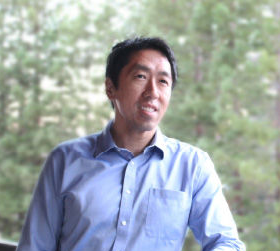

# 人工智能的重要人物 #

## 吴恩达 ##

关键字：人工智能、机器学习、百度公司首席科学家、Coursera的联合创始人

研究领域：机器学习和人工智能，研究重点是深度学习（Deep Learning）。

吴恩达（1976-，英文名：Andrew Ng），华裔美国人，是斯坦福大学计算机科学系和电子工程系副教授，人工智能实验室主任。吴恩达是人工智能和机器学习领域国际上最权威的学者之一。

2014年5月16日，吴恩达加入百度，担任百度公司首席科学家，负责百度研究院的领导工作，尤其是Baidu Brain计划。

吴恩达也是在线教育平台Coursera的联合创始人（with Daphne Koller）。Coursera是免费大型公开在线课程项目，由美国斯坦福大学两名计算机科学教授创办。旨在同世界顶尖大学合作，在线提供免费的网络公开课程。Coursera的首批合作院校包括斯坦福大学、密歇根大学、普林斯顿大学、宾夕法尼亚大学等美国名校。

## 李飞飞 ##

李飞飞，女，1976年出生于北京，长在四川，16岁随父母移居美国新泽西州。

在人工智能界，“李飞飞”的名字随着AI的升温其关注度也不断窜升。

斯坦福大学计算机系终身教授、斯坦福大学人工智能实验室主任、“谷歌云”首席科学家...单是这几个头衔就能看出她的江湖地位。

不过，对于现在一度“过热”的人工智能，李飞飞也一直在强调“人工智能现在越火，越需要有冷静做研究的人”

她说 “我做研究的心得就是，眼睛看到的前方应该是比较空旷的。如果你眼睛看到的前方是热闹的，那这个方向就不是最好的研究方向。而空旷的地方一般都不是热点，因此你必须找准自己的焦点”

