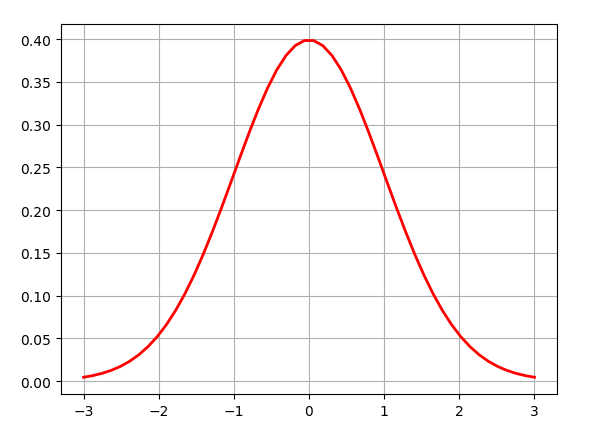

# Python数据可视化：正态分布（高斯分布） #

正态分布（Normal distribution）又称为高斯分布（Gaussian distribution）

## 1、什么是高斯分布 ##

若随机变量服从一个数学期望为、标准方差为的高斯分布，记为：)。

则其概率密度函数为：

=\frac{1}{\sqrt{2\pi}\sigma}&space;e&space;^{-\frac{(x-\mu)^{2}}{2\sigma^{2}}})

正态分布的期望值决定了其位置，其标准差决定了分布的幅度。因其曲线呈钟形，因此人们又经常称之为钟形曲线。我们通常所说的标准正态分布是的正态分布： 



## 2、Python代码画图实现高斯分布 ##

编程的时候，可以将作为输入参数，那么概率密度函数变成这个样子：=\frac{1}{\sqrt{2\pi}\sigma}&space;e&space;^{-\frac{(x-\mu)^{2}}{2\sigma^{2}}})。

Python代码如下：

```python
import math
import numpy as np
import matplotlib.pyplot as plt

# Python实现正态分布
# 绘制正态分布概率密度函数

u = 0 # 均值μ
sigma = math.sqrt(1) # 标准差δ

x = np.linspace(u - 3*sigma, u + 3*sigma, 50)
y = np.exp(-(x - u) ** 2 /(2* sigma **2))/(math.sqrt(2*math.pi)*sigma)

plt.plot(x, y, "r-", linewidth=2)
plt.grid(True)
plt.show()
```


