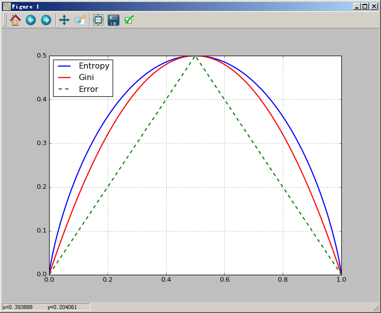

# Gini系数 #

Python代码：

```python
import numpy as np
import matplotlib.pyplot as plt

if __name__ == '__main__':
    p = np.arange(start=0.001, stop=1, step=0.001, dtype=np.float32)
    gini = 2 * p * (1-p)
    h = -(p * np.log2(p) + (1-p) * np.log2(1-p)) / 2
    err = 1 - np.max(np.vstack((p, 1-p)), 0)
    plt.plot(p, h, 'b-', linewidth=2, label='Entropy')
    plt.plot(p, gini, 'r-', linewidth=2, label='Gini')
    plt.plot(p, err, 'g--', linewidth=2, label='Error')
    plt.grid(True)
    plt.legend(loc='upper left')
    plt.show()
```

输出结果：




