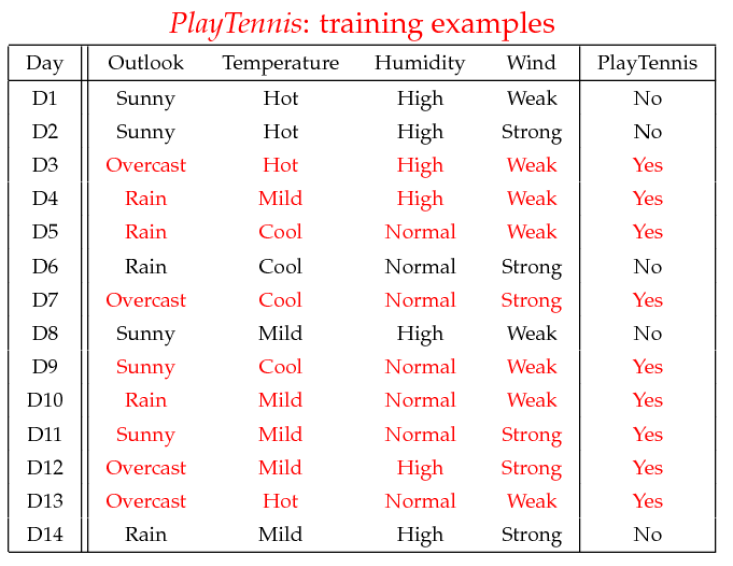
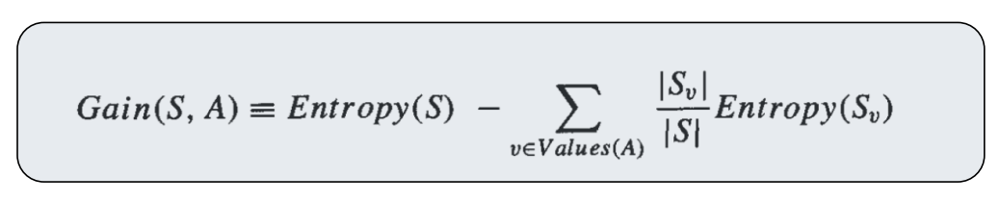
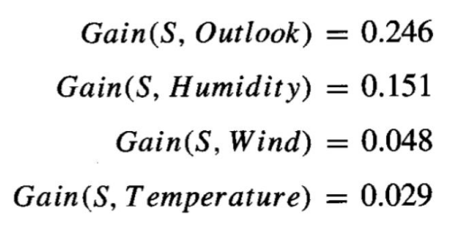
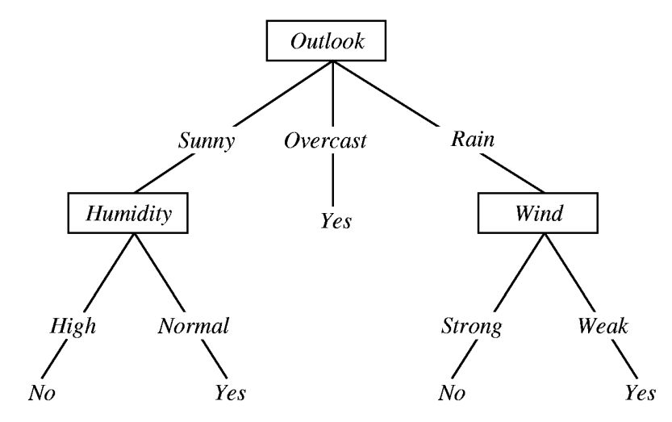

# 信息增益 #









总的统计：

Play Tennis | Num | Days
---|---|---
Yes-Days | 9 | D3,D4,D5,D7,D9,D10,D11,D12,D13
No-Days | 5 | D1,D2,D6,D8,D14
Total | 14 | &nbsp;

Entropy(Total)=-(5/14)log2(5/14) - (9/14)log2(9/14) = 0.940

```python
import numpy as np

def getAmountOfInformation(p):
    if p == 0 or p == 1:
        return 0
    return -1 * p * np.log2(p)

def getEntropy(plist):
    entropy_sum = 0.0
    for p in plist:
        entropy_sum += getAmountOfInformation(p)
    return entropy_sum

total_entropy = getEntropy([9.0/14,5.0/14])
print('total_entropy = ', total_entropy)
```

输出：

	total_entropy =  0.9402859586706311


按Outlook来统计:

Outlook | Total | Yes | No | Yes-Days | No-Days 
---|---|---|---|---|---
Sunny | 5 | 2 | 3 | D9,D11 | D1,D2,D8
Overcast | 4 | 4 | 0 | D3,D7,D12,D13 | &nbsp;
Rain | 5 | 3 | 2 | D4,D5,D10 | D6,D14

```python
import numpy as np

def getAmountOfInformation(p):
    if p == 0 or p == 1:
        return 0
    return -1 * p * np.log2(p)

def getEntropy(plist):
    entropy_sum = 0.0
    for p in plist:
        entropy_sum += getAmountOfInformation(p)
    return entropy_sum

total_entropy = getEntropy([9.0/14,5.0/14])
print('total_entropy = ', total_entropy)

sunny_entropy = getEntropy([2.0/5,3.0/5])
print('\tsunny_entropy = ', sunny_entropy)

overcast_entropy = getEntropy([4.0/4,0.0/4])
print('\tovercast_entropy = ', overcast_entropy)

rain_entropy = getEntropy([3.0/5,2.0/5])
print('\train_entropy = ', rain_entropy)

outlook_entropy = (5.0/14) * sunny_entropy + (4.0/14) * overcast_entropy + (5.0/14) * rain_entropy
print('outlook_entropy = ', outlook_entropy)

info_gain = total_entropy - outlook_entropy
print('info_gain = ', info_gain)
```

输出：

	total_entropy =  0.9402859586706311
		sunny_entropy =  0.9709505944546686
		overcast_entropy =  0.0
		rain_entropy =  0.9709505944546686
	outlook_entropy =  0.6935361388961918
	info_gain =  0.24674981977443933

按Temperature统计：

Temperature | Total | Yes | No | Yes-Days | No-Days 
---|---|---|---|---|---
Hot | 4 | 2 | 2 | D3,D13 | D1,D2
Mild | 6 | 4 | 2 | D4,D10,D11,D12 | D8,D14 
Cool | 4 | 3 | 1 | D5,D7,D9 | D8

```python
import numpy as np

def getAmountOfInformation(p):
    if p == 0 or p == 1:
        return 0
    return -1 * p * np.log2(p)

def getEntropy(plist):
    entropy_sum = 0.0
    for p in plist:
        entropy_sum += getAmountOfInformation(p)
    return entropy_sum

total_entropy = getEntropy([9.0/14,5.0/14])
print('total_entropy = ', total_entropy)

hot_entropy = getEntropy([2.0/4,2.0/4])
print('\thot_entropy = ', hot_entropy)

mild_entropy = getEntropy([4.0/6,2.0/6])
print('\tmild_entropy = ', mild_entropy)

cool_entropy = getEntropy([3.0/4,1.0/4])
print('\tcool_entropy = ', cool_entropy)

temperature_entropy = (4.0/14) * hot_entropy + (6.0/14) * mild_entropy + (4.0/14) * cool_entropy
print('temperature_entropy = ', temperature_entropy)

info_gain = total_entropy - temperature_entropy
print('info_gain = ', info_gain)
```

输出：

	total_entropy =  0.9402859586706311
		hot_entropy =  1.0
		mild_entropy =  0.9182958340544896
		cool_entropy =  0.8112781244591328
	temperature_entropy =  0.9110633930116763
	info_gain =  0.02922256565895487

按Humidity统计：

Humidity | Total | Yes | No | Yes-Days | No-Days 
---|---|---|---|---|---
High | 7 | 3 | 4 | D3,D4,D12 | D1,D2,D8,D14
Normal | 7 | 6 | 1 | D5,D7,D9,D10,D11,D13 | D6

```python
import numpy as np

def getAmountOfInformation(p):
    if p == 0 or p == 1:
        return 0
    return -1 * p * np.log2(p)

def getEntropy(plist):
    entropy_sum = 0.0
    for p in plist:
        entropy_sum += getAmountOfInformation(p)
    return entropy_sum

total_entropy = getEntropy([9.0/14,5.0/14])
print('total_entropy = ', total_entropy)

high_entropy = getEntropy([3.0/7,4.0/7])
print('\thigh_entropy = ', high_entropy)

normal_entropy = getEntropy([6.0/7,1.0/7])
print('\tnormal_entropy = ', normal_entropy)

humidity_entropy = (7.0/14) * high_entropy + (7.0/14) * normal_entropy
print('humidity_entropy = ', humidity_entropy)

info_gain = total_entropy - humidity_entropy
print('info_gain = ', info_gain)
```

输出：

	total_entropy =  0.9402859586706311
		high_entropy =  0.9852281360342515
		normal_entropy =  0.5916727785823275
	humidity_entropy =  0.7884504573082896
	info_gain =  0.15183550136234159

按Wind统计：

Wind | Total | Yes | No | Yes-Days | No-Days 
---|---|---|---|---|---
Strong | 6 | 3 | 3 | D7,D11,D12 | D2,D6,D14
Weak | 8 | 6 | 2 | D3,D4,D5,D9,D10,D13 | D1,D8

```python
import numpy as np

def getAmountOfInformation(p):
    if p == 0 or p == 1:
        return 0
    return -1 * p * np.log2(p)

def getEntropy(plist):
    entropy_sum = 0.0
    for p in plist:
        entropy_sum += getAmountOfInformation(p)
    return entropy_sum

total_entropy = getEntropy([9.0/14,5.0/14])
print('total_entropy = ', total_entropy)

strong_entropy = getEntropy([3.0/6,3.0/6])
print('\tstrong_entropy = ', strong_entropy)

weak_entropy = getEntropy([6.0/8,2.0/8])
print('\tweak_entropy = ', weak_entropy)

wind_entropy = (6.0/14) * strong_entropy + (8.0/14) * weak_entropy
print('wind_entropy = ', wind_entropy)

info_gain = total_entropy - wind_entropy
print('info_gain = ', info_gain)
```

输出：

	total_entropy =  0.9402859586706311
		strong_entropy =  1.0
		weak_entropy =  0.8112781244591328
	wind_entropy =  0.8921589282623617
	info_gain =  0.04812703040826949

