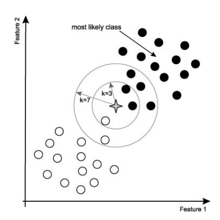

# K-Nearest Neighbor #

**核心想法**：
在距离空间里，如果一个样本的最接近的k个邻居里，绝大多数属于某个类别，则该样本也属于这个类别。

k-nearest neighbors algorithm(**k-NN**) is a **non-parametric** method used for classification and regression. The input consists of the k closest training examples in the feature space.



## Q: k has to be an odd number? ##

k不需要一定是奇数，也可以是偶数。

假设有两个类别“白色”和“黑色”。如果k=3时，有两个小球是属于黑色，有一个小球属于白色，那么这个当前的小球就属于黑色。

当k=4的时候，有2个白色小球，有2个黑色小球，虽然白球和黑球更占一半，但是这4个小球离当前小球的距离可能是不一样的，因此可以根据距离取权重值，来判断小球属于哪一个类型；如果距离也是相同的，那可以通过随机的方式来选取一个类别。

## Can k-NN Work for prediction? ##

可以的。


## Python实现KNN ##

示例代码：

```python
import numpy as np

def getTrainData():
    X = np.array([[1.0,0.9],
                  [1.0,1.0],
                  [0.1,0.2],
                  [0.0,0.1]])
    labels = ['A','A','B','B']
    return X, labels

def kNNClassify(newX, train_X, train_y, k):
    train_sample_num = train_X.shape[0]
    diff = np.tile(A=newX, reps=(train_sample_num,1)) - train_X
    squaredDiff = diff ** 2
    squaredDist = np.sum(a=squaredDiff,axis=1)
    distance = squaredDist ** 0.5
    sortDistIndices = np.argsort(a=distance)

    classCount = {}
    for i in range(k):
        voteLabel = train_y[sortDistIndices[i]]
        classCount[voteLabel] = classCount.get(voteLabel,0) + 1

    maxCount = 0
    for key, value in classCount.items():
        if value > maxCount:
            maxCount = value
            outputLabel = key
    return outputLabel

if __name__ == '__main__':
    train_X, train_y = getTrainData()
    newX = np.array([1.2,1.0])
    outputLabel = kNNClassify(newX, train_X, train_y, 3)
    print("Your input is:", newX, "and classified to class: ", outputLabel)

    newX = np.array([0.1, 0.3])
    outputLabel = kNNClassify(newX, train_X, train_y, 3)
    print("Your input is:", newX, "and classified to class: ", outputLabel)
```

输出：

	Your input is: [1.2 1. ] and classified to class:  A
	Your input is: [0.1 0.3] and classified to class:  B

