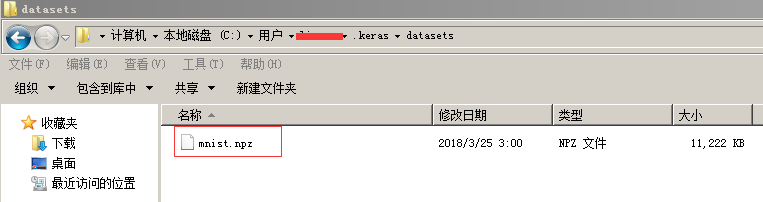
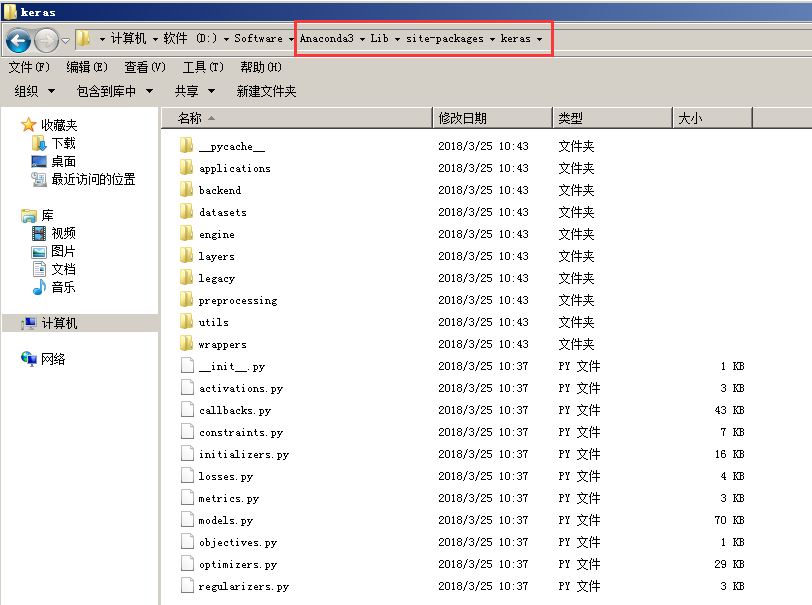

# 使用Keras训练MNIST数据 #

## 1、使用Keras读取MNIST数据 ##

示例代码：

```python
from keras.datasets import mnist

(x_train, y_train), (x_test, y_test) = mnist.load_data(path="mnist.npz")

print('x_train.shape = ', x_train.shape)
print('y_train.shape = ', y_train.shape)
print('x_test.shape = ', x_test.shape)
print('y_test.shape = ', y_test.shape)

print(x_train[0])
print(y_train[0])
```

输出：

	Using TensorFlow backend.
	x_train.shape =  (60000, 28, 28)
	y_train.shape =  (60000,)
	x_test.shape =  (10000, 28, 28)
	y_test.shape =  (10000,)
	
	[[  0   0   0   0   0   0   0   0   0   0   0   0   0   0   0   0   0   0    0   0   0   0   0   0   0   0   0   0]
	 [  0   0   0   0   0   0   0   0   0   0   0   0   0   0   0   0   0   0    0   0   0   0   0   0   0   0   0   0]
	 [  0   0   0   0   0   0   0   0   0   0   0   0   0   0   0   0   0   0    0   0   0   0   0   0   0   0   0   0]
	 [  0   0   0   0   0   0   0   0   0   0   0   0   0   0   0   0   0   0    0   0   0   0   0   0   0   0   0   0]
	 [  0   0   0   0   0   0   0   0   0   0   0   0   0   0   0   0   0   0    0   0   0   0   0   0   0   0   0   0]
	 [  0   0   0   0   0   0   0   0   0   0   0   0   3  18  18  18 126 136  175  26 166 255 247 127   0   0   0   0]
	 [  0   0   0   0   0   0   0   0  30  36  94 154 170 253 253 253 253 253  225 172 253 242 195  64   0   0   0   0]
	 [  0   0   0   0   0   0   0  49 238 253 253 253 253 253 253 253 253 251   93  82  82  56  39   0   0   0   0   0]
	 [  0   0   0   0   0   0   0  18 219 253 253 253 253 253 198 182 247 241    0   0   0   0   0   0   0   0   0   0]
	 [  0   0   0   0   0   0   0   0  80 156 107 253 253 205  11   0  43 154    0   0   0   0   0   0   0   0   0   0]
	 [  0   0   0   0   0   0   0   0   0  14   1 154 253  90   0   0   0   0    0   0   0   0   0   0   0   0   0   0]
	 [  0   0   0   0   0   0   0   0   0   0   0 139 253 190   2   0   0   0    0   0   0   0   0   0   0   0   0   0]
	 [  0   0   0   0   0   0   0   0   0   0   0  11 190 253  70   0   0   0    0   0   0   0   0   0   0   0   0   0]
	 [  0   0   0   0   0   0   0   0   0   0   0   0  35 241 225 160 108   1    0   0   0   0   0   0   0   0   0   0]
	 [  0   0   0   0   0   0   0   0   0   0   0   0   0  81 240 253 253 119   25   0   0   0   0   0   0   0   0   0]
	 [  0   0   0   0   0   0   0   0   0   0   0   0   0   0  45 186 253 253  150  27   0   0   0   0   0   0   0   0]
	 [  0   0   0   0   0   0   0   0   0   0   0   0   0   0   0  16  93 252  253 187   0   0   0   0   0   0   0   0]
	 [  0   0   0   0   0   0   0   0   0   0   0   0   0   0   0   0   0 249  253 249  64   0   0   0   0   0   0   0]
	 [  0   0   0   0   0   0   0   0   0   0   0   0   0   0  46 130 183 253  253 207   2   0   0   0   0   0   0   0]
	 [  0   0   0   0   0   0   0   0   0   0   0   0  39 148 229 253 253 253  250 182   0   0   0   0   0   0   0   0]
	 [  0   0   0   0   0   0   0   0   0   0  24 114 221 253 253 253 253 201   78   0   0   0   0   0   0   0   0   0]
	 [  0   0   0   0   0   0   0   0  23  66 213 253 253 253 253 198  81   2    0   0   0   0   0   0   0   0   0   0]
	 [  0   0   0   0   0   0  18 171 219 253 253 253 253 195  80   9   0   0    0   0   0   0   0   0   0   0   0   0]
	 [  0   0   0   0  55 172 226 253 253 253 253 244 133  11   0   0   0   0    0   0   0   0   0   0   0   0   0   0]
	 [  0   0   0   0 136 253 253 253 212 135 132  16   0   0   0   0   0   0    0   0   0   0   0   0   0   0   0   0]
	 [  0   0   0   0   0   0   0   0   0   0   0   0   0   0   0   0   0   0    0   0   0   0   0   0   0   0   0   0]
	 [  0   0   0   0   0   0   0   0   0   0   0   0   0   0   0   0   0   0    0   0   0   0   0   0   0   0   0   0]
	 [  0   0   0   0   0   0   0   0   0   0   0   0   0   0   0   0   0   0    0   0   0   0   0   0   0   0   0   0]]
	
	5

代码说明

- （1）`mnist.load_data(path="mnist.npz")`中的`mnist.npz`文件位于Windows操作系统的`C:\Users\<username>\.keras\datasets`目录下。



## 2、使用Keras构造CNN模型训练MNIST数据 ##

示例代码：

```python
import numpy as np
from keras.datasets import mnist
from keras.models import Sequential
from keras.layers import Dense
from keras.layers import Dropout
from keras.layers import Flatten
from keras.layers.convolutional import Conv2D
from keras.layers.convolutional import MaxPooling2D

# 读入数据
(x_train, y_train), (x_test, y_test) = mnist.load_data(path="mnist.npz")

# 查看一下数据集的shape信息
print('x_train.shape = ', x_train.shape)          # x_train.shape =  (60000, 28, 28)
print('y_train.shape = ', y_train.shape)          # y_train.shape =  (60000,)
print('x_test.shape = ', x_test.shape)            # x_test.shape =  (10000, 28, 28)
print('y_test.shape = ', y_test.shape)            # y_test.shape =  (10000,)

print('x_train.shape[0] = ', x_train.shape[0])    # x_train.shape[0] =  60000
print('x_test.shape[0] = ', x_test.shape[0])      # x_test.shape[0] =  10000

# 把训练集中的手写黑白字体变成标准的四维张量形式，即（样本数量，长，宽，1）；并把像素值变成浮点格式
x_train = x_train.reshape(x_train.shape[0], 28, 28, 1).astype('float32')
x_test = x_test.reshape(x_test.shape[0], 28, 28, 1).astype('float32')

# 由于每个像素值都介于0到255，所以这里统一除以255，把像素值控制在0-1范围
x_train /= 255
x_test /= 255

# 由于输入层需要10个节点，所以最好把目标数字0-9做成One Hot编码的形式
def oneHotEncoding_y(y):
    y_ohe = np.zeros(10)
    y_ohe[y] = 1
    return y_ohe

# 把标签用One Hot编码重新表示一下
y_train_ohe = np.array([oneHotEncoding_y(y_train[i]) for i in range(len(y_train))])
y_test_ohe = np.array([oneHotEncoding_y(y_test[i]) for i in range(len(y_test))])

# 创建序列模型的对象，再接下来要搭建卷积神经网络
model = Sequential()

# 添加一层卷积层，构造64个过滤器，每个过滤器覆盖范围是3*3*1，过滤器步长为1，图像四周补一圈0，并用relu进行非线性变化
model.add(Conv2D(filters=64, kernel_size=(3,3), strides=(1,1), padding='same', input_shape=(28,28,1), activation='relu'))
# 添加一层最大池化层
model.add(MaxPooling2D(pool_size=(2,2)))
# 设立Dropout层，Dropout的概率为0.5，防止过拟合
model.add((Dropout(rate=0.5)))

# 重复构造（卷积层128卷积核、最大池化层、Dropout层），搭建深度网络
model.add(Conv2D(filters=128, kernel_size=(3,3), strides=(1,1), padding='same', activation='relu'))
model.add(MaxPooling2D(pool_size=(2,2)))
model.add((Dropout(rate=0.5)))

# 重复构造（卷积层256卷积核、最大池化层、Dropout层），搭建深度网络
model.add(Conv2D(filters=256, kernel_size=(3,3), strides=(1,1), padding='same', activation='relu'))
model.add(MaxPooling2D(pool_size=(2,2)))
model.add((Dropout(rate=0.5)))

# 把当前层节点展平
model.add(Flatten())

# 构造全连接层神经网络层
model.add(Dense(128, activation='relu'))
model.add(Dense(64, activation='relu'))
model.add(Dense(32, activation='relu'))
model.add(Dense(10, activation='softmax'))

# 定义损失函数，一般来说分类问题的损失函数都选择采用交叉熵。adagrad=adptive gradient（自适应梯度）。
model.compile(loss='categorical_crossentropy',
              optimizer='adagrad',
              metrics=['accuracy'])

# 放入批量样本，进行训练。实际运行时，我将epochs变为1或2，因为执行完成一次epoch（轮次）需要花费7分钟，20次就太费时了
# model.fit(x=x_train, y=y_train_ohe, 
#           batch_size=128, epochs=20, 
#           validation_data=(x_test, y_test_ohe))
model.fit(x=x_train, y=y_train_ohe, 
          batch_size=128, epochs=1, 
          validation_data=(x_test, y_test_ohe))

# 在测试集上评价模型的准确率
# verbose : 进度表示方式。0表示不显示数据，1表示显示进度条
scores = model.evaluate(x=x_test, y=y_test_ohe, verbose=1)
print("model.metrics_names = ", model.metrics_names)
print("scores = ", scores)
```

部分输出：

	Using TensorFlow backend.
	x_train.shape =  (60000, 28, 28)
	y_train.shape =  (60000,)
	x_test.shape =  (10000, 28, 28)
	y_test.shape =  (10000,)
	x_train.shape[0] =  60000
	x_test.shape[0] =  10000
	Train on 60000 samples, validate on 10000 samples
	Epoch 1/1
	  128/60000 [..............................] - ETA: 6:34 - loss: 2.3232 - acc: 0.0469
	  256/60000 [..............................] - ETA: 4:58 - loss: 2.8506 - acc: 0.0664
	  384/60000 [..............................] - ETA: 4:24 - loss: 2.6666 - acc: 0.0859
	
	...
	59648/60000 [============================>.] - ETA: 1s - loss: 0.4402 - acc: 0.8502
	59776/60000 [============================>.] - ETA: 0s - loss: 0.4395 - acc: 0.8505
	59904/60000 [============================>.] - ETA: 0s - loss: 0.4387 - acc: 0.8507
	60000/60000 [==============================] - 210s 3ms/step - loss: 0.4382 - acc: 0.8509 - val_loss: 0.0674 - val_acc: 0.9790
	model.metrics_names =  ['loss', 'acc']
	scores =  [0.06736540831960738, 0.979]

代码说明：

- （1）`Conv2D`： 2D convolution layer (e.g. spatial convolution over images). This layer creates **a convolution kernel** that is convolved with **the layer input** to produce **a tensor of outputs**. `padding`: one of `"valid"` or `"same"` (case-insensitive).
- （2）`Conv2D`的`input_shape`字段： 4D tensor with shape: `(samples, channels, rows, cols)` if data_format='channels_first' or 4D tensor with shape: `(samples, rows, cols, channels)` if data_format='channels_last'. When using this layer as **the first layer**（卷积层） in a model, provide the keyword argument `input_shape` (tuple of integers, does not include the sample axis), e.g. `input_shape=(128, 128, 3)` for 128x128 RGB pictures in `data_format="channels_last"`.
- （3）`Dropout`： Applies Dropout to the input. Dropout consists in(consists in在于) randomly setting a fraction `rate` of input units to drop at each update during training time, which helps **prevent overfitting**. `rate`: float between 0 and 1. Fraction of the input units to drop.
- （4）`model.compile`： Configures the model for training.
- （5）`model.fit`： Trains the model for a fixed number of epochs (iterations on a dataset).
- （6）`model.evaluate`： Computes the loss on some input data, batch by batch.
- （7）`model.compile`重点在于配置，配置损失函数loss，配置优化器optimizer，配置度量方法metrics，是训练模型之前做的事情；`model.fit`是真正的进行训练了，需要指定**训练集的数据**、batch_size、epoch、validation_data等；而`model.evaluate`是在训练模型成功之后，对于模型的应用。

> keras安装在...\Anaconda3\Lib\site-packages\keras的路径下。




