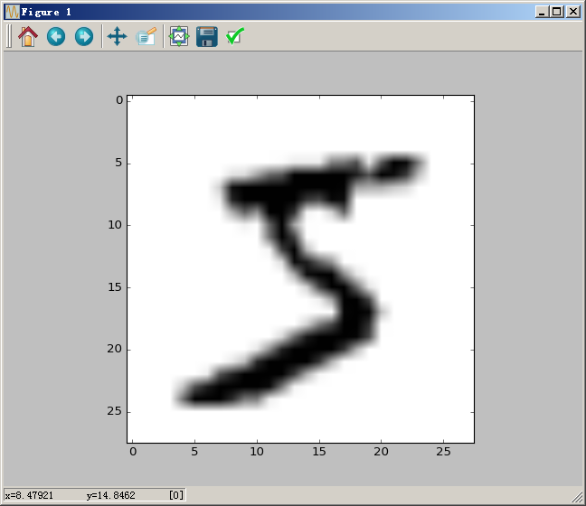

# 使用Keras和VGG16实现迁移学习 #

本文的目的是，使用迁移学习的思想，以VGG16作为模板搭建模型，训练识别手写字体。

## 1、使用VGG16构建神经网络 ##

### 1.1、示例代码和输出 ###

示例代码：

```python
# 首先，引入VGG16模块
from keras.applications.vgg16 import VGG16 

# 其次，加载其他模块
from keras.models import Model
from keras.layers import Flatten
from keras.layers import Dense
from keras.layers import Dropout


model_vgg = VGG16(include_top=False, weights='imagenet', input_shape=(48,48,3))
for layer in model_vgg.layers:
    layer.trainable = False

model = Flatten(name='flatten')(model_vgg.output)
model = Dense(units=4096, activation='relu', name='fc1')(model)
model = Dense(units=4096, activation='relu', name='fc2')(model)
model = Dropout(rate=0.5)(model)
model = Dense(units=10, activation='softmax')(model)
model_vgg_mnist = Model(inputs=model_vgg.input, outputs=model, name='vgg16')

# 打印模型结构，包括所需要的参数
model_vgg_mnist.summary()
```

输出：

	Using TensorFlow backend.
	_________________________________________________________________
	Layer (type)                 Output Shape              Param #   
	=================================================================
	input_1 (InputLayer)         (None, 48, 48, 3)         0         
	_________________________________________________________________
	block1_conv1 (Conv2D)        (None, 48, 48, 64)        1792      
	_________________________________________________________________
	block1_conv2 (Conv2D)        (None, 48, 48, 64)        36928     
	_________________________________________________________________
	block1_pool (MaxPooling2D)   (None, 24, 24, 64)        0         

	......省略......

	_________________________________________________________________
	flatten (Flatten)            (None, 512)               0         
	_________________________________________________________________
	fc1 (Dense)                  (None, 4096)              2101248   
	_________________________________________________________________
	fc2 (Dense)                  (None, 4096)              16781312  
	_________________________________________________________________
	dropout_1 (Dropout)          (None, 4096)              0         
	_________________________________________________________________
	dense_1 (Dense)              (None, 10)                40970     
	=================================================================
	Total params: 33,638,218
	Trainable params: 18,923,530
	Non-trainable params: 14,714,688
	_________________________________________________________________

从上面的输出，可以看到需要训练的模型参数有1471万个。

### 1.2、代码说明 ###

需要讲解的代码只有一行：

	model_vgg = VGG16(include_top=False, weights='imagenet', input_shape=(48,48,3))

- （1）VGG16()。建立一个模型，其类型是Keras的Model类对象。
- （2）`include_top=False`。我们构建的模型会将VGG16顶层去掉，只保留其余的网络结构。这里用`include_top=False`表明我们迁移除顶层以外的其余网络结构到自己的模型中。
- （3）`input_shape=(48,48,3)`。VGG模型对于输入图像数据要求高宽至少为48个像素点，由于硬件配置限制，我们选用48个像素点而不是原来VGG16所采用的224个像素点。即使这样仍然需要24GB以上的内存，或者使用**数据生成器**。


根据VGG16的源码注释文档，总结如下：

- `include_top`: whether to include the 3 fully-connected layers at the top of the network.
- `weights`: one of `None` (random initialization), 'imagenet' (pre-training on ImageNet), or the path to the weights file to be loaded.
- `input_shape`: optional shape tuple, only to be specified if `include_top` is False. It should have exactly 3 input channels, and width and height should be no smaller than 48. 

## 2、OpenCV ##

### 2.1、关于OpenCV ###

OpenCV是一个基于BSD许可（开源）发行的跨平台计算机视觉库，可以运行在Linux、Windows、Android和Mac OS操作系统上。它轻量级而且高效——由一系列 C 函数和少量 C++ 类构成，同时提供了Python、Ruby、MATLAB等语言的接口，实现了图像处理和计算机视觉方面的很多通用算法。

> 总结：OpenCV是一个计算机视觉库，实现了图像处理和计算机视觉方面的很多通用算法。


如何安装opencv？

	pip install opencv_python-3.4.1+contrib-cp35-cp35m-win_amd64.whl

下载地址： https://www.lfd.uci.edu/~gohlke/pythonlibs/#opencv

### 2.2、使用pyplot对mnist数据进行展示 ###

首先，通过Keras读取mnist数据集；其次，拿到第1个数据（索引为0），查看属性信息；最后，通过pyplot进行展示。

示例代码：

```python
from keras.datasets import mnist
import matplotlib.pyplot as plt

# 首先，通过Keras读取mnist数据
(x_train, y_train), (x_test, y_test) = mnist.load_data(path='mnist.npz')

# 其次，拿到第1个数据（索引为0），查看属性信息
x_train_0 = x_train[0]
y_train_0 = y_train[0]
print('type(x_train_0) = ', type(x_train_0))   # type(x_train_0) =  <class 'numpy.ndarray'>
print('x_train_0.shape = ', x_train_0.shape)   # x_train_0.shape =  (28, 28)
print('y_train_0 = ', y_train_0)               # y_train_0 =  5

# 最后，通过pyplot进行展示
plt.imshow(X=x_train_0, cmap='binary')
plt.show()
```

输出：

	Using TensorFlow backend.
	type(x_train_0) =  <class 'numpy.ndarray'>
	x_train_0.shape =  (28, 28)
	y_train_0 =  5



当把`plt.imshow(X=x_train_0, cmap='binary')`中的`binary`换成`gray`时，呈现如下效果：


### 2.3、使用cv2对mnist数据进行展示 ###

**原大小展示图片**。示例代码：

```python
from keras.datasets import mnist
import cv2

# 首先，通过Keras读取mnist数据
(x_train, y_train), (x_test, y_test) = mnist.load_data(path='mnist.npz')

# 其次，拿到第1个数据（索引为0），查看属性信息
x_train_0 = x_train[0]
y_train_0 = y_train[0]
print('type(x_train_0) = ', type(x_train_0))   # type(x_train_0) =  <class 'numpy.ndarray'>
print('x_train_0.shape = ', x_train_0.shape)   # x_train_0.shape =  (28, 28)
print('y_train_0 = ', y_train_0)               # y_train_0 =  5

# 最后，通过cv2进行展示
cv2.namedWindow(winname='image', flags=cv2.WINDOW_AUTOSIZE)
cv2.imshow(winname='image', mat=x_train_0)
cv2.waitKey(0)
cv2.destroyAllWindows()
```


**图片放大到48x48像素再展示**：通过`cv2.resize`对图片进行放大。示例代码：

```python
from keras.datasets import mnist
import cv2

# 首先，通过Keras读取mnist数据
(x_train, y_train), (x_test, y_test) = mnist.load_data(path='mnist.npz')

# 其次，拿到第1个数据（索引为0），查看属性信息
x_train_0 = x_train[0]
y_train_0 = y_train[0]
print('type(x_train_0) = ', type(x_train_0))   # type(x_train_0) =  <class 'numpy.ndarray'>
print('x_train_0.shape = ', x_train_0.shape)   # x_train_0.shape =  (28, 28)
print('y_train_0 = ', y_train_0)               # y_train_0 =  5

# 最后，通过cv2进行放大并展示
resize_img = cv2.resize(src=x_train_0, dsize=(48,48))
cv2.namedWindow(winname='image', flags=cv2.WINDOW_AUTOSIZE)
cv2.imshow(winname='image', mat=resize_img)
cv2.waitKey(0)
cv2.destroyAllWindows()
```


**将灰度图像变成RGB图像**：使用`cv2.cvtColor`方法。示例代码：

```python
from keras.datasets import mnist
import cv2

# 首先，通过Keras读取mnist数据
(x_train, y_train), (x_test, y_test) = mnist.load_data(path='mnist.npz')

# 其次，拿到第1个数据（索引为0），查看属性信息
x_train_0 = x_train[0]
y_train_0 = y_train[0]
print('type(x_train_0) = ', type(x_train_0))   # type(x_train_0) =  <class 'numpy.ndarray'>
print('x_train_0.shape = ', x_train_0.shape)   # x_train_0.shape =  (28, 28)
print('y_train_0 = ', y_train_0)               # y_train_0 =  5

# 最后，通过cv2进行放大、由灰度图像变成RGB图像，进行展示
resize_img = cv2.resize(src=x_train_0, dsize=(48,48))
print('resize_img.shape = ', resize_img.shape) # resize_img.shape =  (48, 48)
rgb_img = cv2.cvtColor(src=resize_img, code=cv2.COLOR_GRAY2RGB)
print('rgb_img.shape = ', rgb_img.shape)       # rgb_img.shape =  (48, 48, 3)
cv2.namedWindow(winname='image', flags=cv2.WINDOW_AUTOSIZE)
cv2.imshow(winname='image', mat=rgb_img)
cv2.waitKey(0)
cv2.destroyAllWindows()
```


### 2.4、探究numpy的newaxis和concatenate ###

示例代码：

```python
from keras.datasets import mnist
import cv2
import numpy as np

# 首先，通过Keras读取mnist数据
(x_train, y_train), (x_test, y_test) = mnist.load_data(path='mnist.npz')

# 其次，拿到第1个数据（索引为0），查看属性信息
x_train_0 = x_train[0]
y_train_0 = y_train[0]
print('type(x_train_0) = ', type(x_train_0))   # type(x_train_0) =  <class 'numpy.ndarray'>
print('x_train_0.shape = ', x_train_0.shape)   # x_train_0.shape =  (28, 28)
print('y_train_0 = ', y_train_0)               # y_train_0 =  5

# 最后，通过cv2进行放大、由灰度图像变成RGB图像，进行展示
resize_img = cv2.resize(src=x_train_0, dsize=(48,48))
print('resize_img.shape = ', resize_img.shape) # resize_img.shape =  (48, 48)
rgb_img = cv2.cvtColor(src=resize_img, code=cv2.COLOR_GRAY2RGB)
print('rgb_img.shape = ', rgb_img.shape)       # rgb_img.shape =  (48, 48, 3)

newaxis_img = rgb_img[np.newaxis]
print('newaxis_img.shape = ', newaxis_img.shape)   # newaxis_img.shape =  (1, 48, 48, 3)
concat1 = np.concatenate([newaxis_img])
print('concat1.shape = ', concat1.shape)           # concat1.shape =  (1, 48, 48, 3)
concat2 = np.concatenate([newaxis_img, newaxis_img])
print('concat2.shape = ', concat2.shape)           # concat2.shape =  (2, 48, 48, 3)
concat3 = np.concatenate([newaxis_img, newaxis_img, newaxis_img])
print('concat3.shape = ', concat3.shape)           # concat3.shape =  (3, 48, 48, 3)
cv2.namedWindow(winname='image', flags=cv2.WINDOW_AUTOSIZE)
cv2.imshow(winname='image', mat=rgb_img)
cv2.waitKey(0)
cv2.destroyAllWindows()
```

## 3、迁移学习：使用VGG16进行MNIST手写体识别 ##

前提：需要在`C:\Users\<username>\.keras\models`目录下有`vgg16_weights_tf_dim_ordering_tf_kernels_notop.h5`文件。

```python
from keras.applications.vgg16 import VGG16

from keras.models import Model
from keras.layers import Flatten
from keras.layers import Dense
from keras.layers import Dropout
from keras.optimizers import SGD

from keras.datasets import mnist

# 加载OpenCV（在命令行中窗口中输入pip install opencv-python），这里为了后期对图像的处理，
# 比如尺寸变化和Channel变化。这些变化是为了使图像满足VGG16所需要的输入格式
import cv2
import numpy as np

def getVGGModel():
    model_vgg = VGG16(include_top=False, weights='imagenet', input_shape=(48,48,3))
    for layer in model_vgg.layers:
        layer.trainable = False
    model = Flatten(name='flatten')(model_vgg.output)
    model = Dense(units=4096, activation='relu', name='fc1')(model)
    model = Dense(units=4096, activation='relu', name='fc2')(model)
    model = Dropout(rate=0.5)(model)
    model = Dense(units=10, activation='softmax')(model)
    model_vgg_mnist = Model(inputs=model_vgg.input, outputs=model, name='vgg16')
    return model_vgg_mnist

# 因为VGG16对网络输入层的要求，我们用OpenCV把图像从32*32变成224*224，把黑白图像转成RGB图像，
# 并把训练数据转化成张量形式，供keras输入
def transpose_x(x_data):
    x_data_3_channels = [cv2.cvtColor(cv2.resize(i, (48, 48)), cv2.COLOR_GRAY2RGB) for i in x_data]
    trans_x_data = np.concatenate([arr[np.newaxis] for arr in x_data_3_channels]).astype('float32')
    trans_x_data = trans_x_data / 255
    return trans_x_data

def onehot_y(y):
    y_ohe = np.zeros(10)
    y_ohe[y] = 1
    return y_ohe

def transpose_y(y_data):
    y_data_ohe = np.array([onehot_y(y_data[i]) for i in range(len(y_data))])
    return y_data_ohe

def get_mnist_data(train_num, validation_num, test_num):
    (x_train, y_train), (x_test, y_test) = mnist.load_data(path='mnist.npz')
    x_train_subset, y_train_subset = x_train[:train_num], y_train[:train_num]
    x_validation_subset, y_validation_subset = x_train[train_num:train_num+validation_num], y_train[train_num:train_num+validation_num]
    x_test_subset, y_test_subset = x_test[:test_num], y_test[:test_num]
    x_train_subset = transpose_x(x_train_subset)
    x_validation_subset = transpose_x(x_validation_subset)
    x_test_subset = transpose_x(x_test_subset)
    y_train_subset = transpose_y(y_train_subset)
    y_validation_subset = transpose_y(y_validation_subset)
    y_test_subset = transpose_y(y_test_subset)
    return (x_train_subset, y_train_subset),(x_validation_subset, y_validation_subset),(x_test_subset, y_test_subset)

model_vgg_mnist = getVGGModel()
model_vgg_mnist.summary()

sgd = SGD(lr=0.05, decay=1e-5)
model_vgg_mnist.compile(optimizer=sgd, loss='categorical_crossentropy', metrics=['accuracy'])

(x_train_subset, y_train_subset),(x_validation_subset, y_validation_subset),(x_test_subset, y_test_subset) = \
    get_mnist_data(train_num=5000, validation_num=1000, test_num=1000)

print(x_train_subset.shape)
print(x_validation_subset.shape)
print(x_test_subset.shape)


# model_vgg_mnist.fit(x=x_train, y=y_train, batch_size=50, epochs=100, validation_data=(x_test, y_test_ohe))
model_vgg_mnist.fit(x=x_train_subset, y=y_train_subset, batch_size=100, epochs=5, validation_data=(x_validation_subset, y_validation_subset))

scores = model_vgg_mnist.evaluate(x=x_test_subset, y=y_test_subset, verbose=1)
print("model_vgg_mnist.metrics_names = ", model_vgg_mnist.metrics_names)
print("scores = ", scores)
```


