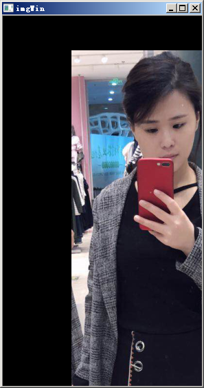

# Python3.5使用OpenCV #

参考资料： 

- 在python3.5中使用OpenCV https://blog.csdn.net/qxconverse/article/details/59704906
- Python-OpenCV基本操作 https://blog.csdn.net/CDQ928/article/details/75137350

## 1、关于OpenCV ##

OpenCV, a real time computer vision library.

## 2、安装OpenCV ##

### 2.1、下载 ###

下载页面：https://www.lfd.uci.edu/~gohlke/pythonlibs/#opencv


### 2.2、安装 ###

> 需要注意的是，在安装这个opencv之前，要保证已经装好了numpy。

使用pip命令进行安装

	pip install opencv_python-3.4.1+contrib-cp35-cp35m-win_amd64.whl

### 2.3、验证是否安装成功 ###

引入opencv的包名。如果不报错，则表示安装成功。

	import cv2


**查看opencv的版本**。示例代码：

```python
import cv2

print(cv2.__version__)   # 3.4.1
```


## 3、彩色图像变灰度图像 ##

**加载图片并显示**。示例代码：

```python
import cv2

img = cv2.imread(filename='AFen.png', flags=cv2.IMREAD_COLOR)
cv2.namedWindow(winname='image', flags=cv2.WINDOW_AUTOSIZE)
cv2.imshow(winname='image', mat=img)
cv2.waitKey(0)
cv2.destroyAllWindows()
```

代码说明：

- （1）cv2.imread(文件名，属性) 读入图像。
	- 属性，指定图像用哪种方式读取文件。
		- cv2.IMREAD_COLOR：读入彩色图像，默认参数，Opencv 读取彩色图像为BGR模式 ！！！注意
		- cv2.IMREAD_GRAYSCALE：读入灰度图像。
- （2）cv2.namedWindow(窗口名，属性) 创建一个窗口
	- 属性:指定窗口大小模式
		- cv2.WINDOW_AUTOSIZE：根据图像大小自动创建大小
		- cv2.WINDOW_NORMAL：窗口大小可调整
- （3）cv2.imshow(窗口名，图像文件) 显示图像，可以创建多个窗口
- （4）cv2.waitKey() 键盘绑定函数。函数等待特定的几毫秒，看是否由键盘输入。
- （5）cv2.destoryAllWindows(窗口名) 删除任何建立的窗口


**cv2.imread**:

- `def imread(filename, flags=None)`: Loads an image from a file. The function imread loads an image from the specified file and returns it. **If the image cannot be read** (because of missing file, improper permissions, unsupported or invalid format), the function returns **an empty matrix**.
- note: The function determines the type of an image by the content, not by the file extension.
- note: In the case of color images, the decoded images will have the channels stored in **B G R** order.
- `filename`: Name of file to be loaded.
- `flags`: Flag that can take values of cv::ImreadModes.
	- IMREAD_ANYCOLOR = 4
	- IMREAD_ANYDEPTH = 2
	- IMREAD_COLOR = 1
	- IMREAD_GRAYSCALE = 0

**cv2.namedWindow**:

- `def namedWindow(winname, flags=None)`: Creates a window. The function `namedWindow` creates a window that can be used as **a placeholder** for images and trackbars. **Created windows** are referred to by **their names**.
	- namedWindow-->placeholder-->their names
- If a window with the same name already exists, the function does nothing.
- You can call `cv::destroyWindow` or `cv::destroyAllWindows` to close the window and de-allocate any associated memory usage.
- `winname`: Name of the window in the window caption that may be used as a window identifier.
- `flags`: Flags of the window. The supported flags are: (cv::WindowFlags)
	- **WINDOW_NORMAL or WINDOW_AUTOSIZE:** `WINDOW_NORMAL` enables you to resize the window, whereas `WINDOW_AUTOSIZE` adjusts automatically the window size to fit the displayed image (see `imshow` ), and you cannot change the window size manually.

**cv2.imshow**:

- `def imshow(winname, mat)`: Displays an image in the specified window.
- If the window was not created before this function, it is assumed creating a window with `cv::WINDOW_AUTOSIZE`.
- `winname`: Name of the window.
- `mat`: Image to be shown. `mat`表示matrix，是指数据的矩阵。

**cv2.destroyAllWindows**:

- `def destroyAllWindows()`: Destroys all of the HighGUI windows. The function `destroyAllWindows` destroys all of the opened HighGUI windows.


**将彩色图片变为灰度图片**。稍微修改代码：`img = cv2.imread(filename='AFen.png', flags=0)`，示例代码

```python
import cv2

img = cv2.imread(filename='AFen.png', flags=cv2.IMREAD_GRAYSCALE)
cv2.namedWindow(winname='image', flags=cv2.WINDOW_NORMAL)
cv2.imshow(winname='image', mat=img)
cv2.waitKey(0)
cv2.destroyAllWindows()
```


## 4、保存图像 ##

示例代码：

```python
import cv2

img = cv2.imread(filename='AFen.png', flags=cv2.IMREAD_GRAYSCALE)
cv2.imshow(winname='image', mat=img)
key = cv2.waitKey(0)
while key != 27:         # 等待 ESC 键退出
    if key == ord('s'):  # 等待 's' 键来保存和退出
        cv2.imwrite(filename='gray_img.bmp', img=img)
        break
    key = cv2.waitKey(0)
cv2.destroyAllWindows()
```

代码说明：

- cv2.imwrite(保存图像名，需保存图像) 保存图像

**cv2.imwrite**:

- `def imwrite(filename, img, params=None)`: Saves an image to a specified file. The function imwrite saves the image to the specified file. The image format is chosen based on the filename extension.
- `filename`: Name of the file.
- `img`: Image to be saved.

## 5、获取图片属性 ##

示例代码：

```python
import cv2

img0 = cv2.imread(filename='AFen.png', flags=cv2.IMREAD_GRAYSCALE)  # 灰色图片
print('img0.shape = ', img0.shape)   # img0.shape =  (537, 290)
print('img0.size = ', img0.size)     # img0.size =  155730     537*290=155730
print('img0.dtype = ', img0.dtype)   # img0.dtype =  uint8
img1 = cv2.imread(filename='AFen.png', flags=cv2.IMREAD_COLOR)      # 彩色图片
print('img1.shape = ', img1.shape)   # img1.shape =  (537, 290, 3)
print('img1.size = ', img1.size)     # img1.size =  467190
print('img1.dtype = ', img1.dtype)   # img1.dtype =  uint8
```

## 6、缩放图片 ##

实现缩放图片并保存，在使用OpenCV时常用的操作。`cv2.resize()`支持多种插值算法，

- 默认使用`cv2.INTER_LINEAR`，
- 缩小最适合使用：`cv2.INTER_AREA`，
- 放大最适合使用：`cv2.INTER_CUBIC`或`cv2.INTER_LINEAR`。 

核心代码：

	res=cv2.resize(image,(2*width,2*height),interpolation=cv2.INTER_CUBIC) 

或者： 

	res=cv2.resize(image,None,fx=2,fy=2,interpolation=cv2.INTER_CUBIC) 

此处None本应该是输出图像的尺寸，因为后边设置了缩放因子

**cv2.resize**:

- `def resize(src, dsize, dst=None, fx=None, fy=None, interpolation=None)`: Resizes an image. The function `resize` resizes the image `src` down to or up to the specified size.
- explicitly specify `dsize=dst.size()`; `fx` and `fy` will be computed from that.
	- `resize(src, dst, dst.size(), 0, 0, interpolation)`
- specify `fx` and `fy` and let the function compute the destination image size.
	- `resize(src, dst, Size(), 0.5, 0.5, interpolation)`
- To **shrink an image**, it will generally look best with `#INTER_AREA` interpolation, whereas to **enlarge an image**, it will generally look best with `c#INTER_CUBIC` (slow) or `#INTER_LINEAR` (faster but still looks OK).
- `src`: input image.
- `dst`: output image; it has the size `dsize` (when it is non-zero) or the size computed from `src.size()`, `fx`, and `fy`; the type of `dst` is the same as of `src`.
- `dsize`: output image size; if it equals zero, it is computed as: `dsize = Size(round(fx*src.cols), round(fy*src.rows))`. Either `dsize` or both `fx` and `fy` must be non-zero.
- `fx`: scale factor along the horizontal axis; when it equals 0, it is computed as `(double)dsize.width/src.cols`.
- `fy`: scale factor along the vertical axis; when it equals 0, it is computed as `(double)dsize.height/src.rows`.
- `interpolation`: interpolation method

**图片放大2倍**。示例代码：

```python
import cv2

img = cv2.imread(filename='AFen.png', flags=cv2.IMREAD_COLOR)
(height, width, channel) = img.shape
print('img.shape = ', img.shape)                # img.shape =  (537, 290, 3)

resize_img=cv2.resize(src=img, dsize=(2*width,2*height), dst=None, fx=0, fy=0, interpolation=cv2.INTER_CUBIC)
# resize_img=cv2.resize(src=img, dsize=(2*width,2*height), dst=None, fx=0, fy=0, interpolation=cv2.INTER_LINEAR)
print('resize_img.shape = ', resize_img.shape)  # resize_img.shape =  (1074, 580, 3)

cv2.imshow(winname='imgWin',mat=resize_img)
cv2.waitKey(0)
cv2.destroyAllWindows()
```

**图片缩小一半**。示例代码：

```python
import cv2

img = cv2.imread(filename='AFen.png', flags=cv2.IMREAD_COLOR)
(height, width, channel) = img.shape
print('img.shape = ', img.shape)                # img.shape =  (537, 290, 3)

resize_img=cv2.resize(src=img, dsize=(0,0), dst=None, fx=0.5, fy=0.5, interpolation=cv2.INTER_AREA)
print('resize_img.shape = ', resize_img.shape)  # resize_img.shape =  (268, 145, 3)

cv2.imshow(winname='imgWin',mat=resize_img)
cv2.waitKey(0)
cv2.destroyAllWindows()
```

## 7、图像平移 ##

`cv2.warpAffine(src, M, dsize[, dst[, flags[, borderMode[, borderValue]]]])` 
平移就是将图像换个位置，如果要沿(x,y)方向移动，移动距离为(tx,ty),则需要构建偏移矩阵M。


平移图片(100,50），示例代码：

```python
import cv2
import numpy as np

img = cv2.imread(filename='AFen.png', flags=cv2.IMREAD_COLOR)
rows, cols, channel = img.shape
print('img.shape = ', img.shape)                # img.shape =  (537, 290, 3)

M = np.float32([[1,0,100],[0,1,50]])
dst = cv2.warpAffine(src=img, M=M, dsize=(cols,rows))

cv2.imshow(winname='imgWin',mat=dst)
cv2.waitKey(0)
cv2.destroyAllWindows()
```



**cv2.warpAffine**:

- `def warpAffine(src, M, dsize, dst=None, flags=None, borderMode=None, borderValue=None)`: Applies an affine transformation to an image. The function warpAffine transforms the source image using the specified matrix: 
	- `new_x = M11 * x + M12 * y + M13`
	- `new_y = M21 * x + M22 * y + M23`
- `src`: input image.
- `dst`: output image that has the size `dsize` and the same type as `src` .
- `M`: 2 times 3 transformation matrix.
- `dsize`: size of the output image.

> affine   adj.	仿射（几何学）

**AffineTransform** 类表示 2D 仿射变换，它执行从 2D 坐标到其他 2D 坐标的线性映射，保留了线的“直线性”和“平行性”。可以使用一系列平移 (translation)、缩放 (scale)、翻转 (flip)、旋转 (rotation) 和错切 (shear) 来构造仿射变换。

## 8、图像旋转 ##

OpenCV中首先需要构造一个旋转矩阵，通过`cv2.getRotationMatrix2D`获得。

示例代码：

```python
import cv2

img = cv2.imread(filename='AFen.png', flags=cv2.IMREAD_COLOR)
rows, cols, channel = img.shape
print('img.shape = ', img.shape)                # img.shape =  (537, 290, 3)

M = cv2.getRotationMatrix2D(center=(cols/2,rows/2), angle=45, scale=0.6)
# M =  [[  0.42426407   0.42426407 -30.43319241]
#  [ -0.42426407   0.42426407 216.10338751]]
print("M = ", M)

dst = cv2.warpAffine(src=img, M=M, dsize=(round(1.2*cols),round(1.2*rows)))
print('dst.shape = ', dst.shape)                # dst.shape =  (644, 348, 3)

cv2.imshow(winname='imgWin',mat=dst)
cv2.waitKey(0)
cv2.destroyAllWindows()
```


**cv2.getRotationMatrix2D**:

- `def getRotationMatrix2D(center, angle, scale)`: Calculates an affine matrix of 2D rotation.
- `center`: Center of the rotation in the source image.
- `angle`: Rotation angle in degrees. Positive values mean counter-clockwise rotation (the coordinate origin is assumed to be the top-left corner).
- `scale`: Isotropic scale factor.


## 9、仿射变换 ##

在**仿射变换**中，原图中所有的平行线在结果图像中同样平行。为了创建**偏移矩阵**，需要在原图像中找到三个点以及它们在输出图像中的位置。然后OpenCV中提供了`cv2.getAffineTransform`创建`2*3`的矩阵，最后将矩阵传给函数`cv2.warpAffine`。

示例代码：

```python
import cv2
import numpy as np
import matplotlib.pyplot as plt

img = cv2.imread(filename='AFen.png', flags=cv2.IMREAD_COLOR)
rows, cols, channel = img.shape

points_src = np.float32([[50,50],[200,50],[50,200]])
points_dst = np.float32([[10,100],[200,50],[100,250]])
M = cv2.getAffineTransform(src=points_src, dst=points_dst)
dst = cv2.warpAffine(src=img, M=M, dsize=(cols,rows))

plt.subplot(121), plt.imshow(img), plt.title('Input')
plt.subplot(122), plt.imshow(dst), plt.title('Output')
plt.show()
```


在上面的图片输出结果中，可以看到**仿射变换**的结果。但是，颜色上显示有点不正常。原因是**使用opencv读取图片时， 默认的通道顺序是BGR而非RGB**。在RGB为主流的当下，这种默认给我们带来了一点不便。那么， opencv 为什么要使用BGR而非RGB呢？ 目前看到的一种解释说是因为历史原因：早期BGR也比较流行，opencv一开始选择了BGR，到后来即使RGB成为主流，但也不好改了。 （这个观点未经考证，也没有严肃考证的动力， 在“碰到”新的不同解释前， 估且就这么认为吧）

在stackoverflow上，有一个讨论此种问题的解决方法的回复 https://stackoverflow.com/questions/4661557/pil-rotate-image-colors-bgr-rgb


在原来代码的基础上，添加以下代码：

	img = cv2.cvtColor(img, cv2.COLOR_BGR2RGB)

完整代码如下：

```python
import cv2
import numpy as np
import matplotlib.pyplot as plt

img = cv2.imread(filename='AFen.png', flags=cv2.IMREAD_COLOR)
img = cv2.cvtColor(src=img, code=cv2.COLOR_BGR2RGB)
rows, cols, channel = img.shape

points_src = np.float32([[50,50],[200,50],[50,200]])
points_dst = np.float32([[10,100],[200,50],[100,250]])
M = cv2.getAffineTransform(src=points_src, dst=points_dst)
dst = cv2.warpAffine(src=img, M=M, dsize=(cols,rows))

plt.subplot(121), plt.imshow(img), plt.title('Input')
plt.subplot(122), plt.imshow(dst), plt.title('Output')
plt.show()
```


**cv2.cvtColor**:

- `def cvtColor(src, code, dst=None, dstCn=None)`: Converts an image from one color space to another.

> 至此结束。 书犹药也，善读之可以医愚。——刘向