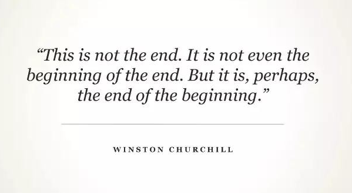

# 人工智能的关键词 #

## 机器学习 ##

### CNN ###

卷积神经网络（Convolution Neuron Network, CNN）

### CTR  ###

CTR意思就是Click Through Rate，即“点击率”。把每一个推荐给用户的物品按照“会否点击”二分类，构建分类模型，预估其中一种分类的概率，就是CTR预估。

### Logit模型 ###

Logit模型（Logit model，也译作“评定模型”，“分类评定模型”，又作Logistic regression，“逻辑回归”）是离散选择法模型之一，Logit模型是最早的离散选择模型，也是目前应用最广的模型。

### RBF ###

所谓径向基函数 (Radial Basis Function 简称 RBF), 就是某种沿径向对称的标量函数。 通常定义为空间中任一点x到某一中心xc之间欧氏距离的单调函数 , 可记作 k(||x-xc||), 其作用往往是局部的 , 即当x远离xc时函数取值很小。

最常用的径向基函数是高斯核函数 ,形式为 k(||x-xc||)=exp{- ||x-xc||^2/(2*σ)^2) } 其中xc为核函数中心,σ为函数的宽度参数 , 控制了函数的径向作用范围。

建议首选RBF核函数，因为：

- 能够实现非线性映射；
- 参数的数量影响模型的复杂程度，多项式核函数参数较多。
- the RBF kernel has less numerical difficulties.

### RNN ###

循环神经网络（Recurrent neural networks，简称RNN）是一种通过隐藏层节点周期性的连接，来捕捉序列化数据中动态信息的神经网络，可以对序列化的数据进行分类。和其他前向神经网络不同，RNN可以保存一种上下文的状态，甚至能够在任意长的上下文窗口中存储、学习、表达相关信息，而且不再局限于传统神经网络在空间上的边界，可以在时间序列上有延拓，直观上讲，就是本时间的隐藏层和下一时刻的隐藏层之间的节点间有边。RNN广泛应用在和序列有关的场景，如如一帧帧图像组成的视频，一个个片段组成的音频，和一个个词汇组成的句子。

过拟合
损失函数
目标函数
分类决策函数

注意“损失函数”和“目标函数”的关系。

## 固定词汇 ##

全局最优解、不错的局部解

	有的时候，不一定能得到全局的最优解，得到一个不错的局部解也是可以，使得最后的模型堪用。

## 框架 ##

### Keras ###

是一个深度学习框架。

易使用：对于想把它作为黑箱子使用的人，keras超级易上手。

扩展性强：keras的设计是把大量内部运算都隐藏了。大家很自然而然的就认为它的功能比较狭窄。其实它有的扩展性并不差，有很多办法实现框架上没有的功能。用户始终可以用theano或tensorflow的语句来写扩展功能并和keras结合使用。

基于tensorflow：Keras 提供了一个更简单，快捷的方式让你可以在 TensorFlow 中构建并训练模型，因为模型仍然是由 TensorFlow 引擎运行的，所以不会影响性能。所以如果你关心你自己的时间和生产效率的话，你就应该关注 Keras。

### Theano ###

Theano是一个Python库，专门用于定义、优化、求值数学表达式，效率高，适用于多维数组。

## 数据集 ##

train 训练集
test 测试集

### Iris鸢尾花 ###

**Creator**: R.A. Fisher

**Number of Instances**: 150 (50 in each of three classes)

**Number of Attributes**: 4 numeric, predictive attributes and the class

**Attribute Information**:
   1. sepal length in cm 花萼长度
   2. sepal width in cm 花萼宽度
   3. petal length in cm 花瓣长度
   4. petal width in cm 花瓣宽度
   5. class: 
      -- Iris Setosa 山鸢尾
      -- Iris Versicolour 杂色鸢尾
      -- Iris Virginica 维吉尼亚鸢尾

Iris数据集是常用的分类实验数据集，由Fisher, 1936收集整理。Iris也称鸢尾花卉数据集，是一类多重变量分析的数据集。数据集包含150个数据集，分为3类，每类50个数据，每个数据包含4个属性。可通过花萼长度，花萼宽度，花瓣长度，花瓣宽度4个属性预测鸢尾花卉属于（Setosa，Versicolour，Virginica）三个种类中的哪一类。

### MNIST ###

The **MNIST** database (**M**ixed **N**ational **I**nstitute of **S**tandards and **T**echnology database) is **a large database of handwritten digits** that is commonly used for training **various image processing systems**. The database is also widely used for training and testing in the field of **machine learning**.

	MNIST是一个large database，里面的数据是handwritten digits。
	MNIST常用于训练图像处理系统（various image processing systems），也用于机器学习（machine learning）。

The MNIST database contains 60,000 training images and 10,000 testing images.

	MNIST的训练集有6万张图片，测试集有1万张图片。

[MNIST机器学习入门](http://wiki.jikexueyuan.com/project/tensorflow-zh/tutorials/mnist_beginners.html)

## 比赛 ##

### Kaggle ###

Kaggle号称是**全球最大的数据科学家汇聚的平台**，高手云集，同时对萌新也很友好。Kaggle网址：https://www.kaggle.com/。目前为止（2016.12）网站有这么几个版块：
1、竞赛competitions
2、数据datasets
3、代码kernels
4、论坛forums
5、工作机会jobs

kaggle winner = feature engineering + ensemble + good machine + domain knowledge。

ensemble 全体; <音>合奏; 全套服装; 总效果

Kaggle教给我的第一件事情，就是让我清晰领会到了这两者之间的不同：**ML一般从模型或者算法出发，讲的是模型或者算法本身存在的不合理的地方，然后提出新的假设，从而去优化模型或算法**，在这个过程中并不针对某一个具体的特殊的问题。而**DM恰恰相反，它是从数据本身问题本身出发，希望针对问题的特性来设计最适合的方案，关键是在于对问题和数据的理解**。

技术方面上什么最关键？

Kaggle主要是以**Data Mining**的比赛为主，那么这个答案就非常直接了：Feature Engineering。无数经验告诉我们，做Kaggle比赛如果是抱着Machine Learning的态度，沉迷于fancy的模型而忽略数据本身，一定会死得很惨很惨！

我觉得Kaggle是一个对于每个想成为所谓的Data Scientist的同学最好的试炼厂。在这里，你就会知道课上学到的那些东西和能解决一个实际问题所需要的能力的差距。更何况，在学校里往往是拿不到任何大规模的数据。绝大多数课堂上用的还是只有几百个几千个数据的UCI dataset。Kaggle是缩小这个gap最好的一个地方。

转眼到了2018了，大家能明显得感受到，kaggle上data mining的比重越来越少，CV,NLP，优化赛，承办会议赛题越来越多，比如非常有意思的NIPS的对抗攻防，知名度和整体水平都越来越好，体验就是，拿奖牌越来越难。绝不是xgb融合就能轻松搞定的

Kaggle是一个非常友好的社区，大家都乐于分享，这与国内的平台形成了鲜明的对比。如果你是一个机器学习初学者，想快速提升实践能力，那么kaggle是个非常好的地方。

### ImageNet ###

ImageNet项目于2007年由斯坦福大学华人教授李飞飞创办，目标是收集大量带有标注信息的图片数据供计算机视觉模型训练。ImageNet拥有1500万张标注过的高清图片，总共拥有22000类，其中约有100万张标注了图片中主要物体的定位边框。

ImageNet 可以说是计算机视觉研究人员进行大规模物体识别和检测时，最先想到的视觉大数据来源。ImageNet 数据集最初由斯坦福大学李飞飞等人在 CVPR 2009 的一篇论文中推出，并被用于替代 PASCAL 数据集（后者在数据规模和多样性上都不如 ImageNet）和 LabelMe 数据集（在标准化上不如 ImageNet）。

ImageNet 竞赛 2017 是最后一届

## 公司 ##

### Netflix ###

2006年，NETFLIX 对外宣布，他们要设立一项大赛，公开征集电影推荐系统的较佳电脑算法，第一个能把现有推荐系统的准确率提高 10% 的参赛者将获得一百万美元的奖金。2009 年 9 月 21 日，来自全世界 186 个国家的四万多个参赛团队经过近三年的较量，终于有了结果。一个由工程师和统计学家组成的七人团队夺得了大奖，拿到了那张百万美元的超大支票。

第一个百万大奖成功地解决了一个巨大的挑战，为**已有评级的观众**准确地预测了他们的口味和对新影片的喜好。第二个百万大奖的目标是，为那些**不经常做影片评级或者根本不做评级的顾客**推荐影片，这就要求使用一些隐藏着观众口味的地理数据和行为数据来进行预测。如果能解决这个问题，NETFLIX 就能够很快向新客户推荐影片，而不需要等待客户提供大量的评级数据后才能做出推荐。新的比赛用数据集有一亿条数据，包括评级数据，顾客年龄，性别，居住地 区邮编，和以前观看过的影片等信息。

尽管所有的数据都是匿名的，没有办法把这些数据直接关联到 NETFLIX 的任何一位顾客，但是把顾客的年龄、性别、居住地邮编等信息公开让许多人感到不安。美国联邦政府交易委员会开始关注这项大赛对顾客隐私的损害，有一家律师事务所也代表客户递交了对NETFLIX的诉状。为了防止官司缠身，NETFLIX 在 2010 年 3 月宣布取消了第二个百万美金大奖赛。

