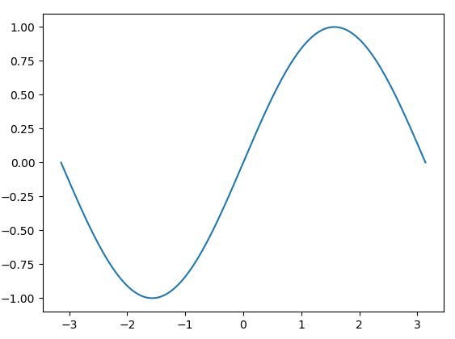
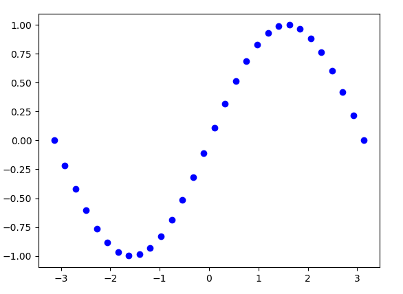
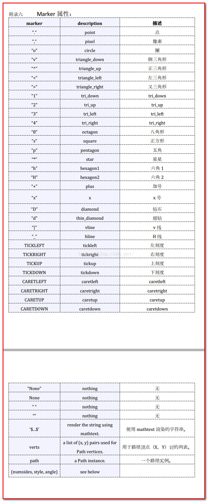

# matplotlib.pyplot参数详解 #

## 支持中文 ##

	import matplotlib as mpl
	import matplotlib.pyplot as plt
    mpl.rcParams['font.sans-serif'] = ['SimHei']
    mpl.rcParams['axes.unicode_minus'] = False

## 标题和坐标轴 ##

### 标题 ###

    plt.title('鸢尾花SVM两个特征分类', fontsize=16)

### 坐标轴标签 ###

	plt.xlabel('X轴', fontsize=13)
	plt.ylabel('Y轴', fontsize=13)

### 坐标轴边界长度 ###

    plt.xlim(x1_min, x1_max)
    plt.ylim(x2_min, x2_max)

### 网格线 ###

    plt.grid(b=True,ls=':')

	# True 显示网格  
	# linestyle 设置线显示的类型(一共四种)  
	# color 设置网格的颜色  
	# linewidth 设置网格的宽度   
	plt.grid(True, linestyle = "-.", color = "r", linewidth = "3")  

## plot ##

### 使用默认的线条样式和颜色 ###

	plot(x, y)       #plot x, y使用默认的线条样式和颜色

示例：

```python
import numpy as np
import matplotlib.pyplot as plt

if __name__ == "__main__":
    X = np.linspace(-np.pi, np.pi, 30, endpoint=True)
    sinY = np.sin(X)
    plt.plot(X,sinY) #使用默认的线条样式和颜色
    plt.show()

```



### 用蓝色圆圈标记 ###

	plot(x, y, 'bo')    #plot x,y用蓝色圆圈标记

示例：

```python
import numpy as np
import matplotlib.pyplot as plt

if __name__ == "__main__":
    X = np.linspace(-np.pi, np.pi, 30, endpoint=True)
    sinY = np.sin(X)
    plt.plot(X,sinY,'bo') #用蓝色圆圈标记
    plt.show()
```



### plot使用更多参数 ###

	plt.plot(X, C, color="blue", linewidth=2.5, linestyle="-", label="cosine")

color取值:

- blue
- red
- green

linewidth：线宽

linestyle：线型

label: 名称

## scatter ##

	def scatter(x, y, s=None, c=None, marker=None, cmap=None, norm=None, vmin=None,
	            vmax=None, alpha=None, linewidths=None, verts=None, edgecolors=None,
	            hold=None, data=None, **kwargs):

- x,y :输入数据
- s : 点的大小，可以是一个数（例如20），也可以是一个数组
- c : 颜色索引号，配置cmap使用
- marker: MarkerStyle，可选，默认为'o'
- cmap :实际可选的颜色
- edgecolors : marker的边界颜色

构造cmap示例：

    cm_light = mpl.colors.ListedColormap(['#A0FFA0', '#FFA0A0', '#A0A0FF'])
    cm_dark = mpl.colors.ListedColormap(['g', 'r', 'b'])
	plt.scatter(x[0], x[1], c=y, edgecolors='k', s=50, cmap=cm_dark)



## 线条和颜色 ##

### 线条 ###

用字符来描述绘制图形的线条：

字符 | 描述
---|---
'-' | 实线
'--' | 虚线
'-.' | 点线
':' | 点虚线
'.' | 点
',' | 像素
'o' | 圆形
'v' | 朝下的三角形
'^' | 朝上的三角形
'<' | 朝左的三角形
'>' | 朝右的三角形
's' | 正方形
'p' | 五角形
'h' | 1号六角形
'H' | 2号六角形
'*' | 星型
'+' | +号标记
'x' | x号标记
'D' | 钻石形
'd' | 小版钻石形
'|' | 垂直线形
'_' | 水平线行


### 颜色 ###

颜色用以下字符表示:

字符 | 颜色
---|---
'b' | 蓝色blue
'g' | 绿色green
'r' | 红色red
'c' | 青色cyan
'm' | 品红magenta
'y' | 黄色 yellow
'k' | 黑色black
'w' | 白色white

此外，你可以在很多古怪的方式和精彩的指定颜色，包括完整的名称（绿色的），十六进制字符串（“# 008000”）、RGB、RGBA元组（（0,1,0,1））或灰度强度作为一个字符串（‘0.8’）。这些字符串的规格可用于格式化，但以元组的形式只能用作**kwargs。

### 颜色与线条组合 ###

线条样式和颜色组合在一个单一的格式字符串中，如在'bo'为蓝色圆圈。
