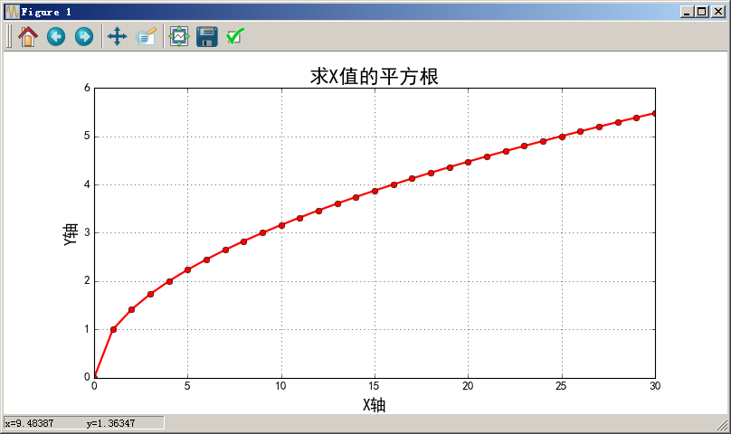

# np.frompyfunc #

## Definition ##

```python 
def frompyfunc(func, nin, nout):
```

## 示例 ##

```python
import math
import numpy as np
import matplotlib as mpl
import matplotlib.pyplot as plt

def getSqrt(x):
    if x < 1e-6:
        return 0
    last_val = x
    y = x / 2
    while math.fabs(y - last_val) > 1e-6:
        last_val = y
        y = (y + x / y) / 2
    return y

if __name__ == '__main__':
    x = np.linspace(start=0, stop=30, num=31)
    # ufunc = np.frompyfunc(func=getSqrt, nin=1, nout=1) # 这种方式会报错
    ufunc = np.frompyfunc(getSqrt, 1, 1)
    y = ufunc(x)

    mpl.rcParams['font.sans-serif'] = ['SimHei']
    mpl.rcParams['axes.unicode_minus'] = False
    plt.figure(figsize=(10,5), facecolor='w')
    plt.plot(x, y, 'ro-', linewidth=2, markersize=6)
    plt.xlabel('X轴', fontsize=16)
    plt.ylabel('Y轴', fontsize=16)
    plt.title('求X值的平方根', fontsize=20)
    plt.grid(b=True, ls=':')
    plt.show()
```

输出：




