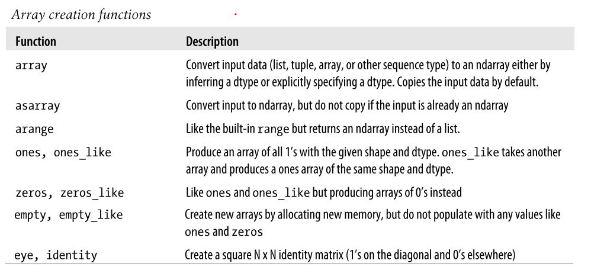

# Numpy Basics #

Numpy 是 Numerical Python的缩写，是一个非常重要的包（fundamental package），用于高性能的科学计算和数据分析（required for high performance scientific computing and data analysis），是其它工具的基础（It is the foundation on which nearly all of the higher-level tools are buit）。

Numpy主要提供了以下功能：

- **ndarry**, a fast and space-efficient multidimensional array providing vectorized arithmetic operations and sophisticated broadcasting capability.
- **Standard mathematical functions** for fast operations on entire arrays of data without having to write loops
- Tools for **reading / writing array data** to disk and working with memory-mapped files
- **Linear algebra**, **random number generation**, and **Fourier transform capabilities**
- Tools for integrating code written in C, C++, and Fortran

理解Numpy的arrays和array-oriented computing有助于使用pandas。（While NumPy by itself does not provide very much high-level data analytical functionality, having an understanding of NumPy arrays and array-oriented computing will help you use tools like pandas much more effectively.）

pandas相对于Numpy的优势是：（1）pandas提供了更高层的接口；（2）pandas提供了domain-specific functionality。While NumPy provides the computational foundation for these operations, you will likely want to use pandas as your basis for most kinds of data analysis (especially for structured or tabular data) as it provides a rich, high-level interface making most common data tasks very concise and simple. pandas also provides some more domain-specific functionality like time series manipulation, which is not present in NumPy.

In this chapter and throughout the book, I use the standard NumPy convention of always using `import numpy as np`. 

## The NumPy ndarray: A Multidimensional Array Object ##

这一部分主要是介绍ndarray。

Numpy中最重要一个特色就是ndarray，它是一个数据的容器，运算起来快，使用起来灵活。ndarray在进行mathematical operations时，是对whole blocks of data进行操作，这和标量（scalar elements）的操作是一样的。

	One of the key features of NumPy is its N-dimensional array object, or ndarray, which
	is a fast, flexible container for large data sets in Python. Arrays enable you to perform
	mathematical operations on whole blocks of data using similar syntax to the equivalent
	operations between scalar elements.

ndarray是一个多维度的container，用于存在同质化的数据（homogeneous data）。每一个ndarray都有两个属性shape和dtype。

	An ndarray is a generic multidimensional container for homogeneous data; that is, all
	of the elements must be the same type. Every array has a `shape`, a tuple indicating the
	size of each dimension, and a `dtype`, an object describing the data type of the array.

养成array-oriented programming and thinking是非常重要的。

	While it’s not necessary to have
	a deep understanding of NumPy for many data analytical applications, becoming pro-
	ficient in array-oriented programming and thinking is a key step along the way to be-
	coming a scientific Python guru.

ndarray的概念相等的几个名词

	Whenever you see “array”, “NumPy array”, or “ndarray” in the text,
	with few exceptions they all refer to the same thing: the ndarray object.

## Creating ndarrays ##

### 通过np.array来创建ndarray对象 ###

最简单的创建ndarray对象的方法就是通过numpy的`array`方法。

	The easiest way to create an array is to use the `array` function. This accepts any se-
	quence-like object (including other arrays) and produces a new NumPy array contain-
	ing the passed data. For example, a list is a good candidate for conversion:

多维ndarray数组的创建：

	Nested sequences, like a list of equal-length lists, will be converted into a multidimen-
	sional array:

在调用`np.array`方法的时候，如果不指定数据类型，那么`np.array`会对数据类型进行推断。可以通过`dtype`来查看ndarray中的类型。

	Unless explicitly specified (more on this later), `np.array` tries to infer a good data type
	for the array that it creates. The data type is stored in a special `dtype` object;

示例如下：

```python
import numpy as np

# 创建1维ndarray
data1 = [6,7.5,8,0,1]
arr1 = np.array(data1)
print("arr1 = ",arr1)
print("arr1.dtype = ",arr1.dtype)
print("arr1.shape = ",arr1.shape)
print("arr1.ndim = ",arr1.ndim)    #显示维度
print("-"*40)

# 创建2维ndarray
data2 = [[1,2,3,4],[5,6,7,8]]
arr2 = np.array(data2)
print("arr2 = \n",arr2)
print("arr2.dtype = ",arr2.dtype)
print("arr2.shape = ",arr2.shape)
print("arr2.ndim = ",arr2.ndim)    #显示维度
```

### 通过np.zeros、np.ones、np.empty来创建ndarray对象 ###

除了`np.array`，还有其它的方法来创建ndarray对象，例如np.zeros、np.ones、np.empty。

	In addition to np.array, there are a number of other functions for creating new arrays.
	As examples, `zeros` and `ones` create arrays of 0’s or 1’s, respectively, with a given length
	or shape. `empty` creates an array without initializing its values to any particular value.
	To create a higher dimensional array with these methods, pass a tuple for the shape:

示例：

```python
import numpy as np

print(np.zeros(10))
print(np.zeros((3,6)))
print(np.ones(10))
print(np.ones((3,6)))
print(np.empty((2,3,2)))
```

注意：It’s not safe to assume that `np.empty` will return an array of all zeros. In many cases, it will return uninitialized garbage values.

### 通过np.arange来创建ndarray对象 ###

使用np.arange来创建ndarray对象

	`arange` is an array-valued version of the built-in Python `range` function:

示例：

```python
import numpy as np

print(np.arange(15))

print(np.eye(4, 6))
```
a short list of standard array creation functions.




Since NumPy is focused on numerical computing, the data type, if not specified, will in many cases be float64 (floating point).

## Data Types for ndarrays ##

ndarray中的dtype属性是一个特殊对象，它告诉ndarray应该将a chunk of memory解释成什么类型的数据。 The data type or `dtype` is a special object containing the information the ndarray needs to interpret a chunk of memory as a particular type of data. Dtypes are part of what make NumPy so powerful and flexible. 

数值类型的dtype命名是有规则的：a type name + a number indicating the number of bits per element

	The numerical dtypes are named the same way: a type name,
	like float or int, followed by a number indicating the number of bits per element. A
	standard double-precision floating point value (what’s used under the hood in Python’s
	float  object)  takes  up  8  bytes  or  64  bits.  Thus,  this  type  is  known  in  NumPy  as
	float64. 


### 在创建ndarray对象的同时，指定数据类型dtype ###

示例：

```python
import numpy as np

arr1 = np.array([1,2,3],dtype=np.float64)
arr2 = np.array([2,3,4],dtype=np.int32)
print("arr1.dtype = ",arr1.dtype)
print("arr2.dtype = ",arr2.dtype)
```

### 使用np.asarray方法对数据类型进行转换 ###

调用`astype`方法可以完成数据类型的转换。You can explicitly convert or cast an array from one dtype to another using ndarray’s `astype` method.

调用`astype`方法会生成一个新的ndarray对象。Calling `astype` always creates a new array (a copy of the data), even if the new dtype is the same as the old dtype.

示例1：由整型转换为float64

```python
import numpy as np

arr = np.array([1,2,3,4,5])
print(arr.dtype)

float_arr = arr.astype(np.float64)
print(float_arr.dtype)
```

示例2：由float型转换为int32型

If You cast some floating point numbers to be of integer dtype, the decimal part will be truncated

```python
import numpy as np

arr = np.array([3.7,-1.2,-2.6,0.5,12.9,10.1])
print(arr)

int_arr = arr.astype(np.int32)
print(int_arr)
```
示例3：由字符串转换成float64型

Should you have an array of strings representing numbers, you can use `astype` to convert them to numeric form

```python
import numpy as np

numeric_strings = np.array(['1.25','-9.6','42'],dtype=np.string_)
float_arr = numeric_strings.astype(float)  # 这里可以将np.float64简写成float
# float_arr = numeric_strings.astype(np.float64)
print(float_arr)
print(float_arr.dtype)
```

If  casting  were  to  fail  for  some  reason  (like  a  string  that  cannot  be  converted  to float64), a **TypeError** will be raised. 

See that I was a bit lazy and wrote `float` instead of `np.float64`; NumPy is smart enough to alias the Python types to the equivalent dtypes.

示例4：转成另外一个ndarray的类型

```python
import numpy as np

int_array = np.arange(10)
print(int_array)

calibers = np.array([.22, .270, .357, .38, .44, .50],dtype=np.float64)
print(calibers)

float_array = int_array.astype(calibers.dtype)
print(float_array)
print(float_array.dtype)
```


