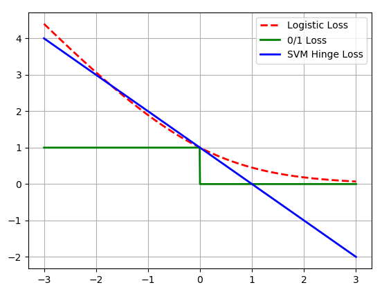
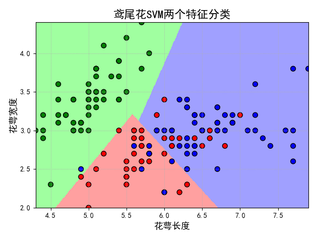
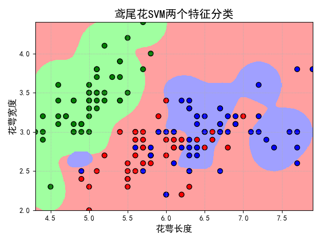
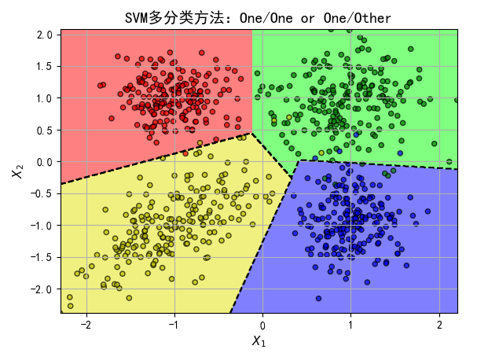
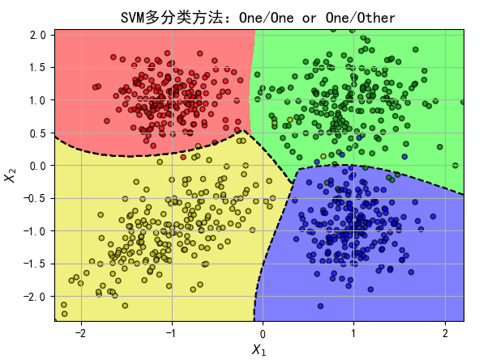
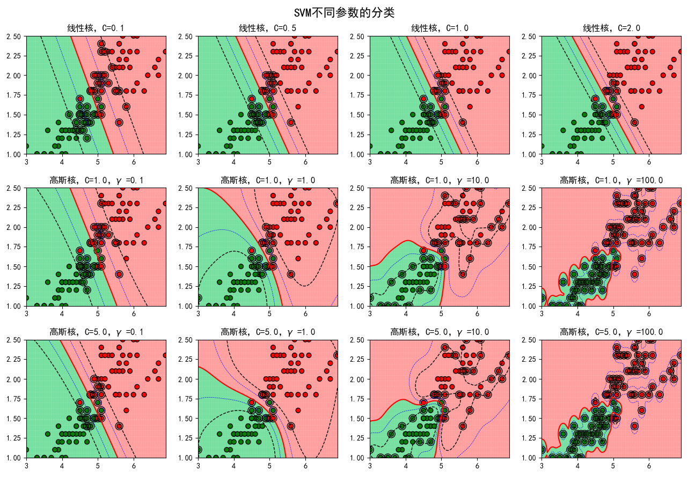

# SVM #

## 损失函数分析 ##

- 绿色：0/1损失
- 蓝色：SVM Hinge损失函数
- 红色：Logistic损失函数

```python
import math
import numpy as np
import matplotlib.pyplot as plt

if __name__ == "__main__":
    x = np.array(np.linspace(start=-3,stop=3,num=1001,dtype=np.float64))
    y_logit = np.log(1 + np.exp(-x)) / math.log(2)
    y_01 = x < 0
    y_hinge = 1.0 - x 
    
    plt.plot(x, y_logit, 'r--', label='Logistic Loss', linewidth=2)
    plt.plot(x, y_01, 'g-', label='0/1 Loss', linewidth=2)
    plt.plot(x, y_hinge, 'b-',label= 'SVM Hinge Loss', linewidth=2)
    plt.grid()
    plt.legend(loc='upper right')
    plt.savefig('1.png')
    plt.show()
```




## 线性SVM和高斯核SVM ##

```python
import numpy as np
import pandas as pd
import matplotlib as mpl
import matplotlib.pyplot as plt
from sklearn import svm
from sklearn.model_selection import train_test_split
from sklearn.metrics import accuracy_score

if __name__ == "__main__":
    iris_feature = '花萼长度', '花萼宽度', '花瓣长度', '花瓣宽度'
    path = '.\\data\\iris.data'
    data = pd.read_csv(path,header=None)
    x, y = data[[0,1]], pd.Categorical(data[4]).codes
    
    x_train, x_test, y_train, y_test = train_test_split(x, y, random_state=1, train_size=0.6)
    print(x_train)

    # 分类器
    clf = svm.SVC(C=0.1,kernel='linear',decision_function_shape='ovr')
#     clf = svm.SVC(C=0.8, kernel='rbf', gamma=20, decision_function_shape='ovr')
    clf.fit(x_train,y_train.ravel())  # ravel方法：Return a flattened (numpy) array
    
    # 准确率
    print(clf.score(x_train,y_train))  # 精度
    print('训练集准确率：',accuracy_score(y_train, clf.predict(x_train)))
    print(clf.score(x_test, y_test))
    print('测试集准确率：',accuracy_score(y_test, clf.predict(x_test)))
    
    # decision_function
    print(x_train[:5])
    print('decision_function:\n', clf.decision_function(x_train))
    print('\npredict:\n',clf.predict(x_train))
    
    # 画图
    x1_min, x2_min = x.min()
    x1_max, x2_max = x.max()
    x1, x2 = np.mgrid[x1_min:x1_max:500j,x2_min:x2_max:500j]   # 生成网格采样点
    grid_test = np.stack((x1.flat,x2.flat),axis=1) # 测试点
    grid_hat = clf.predict(grid_test)       # 预测分类值
    grid_hat = grid_hat.reshape(x1.shape)  # 使之与输入的形状相同
    
    mpl.rcParams['font.sans-serif'] = ['SimHei']
    mpl.rcParams['axes.unicode_minus'] = False
    
    cm_light = mpl.colors.ListedColormap(['#A0FFA0', '#FFA0A0', '#A0A0FF'])
    cm_dark = mpl.colors.ListedColormap(['g', 'r', 'b'])
    
    plt.figure(facecolor='w')
    plt.pcolormesh(x1, x2, grid_hat, cmap=cm_light)
    
    # s可以理解为size，即点的大小；cmap是可选的填充色，c色彩的序列号，edgecolors是点的边界颜色
    plt.scatter(x[0], x[1], c=y, edgecolors='k', s=50, cmap=cm_dark)      # 样本
#     plt.scatter(x_test[0], x_test[1], s=120, facecolors='none', zorder=10)     # 圈中测试集样本
#     plt.scatter(x_test[0], x_test[1], s=120,c=clf.predict(x_test), edgecolors='k',cmap=cm_dark)     # 圈中测试集样本

    plt.xlabel(iris_feature[0],fontsize=13)
    plt.ylabel(iris_feature[1],fontsize=13)
    plt.xlim(x1_min, x1_max)
    plt.ylim(x2_min, x2_max)
    plt.title('鸢尾花SVM两个特征分类', fontsize=16)
    plt.grid(b=True,ls=':')
    plt.tight_layout(pad=1.5)
    plt.show()
```

线下SVM如下图：




高斯核SVM如下图：



## SVM多分类 ##

```python
import numpy as np
from sklearn import svm
from scipy import stats
from sklearn.metrics import accuracy_score
import matplotlib as mpl
import matplotlib.pyplot as plt

def extend(a, b, r=0.01):  # 这个方法是做什么用的呢？
    return a * (1 + r) - b * r, -a * r + b * (1 + r)

if __name__ == "__main__":
    np.random.seed(0)
    N = 200
    x = np.empty((4*N,2))
    means = [(-1,1),(1,1),(1,-1),(-1,-1)]
    sigmas = [np.eye(2), 2*np.eye(2), np.diag((1,2)), np.array(((3,2),(2,3)))]
    for i in range(4):
        mn = stats.multivariate_normal(means[i],sigmas[i]*0.1)
        x[i*N:(i+1)*N,:]=mn.rvs(N)
    a = np.array((0,1,2,3)).reshape((-1,1))
    y = np.tile(a,N).flatten()
    clf = svm.SVC(C=1, kernel='rbf', gamma=1, decision_function_shape='ovr')
#     clf = svm.SVC(C=1, kernel='linear', decision_function_shape='ovr')
    clf.fit(x,y)
    y_hat = clf.predict(x)
    print(y_hat)
    acc = accuracy_score(y, y_hat)
    print(acc)
    np.set_printoptions(suppress=True)
    print('预测正确的样本个数：%d，正确率：%.2f%%' % (round(acc*4*N),100*acc))
    
    # decision_function
    print(clf.decision_function(x))
    
    
    x1_min, x2_min = np.min(x, axis=0)
    x1_max, x2_max = np.max(x, axis=0)
#     x1_min, x1_max = extend(x1_min, x1_max)
#     x2_min, x2_max = extend(x2_min, x2_max)
    
    x1, x2 = np.mgrid[x1_min:x1_max:500j, x2_min:x2_max:500j]
    x_test = np.stack((x1.flat, x2.flat), axis=1)
    y_test = clf.predict(x_test)
    y_test = y_test.reshape(x1.shape)
    
    cm_light = mpl.colors.ListedColormap(['#FF8080', '#80FF80', '#8080FF', '#F0F080'])
    cm_dark = mpl.colors.ListedColormap(['r', 'g', 'b', 'y'])
    mpl.rcParams['font.sans-serif'] = ['SimHei']
    mpl.rcParams['axes.unicode_minus'] = False
    plt.figure(facecolor='w')
    plt.pcolormesh(x1, x2, y_test, cmap=cm_light)
    plt.contour(x1, x2, y_test, levels=(0,1,2), colors='k', linestyles='--')
    plt.scatter(x[:, 0], x[:, 1], s=20, c=y, cmap=cm_dark, edgecolors='k', alpha=0.7)
    plt.xlabel('$X_1$', fontsize=11)
    plt.ylabel('$X_2$', fontsize=11)
    plt.xlim((x1_min, x1_max))
    plt.ylim((x2_min, x2_max))
    plt.grid(b=True)
    plt.tight_layout(pad=2.5)
    plt.title('SVM多分类方法：One/One or One/Other', fontsize=14)
    plt.show()
```

线性SVM分类如下：



高斯核SVM分类如下图：



## SVM不同参数的分类 ##

```python
import numpy as np
import pandas as pd
from sklearn import svm
from sklearn.metrics import accuracy_score
import matplotlib as mpl
import matplotlib.pyplot as plt

if __name__ == "__main__":
    data = pd.read_csv('.\\data\\bipartition.txt',sep='\t',header=None)
    x, y = data[[0,1]], data[2]
    
    # 分类器
    clf_param = (('linear', 0.1), ('linear', 0.5), ('linear', 1), ('linear', 2),
                ('rbf', 1, 0.1), ('rbf', 1, 1), ('rbf', 1, 10), ('rbf', 1, 100),
                ('rbf', 5, 0.1), ('rbf', 5, 1), ('rbf', 5, 10), ('rbf', 5, 100))
    
    x1_min, x2_min = np.min(x, axis=0)
    x1_max, x2_max = np.max(x, axis=0)
    x1, x2 = np.mgrid[x1_min:x1_max:200j, x2_min:x2_max:200j]
    grid_test = np.stack((x1.flat, x2.flat), axis=1)
    
    cm_light = mpl.colors.ListedColormap(['#77E0A0', '#FFA0A0'])
    cm_dark = mpl.colors.ListedColormap(['g', 'r'])
    mpl.rcParams['font.sans-serif'] = ['SimHei']
    mpl.rcParams['axes.unicode_minus'] = False
    plt.figure(figsize=(13, 9), facecolor='w')
    
    for i, param in enumerate(clf_param):
        clf = svm.SVC(C=param[1], kernel=param[0])
        if param[0] == 'rbf':
            clf.gamma = param[2]
            title = '高斯核，C=%.1f，$\gamma$ =%.1f' % (param[1], param[2])
        else:
            title = '线性核，C=%.1f' % param[1]
            
        clf.fit(x,y)
        y_hat = clf.predict(x)
        print('准确率：', accuracy_score(y, y_hat))
    
        # 画图
        print(title)
        print('支撑向量的数目：', clf.n_support_)
        print('支撑向量的系数：', clf.dual_coef_)
        print('支撑向量：', clf.support_)
        plt.subplot(3, 4, i+1)
        grid_hat = clf.predict(grid_test)       # 预测分类值
        grid_hat = grid_hat.reshape(x1.shape)  # 使之与输入的形状相同
        plt.pcolormesh(x1, x2, grid_hat, cmap=cm_light, alpha=0.8)
        plt.scatter(x[0], x[1], c=y, edgecolors='k', s=40, cmap=cm_dark)      # 样本的显示
        plt.scatter(x.loc[clf.support_, 0], x.loc[clf.support_, 1], edgecolors='k', facecolors='none', s=100, marker='o')   # 支撑向量
        z = clf.decision_function(grid_test)
        # print 'z = \n', z
        print('clf.decision_function(x) = ', clf.decision_function(x))
        print('clf.predict(x) = ', clf.predict(x))
        z = z.reshape(x1.shape)
        plt.contour(x1, x2, z, colors=list('kbrbk'), linestyles=['--', '--', '-', '--', '--'],
                    linewidths=[1, 0.5, 1.5, 0.5, 1], levels=[-1, -0.5, 0, 0.5, 1])
        plt.xlim(x1_min, x1_max)
        plt.ylim(x2_min, x2_max)
        plt.title(title, fontsize=12)
    
    plt.suptitle('SVM不同参数的分类', fontsize=16)
    plt.tight_layout(1.4)
    plt.subplots_adjust(top=0.92)
    plt.show()
```

输出结果如下：



## 经常混淆的几个概念：Accuracy/Precision/Recall/f1 score/F-beta ##

```python
import numpy as np
from sklearn.metrics import accuracy_score
from sklearn.metrics import precision_score, recall_score, f1_score, fbeta_score
from sklearn.metrics import precision_recall_fscore_support, classification_report


if __name__ == "__main__":
    y_true = np.array([1, 1, 1, 1, 0, 0])
    y_hat = np.array([1, 0, 1, 1, 1, 1])
    print('Accuracy：\t', accuracy_score(y_true, y_hat))

    # The precision is the ratio 'tp / (tp + fp)' where 'tp' is the number of
    # true positives and 'fp' the number of false positives. The precision is
    # intuitively the ability of the classifier not to label as positive a sample
    # that is negative.
    # The best value is 1 and the worst value is 0.
    precision = precision_score(y_true, y_hat)
    print('Precision:\t', precision)

    # The recall is the ratio 'tp / (tp + fn)' where 'tp' is the number of
    # true positives and 'fn' the number of false negatives. The recall is
    # intuitively the ability of the classifier to find all the positive samples.
    # The best value is 1 and the worst value is 0.
    recall = recall_score(y_true, y_hat)
    print('Recall:  \t', recall)

    # F1 score, also known as balanced F-score or F-measure
    # The F1 score can be interpreted as a weighted average of the precision and
    # recall, where an F1 score reaches its best value at 1 and worst score at 0.
    # The relative contribution of precision and recall to the F1 score are
    # equal. The formula for the F1 score is:
    #     F1 = 2 * (precision * recall) / (precision + recall)
    print('f1 score: \t', f1_score(y_true, y_hat))
    print(2 * (precision * recall) / (precision + recall))

    # The F-beta score is the weighted harmonic mean of precision and recall,
    # reaching its optimal value at 1 and its worst value at 0.
    # The 'beta' parameter determines the weight of precision in the combined
    # score. 'beta < 1' lends more weight to precision, while 'beta > 1'
    # favors recall ('beta -> 0' considers only precision, 'beta -> inf' only recall).
    print('F-beta：')
    for beta in np.logspace(-3, 3, num=7, base=10):
        fbeta = fbeta_score(y_true, y_hat, beta=beta)
        print('\tbeta=%9.3f\tF-beta=%.5f' % (beta, fbeta))
        #print (1+beta**2)*precision*recall / (beta**2 * precision + recall)

    print(precision_recall_fscore_support(y_true, y_hat, beta=1))
    print(classification_report(y_true, y_hat))
```

输出如下：

	Accuracy：	 0.5
	Precision:	 0.6
	Recall:  	 0.75
	f1 score: 	 0.666666666667
	0.666666666667
	F-beta：
		beta=    0.001	F-beta=0.60000
		beta=    0.010	F-beta=0.60001
		beta=    0.100	F-beta=0.60119
		beta=    1.000	F-beta=0.66667
		beta=   10.000	F-beta=0.74815
		beta=  100.000	F-beta=0.74998
		beta= 1000.000	F-beta=0.75000
	(array([ 0. ,  0.6]), array([ 0.  ,  0.75]), array([ 0.        ,  0.66666667]), array([2, 4], dtype=int64))
	             precision    recall  f1-score   support
	
	          0       0.00      0.00      0.00         2
	          1       0.60      0.75      0.67         4
	
	avg / total       0.40      0.50      0.44         6


