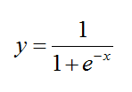
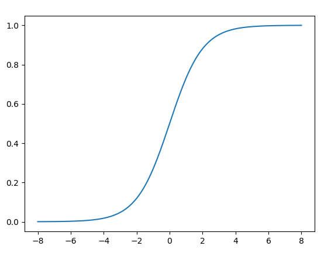
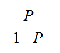
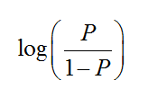
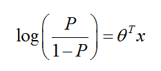
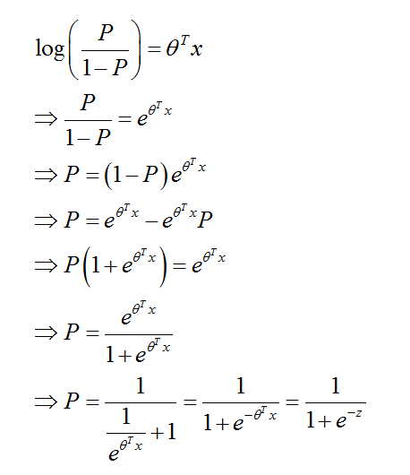

# Sigmoid Function #

The **sigmoid function**, also called the **sigmoidal curve** (von Seggern 2007, p. 148) or **logistic function**, is the function



当x=0时，y=1/2。

```python
import numpy as np
import matplotlib.pyplot as plt

def func(x):
    return 1 / (1 + np.exp(-x))

# Return evenly spaced numbers over a specified interval.
xdata = np.linspace(-8, 8, 160,endpoint=True)
ydata = func(xdata)

plt.plot(xdata,ydata)

plt.show()
```

绘制图形如下：



## 几率和概率 ##

概率：当n趋向于正无穷的时候，生男生女的概率是50%。
几率：当n处于某一定值时（例如100人），出生男孩女孩分别是70和30，那生男孩的几率就是0.7；生男孩女孩的概率是0.5，是不会变的。

- 几率：就是指在已经发生的随机事件中，某一种随机事件在整个随机事件中所占的比例。
- 概率：是由巨大数据统计后得出的结论，讲的是一个大的整体趋势，在讲整体的规律。几率是较少数据统计的结果，是一种具体的趋势和规律，是阶段性的趋势和规律。

举例来说，掷一枚硬币，正面和反面出现的**概率**相等，都是1/2。这是经过上百万次试验取得的理论数据。但某人只掷20次，正面出现的几率为13/20，反面出现的几率仅为7/20。

概率和几率的关系，是整体和具体、理论和实践、战略和战术的关系。

## 【Sigmoid函数】与【几率和概率】的关系 ##

假如对于一批数据，要来做二分类，当取出一个样本时，要么就是正例1，要么就是负例0。

如果一个样本是正例的几率是P，那么是负例（不是正例）的几率就是1-P。

首先，让【正例的几率】比上【不是正例的几率】，如下：



现在人为的给这个比例加上log，如下：



这个时候做一个假设：即log(P/(1-P))符合线性变换，也就是



> 数学，好多地方就是假设，让事情先继续下去，最后再证明一下；如果假设符合现实的规律，那么假设就成立，那么根据假设做出的推断也就是正确的。

换句话说，如果我们知道【线性变换】的公式，就可以通过【该公式】求解【几率P】了。根据上式，推演过程如下：




