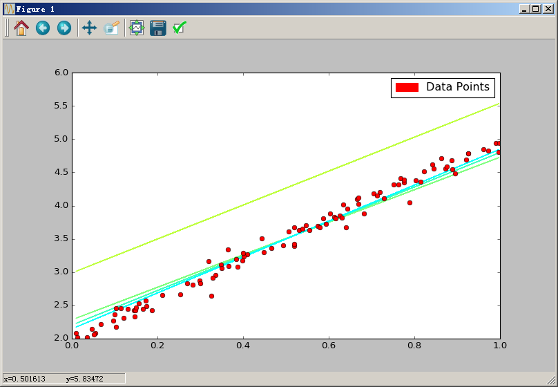

# Linear Regression with TensorFlow #

```python
import numpy as np
import tensorflow as tf
import matplotlib.patches as mpatches
import matplotlib.pyplot as plt

plt.rcParams['figure.figsize'] = (10, 6)

x_data = np.random.rand(100).astype(np.float32)
y_data = x_data * 3 + 2
y_data = np.vectorize(lambda y: y + np.random.normal(loc=0.0, scale=0.1))(y_data)

a = tf.Variable(1.0)
b = tf.Variable(0.2)
y = a * x_data + b

loss = tf.reduce_mean(tf.square(y - y_data))
optimizer = tf.train.GradientDescentOptimizer(0.5)
train = optimizer.minimize(loss)

init = tf.global_variables_initializer()
sess = tf.Session()
sess.run(init)
train_data = []
for step in range(16):
    evals = sess.run([train,a,b])[1:]
    if(step % 5 == 0):
        print(step, evals)
        train_data.append(evals)
sess.close()

converter = plt.colors
cr, cg, cb = (1.0, 1.0, 0.0)
for f in train_data:
    cb += 1.0 / len(train_data)
    cr -= 1.0 / len(train_data)
    if cb > 1.0: cb = 1.0
    if cr < 0.0: cr = 0.0
    [a, b] = f
    f_y = np.vectorize(lambda x: a*x + b)(x_data)
    line = plt.plot(x_data, f_y)
    plt.setp(line, color=(cr,cg,cb))

plt.plot(x_data, y_data, 'ro')

green_line = mpatches.Patch(color='red', label='Data Points')
plt.legend(handles=[green_line])
plt.show()
```



