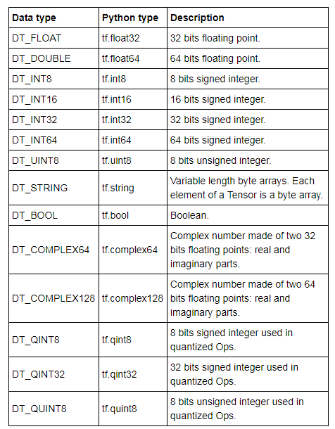

# Variables And Placeholders #


## Variables ##

To define variables we use the command `tf.variable()`. To be able to use variables in a computation graph it is necessary to initialize them before running the graph in a session. This is done by running `tf.global_variables_initializer()`.

```python
import tensorflow as tf

state = tf.Variable(0)
one = tf.constant(1)
new_value = tf.add(state, one)
update = tf.assign(state, new_value)

init_op = tf.global_variables_initializer()

with tf.Session() as session:
    session.run(init_op)
    print(session.run(state))
    for _ in range(3):
        session.run(update)
        print(session.run(state))
```

## Placeholders ##

Now we know how to manipulate **variables inside TensorFlow**, but what about feeding **data outside of a TensorFlow model**?

If you want to feed data to a TensorFlow model from outside a model, you will need to use **placeholders**.

So what are these placeholders and what do they do?

Placeholders can be seen as "holes" in your model, "holes" which you will pass the data to, you can create them using `tf.placeholder(datatype)`, where datatype specifies the type of data (integers, floating points, strings, booleans) along with its precision (8, 16, 32, 64) bits.

The definition of each **data type** with the respective python sintax is defined as:



To pass the data to the model we call the session with an extra argument **feed_dict** in which we should pass a dictionary with each placeholder name folowed by its respective data.

```python
import tensorflow as tf

a = tf.placeholder(tf.float32)
b = a * 2

dictionary = {a: [ [ [1,2,3],[4,5,6],[7,8,9],[10,11,12] ],
                   [ [13,14,15],[16,17,18],[19,20,21],[22,23,24] ] ]}

with tf.Session() as sess:
    result = sess.run(b, feed_dict={a: 3.5})
    print(result)
    result = sess.run(b, feed_dict=dictionary)
    print(result)
```


