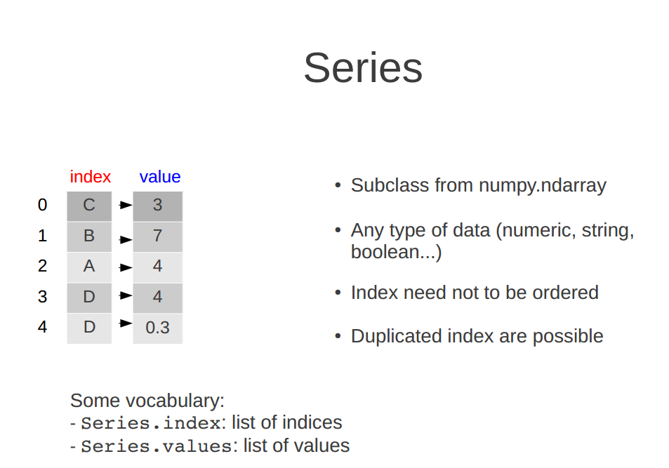

# Pandas #

## 1、Pandas是什么 ##

	Python Data Analysis Library 或 pandas 是基于NumPy 的一种工具，该工具是为了解决数据分析任务而创建的。

## 2、Pandas的数据结构 ##

**Series**: 一维数组，与Numpy中的一维array类似。二者与Python基本的数据结构List也很相近，其区别是：List中的元素可以是不同的数据类型，而Array和Series中则只允许存储相同的数据类型，这样可以更有效的使用内存，提高运算效率。

**DataFrame**: 二维的表格型数据结构。很多功能与R中的data.frame类似。可以将DataFrame理解为Series的容器。以下的内容主要以DataFrame为主。

**Panel**: 三维的数组，可以理解为DataFrame的容器。

## 3、Pandas的安装 ##

## 4、Series ##

### 4.1、创建Series对象 ###

(1)创建一个空的Series

	import pandas as pd
	s = pd.Series()
	print(s)            #输出：Series([], dtype: float64)
	type(s)             #输出： <class 'pandas.core.series.Series'>

(2)通过Numpy的数组创建Series：

